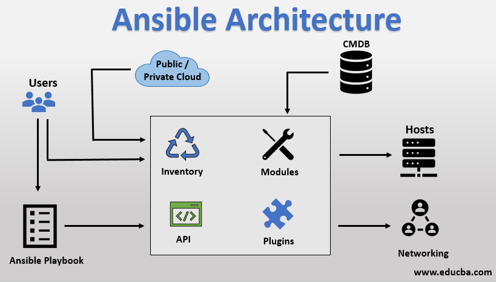

# Ansible 特性

* 基於 Python 語言實現，部署簡單，基於 python 和 SSH (預設已安裝)。

* 無代理架構，不須額外安裝 agent。

    * Ansible 直接透過 SSH（或 WinRM 等協定）連接到目標節點，執行任務後結束會話。這種模式不需要在目標主機上執行任何常駐服務（daemon）。

    * 所以不需要使用 systemctl 等相關服務。

* 安全性: 基於 OpenSSH。

* 模塊化: 內建幾千個模塊，通過調用指定模塊，完成特定任務。

    * 支援自定義模塊，可使用任何程式語言寫模塊。

    * 包含核心的三個組件: 
        1. Paramiko (python 對 SSH 的實現)
        2. PyYAML
        3. Jinja2(模板引擎)

* 冪等性(Idempotent): 

    * 一個任務執行1次和執行n次的效果一樣，防止重複執行。

* 支持 Playbook 編排任務、YAML格式、各種數據結構。

* 支持 Ansible Role。

* ansible 執行命令的過程 (重要)

    1. 加載自己的配置文件，默認 `/etc/ansible/ansible.cfg`。

    2. 加載自己對應的模塊文件，如 `ping`。

    3. 將模塊或命令生成對應的臨時 py 文件，建立在 `local_tmp` 路徑下，並將該文件傳輸至遠端目標主機 `remote_tmp` 路徑下，即 `$HOME/.ansible/tmp/ansible-tmp-數字/XXX.py` 文件。

    4. 將文件 +x 執行。

    5. 執行並返回結果。

    6. 刪除臨時的 py 文件，然後退出。

 

 

# 名詞解釋

* `playbook`: 可以簡單理解為腳本。

* `roles`: 多個 playbook 的集合，就是 roles。

 

 

# 架構圖

 

中間黑框的就是 ansible，包含以下四種組件。

* `Inventory` : 被管理的主機，都會記錄在此清單中。

* `API` : 某些自動化工具，像是 gitlab CI/CD，會透過 ansible 的 API 來觸發執行 ansible 的模塊命令，故 ansible 有提供 API。

* `Modules` : 核心功能單元，用於執行具體任務（如安裝軟體、管理文件、配置系統）。

* `Plugins` : 額外的插件。

ansible 是通過 SSH 協議來向 Hosts (目標主機) 來進行操作。