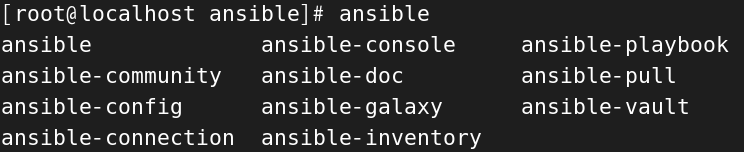
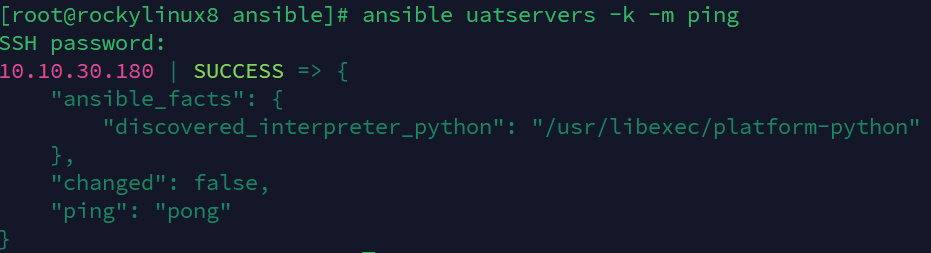
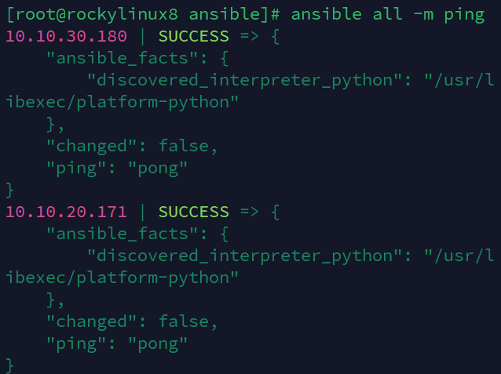

# 配置文件

在 `/etc/ansible` 目錄下，有3個配置文件


1. `ansible.cfg`  
這是 Ansible 的主設定文件，用於定義 Ansible 的全域行為和參數。

2. `hosts`  
預設的靜態 Inventory 文件，用於定義被管理的主機和主機群組。

3. `roles/`

如果存在，這個目錄通常用於儲存共享的角色（roles）。


<br/>

<br/>

# ansible.cfg 配置

ansible 是隱藏預設的配置的，所以想要看到配置，可以使用以下命令

```sh
ansible-config init --disabled > _ansible.cfg
```

進入配置後，大部分的配置都是註解的，代表是預設配置。

<br/>

ansible 在執行命令時，會在 local_tmp 產生臨時的文件，並且會透過 SSH 將此檔案複製到目標主機的 remote_tmp 中，在目標主機執行完命令後，兩邊的臨時文件都會被刪除。

```sh
[defaults]
inventory  = /etc/ansible/hosts    # 主機清單配置文件

remote_tmp = ~/.ansible/tmp        # 在遠端主機上暫時存放檔案的目錄，例如模組檔案、命令腳本和產生的檔案。

local_tmp  = {{ ANSIBLE_HOME ~ "/tmp" }} # 在管理主機上也會產生暫存的檔案。

forks = 5 # 併發的目標主機數量

sudo_user = root # 預設的 sudo 用戶，基本上在 ansible 上的用戶都會直接放 sudo 權限的用戶，以免權限不足。

ask_sudo_pass = True # 每次執行命令是否詢問 SSH 密碼
ask_pass = True

remote_port = 22 # SSH port

host_key_checking = False # 禁用 host key 检查

log_path = /var/log/ansible/ansible.log # 日誌文件路徑
```

<br/>

<br/>

# hosts 配置

可以使用中括號，來作為範圍

```sh
[webservers]
web1.example.com:2222 # 可以直接指定 port
web2.example.com

[dbservers]
db[1:2].example.com # 使用範圍代表 db1, db2 都包含

[appservers]
10.10.20.[1:100] # 使用 IP + 範圍

[dbsrvs]
db-[a:f].example.com # 字母範圍也可以
```

<br/>

<br/>

# ansible 命令



<br/>

ansible 命令有多種，最常用的是 `ansible`, `ansible-playbook`, `ansible-doc` 這幾個

`ansible`：用於執行單一任務的命令行工具，適合測試和小規模操作。

```sh
# 基本語法
ansible <主機群組> -m <模組名稱> -a "<模組參數>"
```

* `<主機群組>`：要執行命令的主機或主機群組（可以在 inventory 檔案中定義）。

* `-m <模組名稱>`：指定要使用的模組，例如 ping、command、shell 等。

* `-a "<模組參數>"`：提供模組所需的參數或命令。

```sh
# 所有 hosts 檔案底下的主機都執行
ansible all -m ping

# webservers 群組下的主機都執行，並加上參數
ansible webservers -m command -a "uname -a"
```

舉例，使用以下命令

```sh
# 會報錯，沒有使用密碼，不給驗證，所以需要加上 -k
ansible uatservers -m ping

# 會顯示交互式輸入密碼
ansible uatservers -k -m ping
```



<br/>

`ansible-playbook`：用於運行和管理定義在 YAML 文件中的一系列任務和配置的主要工具。

```sh
# hello.yml
# 對群組的主機發送廣播
- hosts: uatservers
    remote_user: root
    tasks:
    - name: hello world
        command: /usr/bin/wall hello world
```

運行 playbook.yml
```sh
ansible-playbook hello.yml
```

<br/>


`ansible-doc`：用於查看模組和插件的文件，幫助使用者了解如何使用它們。

```sh
# 每一個模塊，會有一個文件，目前共有 7736 個模塊
ansible-doc --list | wc -l
```

```sh
# 查看 ping 模塊的文件
ansible-doc ping
```

<br/>

`ansible-galaxy`：是一個專為 Ansible 社群設計的分享和發佈角色的平臺。可以讓用戶輕鬆搜尋、下載、使用和分享 Ansible 角色，以便在不同的自動化任務中重用這些角色。

* https://galaxy.ansible.com/

* 使用以下命令下載，下載來源是 github，會下載到本地的 `~/.ansible/roles/` 底下。

    ```sh
    # 下載
    ansible-galaxy install xxxxxxx

    # 查看下載清單
    ansible-galaxy list

    # 刪除
    ansible-galaxy remove
    ```
    
    <br/>

`ansible-pull`：用於將配置管理從 push (控制主機推送任務到目標主機) 改為 pull (目標主機主動拉取配置)。

<br/>

`ansible-vault`：用於加密和解密敏感資訊(如密碼或金鑰)的工具，例如 playbook 配置上，有很多敏感資訊，可以用此工具加密。

* 加密方式

    ```sh
    # 輸入指令後，需要輸入密碼
    ansible-vault encrypt hello.yml
    ```

* 解密方式

    ```sh
    ansible-vault decrypt hello.yml
    ```

* 修改密碼

    ```sh
    ansible-vault rekey hello.yml
    ```

<br/>

`ansible-console`：是一個交互式命令行工具，允許用戶以即時互動的方式對管理的主機執行操作。這種工具對於測試、診斷和快速執行命令非常方便。

<br/>

# 設定 SSH 無密碼登入
使用此方法，將管理主機的公鑰複製給目標主機，ssh-copy-id 的作用是將本地的 SSH 公鑰複製到目標主機的 ~/.ssh/authorized_keys 文件中。這樣一來就可以通過 SSH 使用無密碼登錄來連接該主機，而不需要每次都輸入密碼。

1. `管理主機`上建立公鑰，公鑰位置在 ~/.ssh

    ```sh
    ssh-keygen
    ```

2. 使用 ssh-copy-id 傳輸公鑰給每個目標主機(如果數量太多可以寫迴圈跑)

    ```sh
    # 將公鑰複製給目標主機下的 root 用戶
    ssh-copy-id root@10.10.30.180
    ```

3. 輸入目標主機下 root 用戶的密碼。

4. 檢查目標主機下是否產生 `~/.ssh/authorized_keys`

這樣一來，管理主機使用指令時，就不必再使用 -k 輸入密碼。



<br/>

# 常用指令

將目標主機列出
```sh
# 查看全部
ansible all --list-hosts

# 用分組名稱
ansible uatservers --list-hosts
```

分組邏輯語法，舉例
```sh
# 在分組1，並且也在分組2中
ansible "group1:&group2" --list-hosts

# 在分組1，但不在分組2 (只能使用單引號)
ansible 'group1:!group2' --list-hosts
```

<br/>

|表達式|說明|
|--|--|
|group1:group2|group1 和 group2 的並集。|
|group1:&group2|group1 和 group2 的交集。|
|group1:!group2|group1 減去 group2 的主機。|
|all:!group1|所有主機（all）減去 group1 的主機。|

<br/>

使用正則表達式，`正則是篩選目標主機，不是分組`。

```sh
# 以 app 開頭的主機
ansible '~^app' --list-hosts

# 以 server 結尾的主機
ansible '~server$' --list-hosts

# 以 web 或 db 開頭的主機
ansible '~(web|db).*\.example\.com' --list-hosts
```

<br/>

<br/>

# 其他參數
-v, -vv, -vvv 可以漸進的顯示詳細過程。

```sh
# 顯示最詳細的運行過程
ansible all -vvv -m ping
```