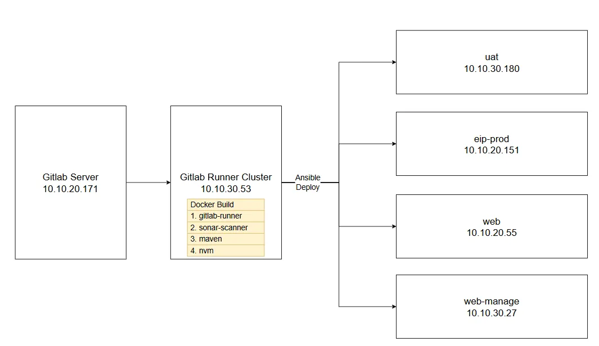

## gitlab-ci.yml 結構



當使用 gitlab-runner cluster 建立好 artifacts 後，就會使用 ansible 把該 artifacts 推送到目標主機上佈署。

<br/>

<br/>

## ansible-playbook 範例

springboot 服務

```yml
- name: Update eip application
  hosts: prod_eip   # 已經在 /etc/ansible/hosts 中定義
  gather_facts: no  # 不要蒐集目標主機資訊，加快速度
  vars: # 變數配置
    ansible_user: "root"
    app_name: "eip"
    artifacts: "/opt/ansible/artifacts/eip/eip.jar"
    dest_path: "/opt/EIP"

  tasks:
    - name: Stop eip service
      systemd:
        name: eip
        state: stopped

    - name: Wait for service to stop
      wait_for:
        timeout: 3

    - name: Check service status after stop
      systemd:
        name: eip
      register: service_status # 將 systemctl status eip.service 產生的字串儲存到 service_status 變數中

    - name: Remove old file
      file:
        path: "{{ dest_path }}/{{ app_name }}.jar"
        state: absent
    
    - name: Copy JAR file to destination
      copy:
        src: "{{ artifacts }}"
        dest: "{{ dest_path }}/{{ app_name }}.jar"
        mode: "0755"
        owner: "root"
        group: "root"

    - name: Start eip service
      systemd:
        name: eip
        state: started

    - name: Check service status after start
      systemd:
        name: eip
      register: service_status

    # 以上步驟都是在目標主機執行，只有此步驟是在 ansible 主機上執行，將產生的 artifacts 產物刪除。
    - name: Remove file on ansible host
      file:
        path: "{{ artifacts }}"
        state: absent
      delegate_to: localhost # localhost 指的就是 ansible 主機
```

<br/>

---

前端 nginx 服務

```yml
- name: Update nginx application
  hosts: prod_eip
  gather_facts: no
  vars:
    ansible_user: "root"
    app_name: "eip"
    artifacts: "/opt/ansible/artifacts/eip/dist"
    dest_path: "/usr/share/nginx/html/EIP"

  tasks:
    - name: Ensure target directory exists
      file:
        path: "{{ dest_path }}"
        state: directory
        mode: "0755"

    # 直接將整個目錄複製到目標主機，再做extract
    - name: Copy file to destination host
      copy:
        src: "{{ artifacts }}"
        dest: "/tmp/"
        force: yes

    - name: Remove all old files and directories
      shell: rm -rf {{ dest_path }}/*

    - name: Extract file to target path
      copy:
        src: "/tmp/dist/"
        dest: "{{ dest_path }}"
        remote_src: yes

    - name: Restart nginx service
      systemd:
        name: nginx
        state: restarted

    - name: Check service status after restart
      systemd:
        name: nginx

    - name: Remove file on target host
      file:
        path: "/tmp/dist"
        state: absent

    - name: Remove file on ansible host
      file:
        path: "{{ artifacts }}"
        state: absent
      delegate_to: localhost
```