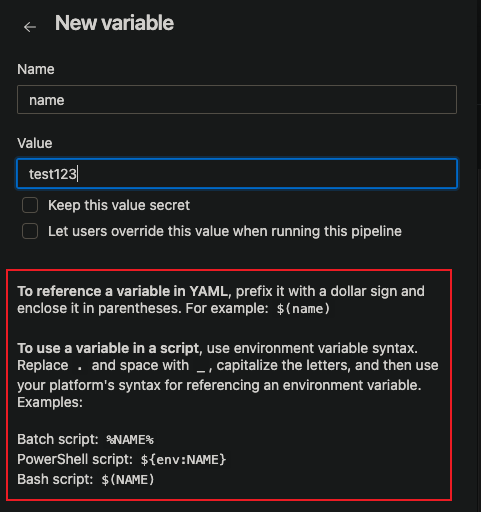

# Azure Devops Pipeline 建置

## 文件
https://learn.microsoft.com/en-us/azure/devops/pipelines/get-started/key-pipelines-concepts?view=azure-devops

## 名詞解釋

### Stage
1. 業務邏輯的邊界，用來區隔如：Build, QA, production 等等的步驟。

2. Stage 一定是有先後順序，一定是執行完 Stage 1 才能執行 Stage 2。

3. 一個 Stage 中，可含多個 Job。

### Job
1. 一個 Job，是由一個 Agent 來執行，可申請一個免費 Agent 的使用權。

2. Job 中，含一組 Steps，而這些 Steps 都會在同一個 Agent 上執行。

3. 不同的 Job 可以區分不同的環境，舉例：若想在一個 Stage 中，執行 x86 和 x64 兩種環境，使用 Job 最有用。

### Step
1. Step 是 pipeline 的最小構建塊。

2. Step 可以是 task 或 script；task 只是為了方便而提供的預先建立的 script。

### Script

1. Script 使用 batch, PowerShell, Bash 將程式碼作為一個 Step 來運行，

2. 可以為 macOS、Linux 和 Windows 編寫跨平台腳本。

3. 與 Job 不同，Script 是自訂程式碼。

 

 

### 設定此 Pipeline 的變數

https://learn.microsoft.com/en-us/azure/devops/pipelines/get-started/yaml-pipeline-editor?view=azure-devops#manage-pipeline-variables

若要使用變數，則可以依照下方說明 call 該變數，yaml 檔就是使用 $(name) 語法去呼叫。

若要管理變數，可依照文件，在 Triggers -> Variables 查看或修改該變數。