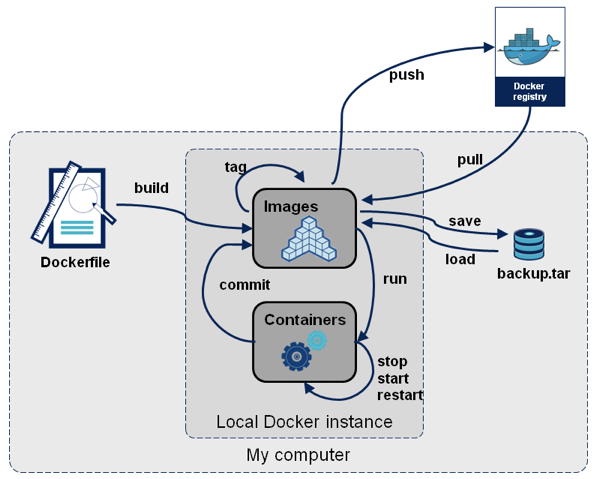
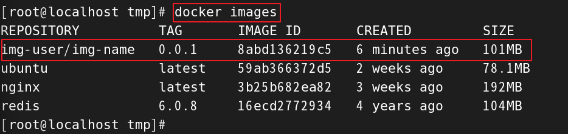
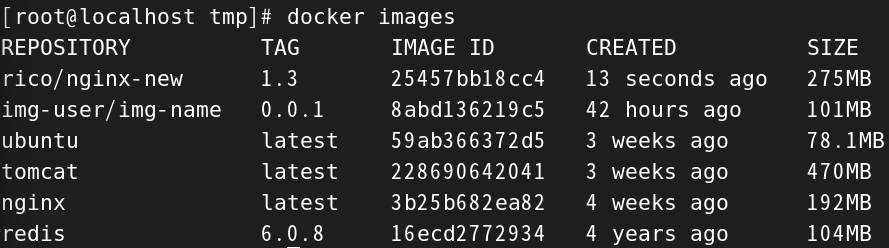

# 安裝環境及設定
## 在 zsh 上安裝 docker auto-completion
```sh
# 1. 有安裝 on-my-zsh
vim ~/.zshrc

# 2. 將 plugins 中加入後，會自動下載外掛
plugins = (... docker docker-compose)

# 3. 存擋後重啟 zsh 設定
source ~/.zshrc
```


<br/>

<br/>

## 在 linux 上安裝 docker

分為 Community(社群版，免費) 和 Enterprise(企業，付費) 版本。

這邊以社群版為舉例。


> 可參考 https://docs.docker.com/engine/install/centos/

先移除舊有的 docker。

```sh
sudo yum remove docker \
                docker-client \
                docker-client-latest \
                docker-common \
                docker-latest \
                docker-latest-logrotate \
                docker-logrotate \
                docker-engine
```

安裝在 CentOS 7

```sh
sudo yum install docker-ce docker-ce-cli containerd.io docker-buildx-plugin docker-compose-plugin
```

啟動

```sh
sudo systemctl start docker
```

確認是否安裝成功

```sh
sudo docker run hello-world
```

<br/>

<br/>
 
# Docker 指令格式
新格式: `docker <command> <sub-command> [options]`  
舊格式(still works): `docker <command> [options]`

<br/>

<br/>

## Docker 各種 command 用途



<br/>

<br/>

# 基本指令
## 查看版本
```sh
docker version
```

<br/>

## 查看 engine config 
```sh
docker info
```

<br/>

## 查看目前 image
```sh
docker image ls
```

```sh
docker images
```

<br/>

## 查看當前 container 
```sh
# -a 可以查看已關閉的 container
docker container ls
```

```sh
docker ps
```

<br/>


## 查看 container 指令
`docker container logs` 查看 container logs 紀錄
```sh
docker container logs <container name>
```

`docker container top` 查看正在執行的 process (一個 container 可能有多個 process)
```sh
docker container top <container name>
```

`docker container inspect` 查看 container 的 config 檔案
```sh
docker container inspect <container name>
```

`docker container stats` 查看 (檢控模式) container(s) 資源使用統計，類似工作管理員


```sh
docker container stats
```
<br/>


<br/>

## 刪除 container 
container 停止時，不會自動刪除，需手動進行刪除
```sh
# container id 可以只輸入前幾位
docker container rm <container id>
```
刪除所有已關閉的 container
```sh
docker container prune
```


<br/>


## 啟動 container
`docker run` 建立 container
```sh
# --detach, -d 在背景中執行
# --name <NAME>  自訂 container 名稱
# --publish, -p <localhost port: container port>   指定 port 號 

docker run --publish 8080:80 --detach --name website nginx
```
若有兩個 container 同時執行，不會 conflict，因為 container 不同，但 localhost 的 port 就不能重複。 

當封包傳送到 localhost:8080 時，會傳遞給 container 的 80 port，代表一台主機可以有很多 nginx，並在各自的 container 中使用 80 port。

```sh
# host 的 8080 port redirect 到 container_1 的 80 port;
docker container run -d -p 8080:80 nginx

# host 的 80 port redirect 到 container_2 的 80 port;
docker container run -d -p 80:80 httpd
```

<br/>

<br/>

## 建立一個新的 container 並執行命令
`docker container run --rm -it <container> <shell>`

觀念：
* 指令會建立一個新的 container，並建立一個有 root 權限的 shell 命令行，可以選擇使用什麼 shell (bash, zsh...)。
* 上述有個前提，此 container 中必須要安裝該 shell，或是另外安裝，否則會報錯。

* 若離開此 container 命令行，此 container 則會關閉，必須再 `start`。

```sh
# -i, --interactive 可以繼續input
# -t, --tty 使用 pseudo-TTY
# --rm 關閉container後，刪除該container

docker container run -it nginx bash
```
舉例：可以在 ubuntu 中安裝 curl。但只限定此 container 中。
```sh
#1 ubuntu 預設 bash 所以不用輸入 bash
docker container run -it ubuntu

#2 安裝套件
apt-get install curl
```
離開 container 命令行，container 也會關閉。
```sh
exit
```

或是可以使用 `ctrl + P + Q`，不會導致容器關閉。


若想要再次開啟此 container 執行命令。使用 `start`
```sh
docker container start -ai ubuntu
```


<br/>

## 對正在執行(run)中的 container 執行命令
* 例如對 mysql, nginx 等正在執行中的 container 進行 troubleshooting。
* 命令行關閉後，container 還是會處於執行狀態。

`docker container exec <container> <shell>`
```sh
# alpine 為容量最小的 os，只支援 sh

docker container exec -it alpine sh
```


<br/>


## 停止 container
`docker stop`
```sh
# container id 可以打開頭前幾位即可
docker stop container <container id>
```

<br/>

<br/>

## 比較 exec 和 attach
在容器啟動後，可以使用 `exec` 和 `attach` 進入容器中，但兩者有所區別。

* `exec` : 在容器中打開新的終端，並且啟動新的 process，`用 exit 退出，不會導致容器停止`。

* `attach` : 直接進入容器打開終端，不會啟動新的 process，`用 exit 退出，會導致容器停止`。

所以基本上都會使用 docker exec，避免容器被關閉。

```sh
docker exec -it e5bb7a82ffe3 /bin/bash

docker attach e5bb7a82ffe3
```


<br/>

<br/>

## docker cp

將容器內的文件複製到主機上，可以備份容器中的檔案

```sh
# docker cp 容器ID:容器路徑 主機路徑
docker cp e5bb7a82ffe3:/tmp/a.txt /tmp
```

<br/>

<br/>

## docker export

將整個容器打包做備份，打包成 tar 在當前目錄(宿主機中)

```sh
# docker export 容器ID > 打包的檔名
docker export 43041a1cbdce > redis.tar
```

可以壓縮成 .gz 檔案

```sh
docker export 43041a1cbdce | gzip > redis.tar.gz
```


<br/>

<br/>

## docker import

將打包成 tar 的檔案，再重新 import 成 image。

```sh
# cat redis.tar | docker import - 鏡像用戶/鏡像名稱:版本號
cat redis.tar | docker import - img-user/img-name:0.0.1
```

使用 docker images 查看



<br/>

<br/>

## docker commit

將客製化的 container，重新建立成一個新的 image。

```sh
# docker commit -m='提交的信息' -a='作者' 容器ID 要創建的鏡像名稱:[tag號]

docker commit -m='add vim cmd' -a='rico' b686a03fe078 rico/nginx-new:1.3
```



<br/>

<br/>

## docker push / pull

 1. 登入 docker hub，使用瀏覽器驗證

    ```sh
    docker login
    ```

2. 建立 docker tag，必須要使用 `username/repository:tag` 這個格式，若沒有符合格式，需要做這個步驟。

    ```sh
    # 前面是本地 image:tag，後面是遠端
    # docker tag image_name:tag username/repository:tag

    docker tag nginx:1.3 ricoliang/nginx:1.3
    ```

3. 推送至 docker hub，不可簡寫。

    ```sh
    docker push ricoliang/nginx:1.3
    ```

<br/>

<br/>

## docker search
用於在 Docker Hub 上搜索公開的 Docker 映像。

```sh
# 搜尋全部
docker search tomcat

# 查詢官方認證的image
docker search  --filter=is-official=true tomcat

# 查詢星星數大於100的image
docker search --filter=stars=100 mysql
```

<br/>

<br/>

## --restart=always
當 docker daemon 重啟服務時，有添加此參數的容器也會自動啟動，不用再手動啟動。類似 `systemctl enable xxxx`

```sh
# Portainer 服務，當啟動 docker daemon 時，自動啟動此服務。
docker run -d -p 8000:8000 -p 9443:9443 \
--name portainer \
--restart=always \
-v /var/run/docker.sock:/var/run/docker.sock \
-v portainer_data:/data \
portainer/portainer-ce:2.21.4
```


<br/>

<br/>

# 系統指令
## 查看當前佔用 port 
```sh
lsof -i -n | grap LISTEN
```

<br/>

## 查看當前執行中 process 
```sh
ps aux
```


