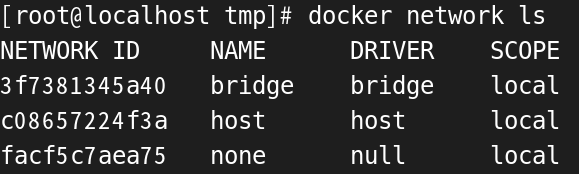
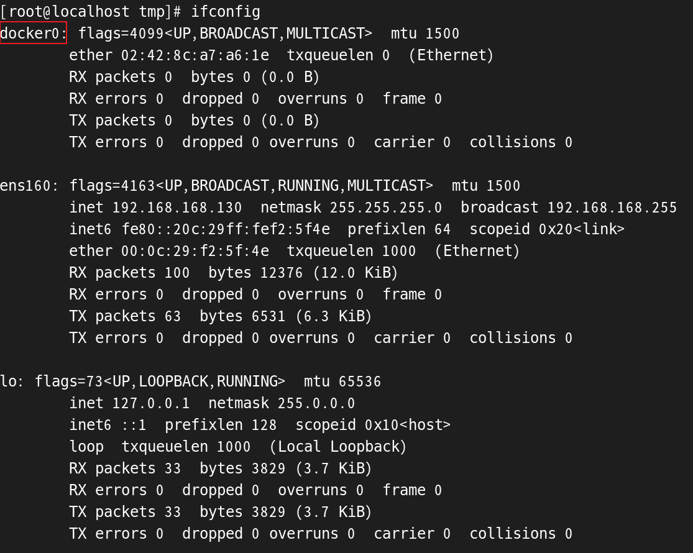
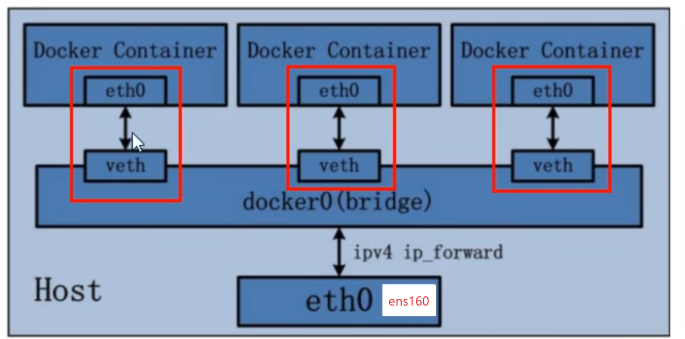
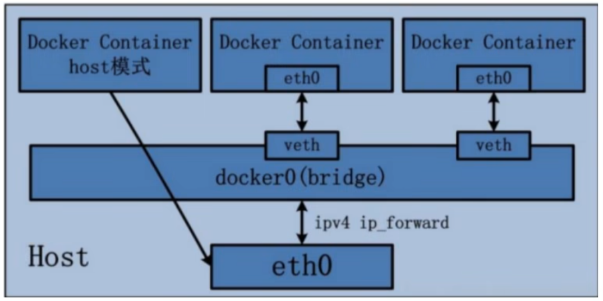
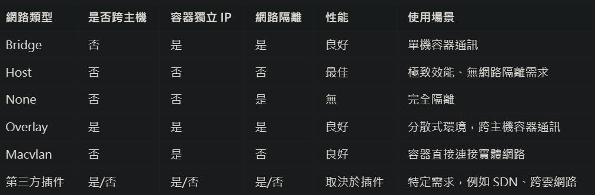

# 概念

* Container 是個封閉的空間，有些功能開發是需要與其他 Containers甚至是外界串接的，例如 PHP, MYSQL, Apache, Nginx 彼此溝通，因此Docker network因應不同需求發展出了多種類別的network。

<br/>

<br/>

# 能幹嘛?

1. 容器間的互聯和通信、端口映射。

2. 容器 IP 變動的時候，可以通過服務名，直接網路通信而不受影響；此情況是跨主機 IP 時候的常見問題。

<br/>

<br/>

# 默認的3個network模式

輸入以下指令查看 network，主要用 `bridge`，有時用 `host`，`none` 則不常見。

```sh
docker network ls
```



<br/>

<br/>

# ifconfig 查看

當在 vmware 上輸入 ifconfig，會出現以下網路配置。



<br/>

1. docker0: 代表是 bridge 模式下的虛擬網路接口，負責宿主機和容器間的通信。

2. ens160: 代表是 vmware 的網路位址，與宿主機共享網路。

3. lo: 代表 localhost，即本地網路。

<br/>

<br/>

# Bridge 模式下，docker0 與主機網路的關係

1. Docker 使用 docker0 來分配容器的內部 IP 地址，意義上跟 switch 雷同。

2. 架構圖；容器1要訪問容器2，需要透過 docker0 (bridge) 才能訪問，不能直接訪問，容器間是各自獨立的。

    

    所以每當建立一個 bridge network 時，就等同建立一組內網網路，可以在 ifconfig 查看到。

    <br/>

3. docker0 通常會自動分配一個默認子網，例如 172.17.0.0/16。

4. 宿主機上的 docker0 通常會有 IP 地址 172.17.0.1。

5. 當容器沒有指定網路時，Docker 會將其自動連接到 docker0。

6. 圖中，每個容器中，都還是會有一個 eth0，網卡接口，一對一的連接到 Bridge 的 veth，可以在容器內使用 `ip addr` 查看接口名稱。

<br/>

<br/>

# Host 模式下，網路架構

1. 容器`不會獲得`獨立的 network namespace，而是和宿主機共用一個 network namespace。

2. 容器將不會虛擬出自己的網卡，而是使用宿主機的 IP 和 Port。


3. 圖中使用 Host 模式的容器，直接會去連接宿主機的 eth0 網卡。

    


<br/>

<br/>

## 分為以下幾種 Network Drivers

### Network driver 解釋
* 為了讓 docker 支援多種網路類型，docker networking subsystem 被設計成是以可抽換 driver 的形式來運作，可根據使用者需求置換不同的 driver 來達到不同的網路設定目的；以下5個 driver 已經是預設存在的：

### 1. Bridge networks 最常見
* 預設就是使用此網路模式。

* 為每一個容器分配、設置 IP，並將容器連交到一個 docker0。

* 就像是 NAT 的網路模式，例如實體主機的 IP 是 192.168.1.10 ，會對應到 Container 裡面的 172.17.0.2，在啟動 Docker 的 service 時會有一個 docker0 的網路卡就是在做此網路的橋接。


### 2. Overlay networks
* 支援跨主機、分散式的容器通信，例如 Docker Swarm 或 Kubernetes。


### 3. Host networking 偶爾會使用
* Host networking 使 container 的隔離性質消失，在該 container當中可以直接使用例如 localhost 來找尋到主機上的 port 或其他資源。

* 容器不會虛擬出自己的網卡和配置 IP，而是使用宿主機的 IP 和 Port。

### 4. Macvlan networks
* 將容器直接連接到實體網絡，容器像實體設備一樣直接獲得網路位址，適用於需要直接與外部網路通訊的場景。

* 容器有獨立的 MAC 位址。

### 5. None networks 很少用

* 不設定 container 的網路，因此 container 無法對外通訊。

* 容器有 Network namespace，但沒有對其進行任何網路設置。

<br/>



<br/>

<br/>

# 查看指令
從主機查看 nginx container 的 IP 地址
```sh
docker container inspect --format "{{ .NetworkSettings.IPAddress}}" nginx
```

選擇 container 的 Network 類型
```sh
# 有 none, host, bridge, overlay, macvlan類型
docker run -it --network bridge nginx bash
```

<br/>

<br/>

# Network 指令
顯示當前 networks
```sh
docker network ls
```

檢查指定 network
```sh
docker network inspect [network_name]
```

建立 network
```sh
# bridge is default drive
docker network create --drive [driver_type] [network_name]
```

將 network 連接至 container
```sh
# Connect a running container to a network
docker network connect [network_name] [container_name]

# Connect a container to a network when it starts (啟動 container 時，可以連接至 network)
docker container run -d --name new_nginx --network my_local_network nginx
```

將 network 與 container 中斷連線
```sh
docker network disconnect
```


</br>

</br>

## 練習
新建立一個 bridge network，在此新建立兩個 nginx1 nginx2，並使用 nginx1 ping nginx2
```sh
#1 建立 network
docker network create -d bridge my_network

#2 建立 container 
docker container run -d --name nginx1 --network my_network nginx:alpine
docker container run -d --name nginx2 --network my_network nginx:alpine

#3 檢查
docker container ls
docker network inspect my_network

#4 執行 CLI
docker container exec -it nginx1 ping nginx2
```

`結論`: 自定義的 Network，容器之間可以使用 `IP` 或 `服務名稱` 來互相訪問。


<br/>

<br/>

# container 相互連接

已經是過時的方式。

`--link` Add link to another container；其實用 `docker-compose` 更簡單
```sh
# --link [container_name] [container]
docker container run -it --name my_nginx --link: db_01 mysql nginx
```