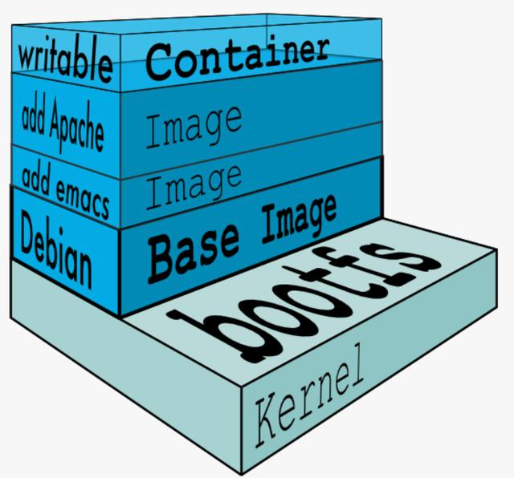

## Docker 資源運用

容器和虛擬機比較

* docker 容器是在`操作系統(OS)層面`上實現虛擬化；直接復用本地主機的操作系統，容器內沒有自己的 kernel (共享本地主機的 kernel)，也沒有硬件虛擬，因此比虛擬機輕便。

* 傳統虛擬機是在`硬體層面`上實現虛擬化，在每台虛擬機中都必須要有底層的作業系統，所以比較笨重。

 

 

## 鏡像分層概念

* Image 採用`分層結構`，資源共享、方便複製遷移，`就是為了重複使用`。

* Image 是由一層一層的文件系統組成，最基礎的稱為基礎鏡像 (Base Image)。

* Image 因為是分層系統，因此鏡像之間可以做繼承。

* docker images 的最底層就是引導文件系統 bootfs。

* 對於一個精簡的 OS，rootfs 可以很小，只需要包括最基本的命令、工具和程序庫就可以了，因為底層直接使用 Host 的 Kernel，自己只需要提供 rootfs 就行了，由此可見對於不同的 linux 發行版，bootfs 基本是一致的。rootfs 會有差別，因此不同的發行版可以公用 bootfs。

    * bootfs: 為啟動過程中提供必要的運作環境，確保系統能夠載入核心並進入根檔案系統。當系統啟動後，根檔案系統 (rootfs) 掛載後，bootfs 就不再使用，會被卸載。
    
    * rootgs: 在系統啟動完成後一直保持掛載狀態，直到系統關閉。

* Image 都是唯讀的，只有 Container 是可以編輯的。

 

 

## 