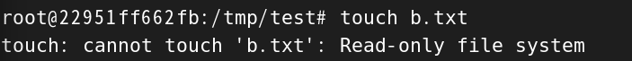

## 概念

1. 目錄或文件，存在一個或多個容器中，由 docker 掛載到容器。

2. 不屬於聯合文件系統，因此能繞過 Union File System 提供用於持續存儲或共享數據的特性。

3. volume 目的就是持久化，完全獨立於容器的生命週期，因此 docker 刪除容器時，不會刪除掛載的 volume。

4. 直接可以取代 docker cp 和 export 功能，是完全自動同步的。

5. 就算容器停止運行，修改掛載路徑下的文件，當容器重新啟動時，被修改的的文件，依舊會更新。

<br/>

<br/>

## 坑

1. 有 volume 指令的，記得要多加一個 `--privileged=true`，這個模式會給容器提供更高的權限，允許其訪問宿主機的幾乎所有功能。。

    * 例如訪問掛載主機的目錄，出現 `cannot open directory: Permission denied`，則加上 `--privileged=true` 即可。


<br/>

<br/>

## 指令

掛載路徑映射，如果沒有 /tmp/test 目錄，docker 會自動建立 (--privileged=true)。

```sh
docker run -d \
    --privileged=true \
    -v /tmp/test:/tmp/test
    nginx
```

<br/>

<br/>

## 讀寫規則

預設是讀寫 `:rw`，即 read, write

```sh
docker run -d \
    --privileged=true \
    -v /tmp/test:/tmp/test:rw
    nginx
```

當要設定成，容器內部只能讀，不能寫，則設定為 `:ro`

```sh
docker run -d \
    --privileged=true \
    -v /tmp/test:/tmp/test:ro
    nginx
```

若在容器內執行寫入動作，會被擋下




<br/>

<br/>

## volume 繼承

先建立一個 u1 容器，則 u2 可以繼承 u1 的掛載配置。


```sh
# 建立 u1 容器
docker run -d \
    --privileged=true \
    -v /tmp/test:/tmp/test:ro
    --name u1
    nginx


# 繼承 u1 容器
docker run -d \
    --privileged=true \
    --volumes-from u1 \
    nginx
```

當 u1, u2 容器都啟動時，當其中一個容器關閉，也不影響另一個容器，各自互相獨立。


