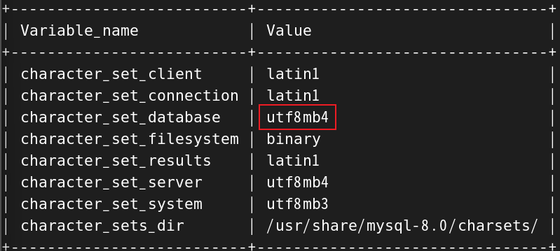

## mysql

安裝2步驟

1. 拉鏡像

    ```sh
    docker pull mysql:8.0.40
    ```

2. 啟動，環境變數`MYSQL_ROOT_PASSWORD`必須要設置，否則啟動報錯。

    ```sh
    docker run -d -p 3306:3306 --name my-mysql -e MYSQL_ROOT_PASSWORD=root mysql:8.0.40
    ```

3. 設定 root 用戶的身分驗證配置

    ```sh
    # 進入容器
    docker exec -it my-mysql /bin/bash

    # 進入容器中的 mysql
    mysql -u root -p

    # 在 mysql 中配置 root 權限
    ALTER USER 'root'@'%' IDENTIFIED WITH mysql_native_password BY 'root';

    # 刷新權限
    flush privileges;
    ```

4. 配置編碼，否則插入中文資料會亂碼。

    ```sh
    # 進入容器中的 mysql
    show variables like 'character%';
    ```

    

    這個環境變數要改成 `utf8mb4`

    ```sh
    # 臨時修改
    SET GLOBAL character_set_database = 'utf8mb4';
    ```

    或是在 `my.cnf` 檔案中配置，並重啟mysqld

    ```sh
    [mysqld]
    character_set_server = utf8mb4
    ```

5. 掛載 mysql 配置檔和資料的指令

    ```sh
    docker run -d \
    -p 3306:3306 \
    --privileged=true \
    -v /tmp/mysql/log:/var/log/mysql \
    -v /tmp/mysql/data:/var/lib/mysql \
    -v /tmp/mysql/conf:/etc/mysql/conf.d \
    -e MYSQL_ROOT_PASSWORD=root \
    --name my-mysql \
    mysql:8.0.40
    ```

6. 配置檔修改

    ```sh
    # host
    cd /tmp/mysql/conf/
    touch my.cnf
    vim my.cnf
    ```
    ```cnf
    [mysqld]
    character-set-server = utf8mb4
    collation-server = utf8mb4_unicode_ci

    [client]
    default-character-set = utf8mb4

    [mysql]
    default-character-set = utf8mb4
    ```

7. 重啟容器

    ```sh
    docker restart my-mysql
    ```

<br/>

<br/>

## redis

1. 拉鏡像

    ```sh
    docker pull redis:6.0.8
    ```

2. docker 啟用的 redis 沒有自帶的配置檔，都是預設帶好的，需要自己配置，這邊使用 -v 掛載後再進行配置。

3. 啟動

    ```sh
    docker run -d \
    -p 6379:6379 \
    --privileged=true \
    -v /tmp/redis/conf/redis.conf:/etc/redis/redis.conf \
    -v /tmp/redis/data:/data \
    --name my-redis \
    redis:6.0.8 \
    redis-server /etc/redis/redis.conf
    ``` 