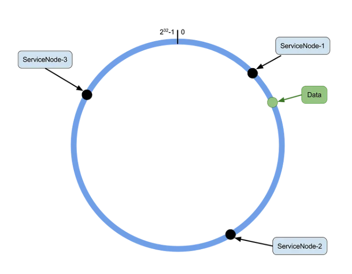
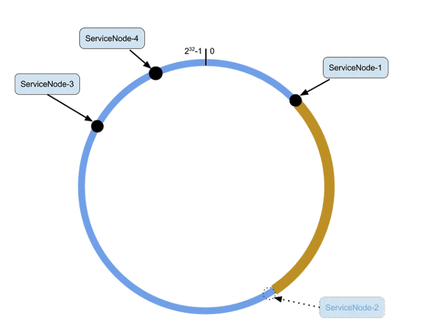
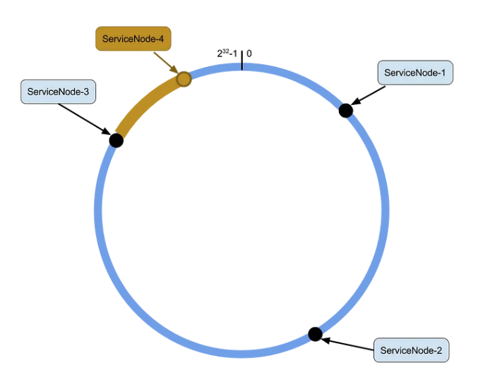
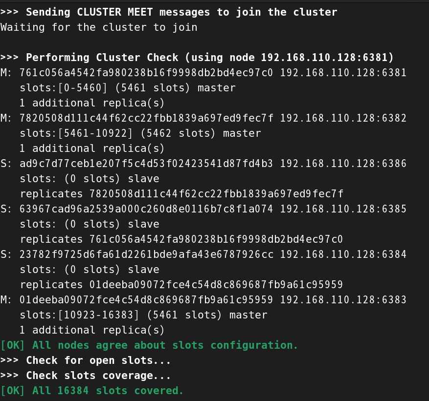

## mysql

安裝2步驟

1. 拉鏡像

    ```sh
    docker pull mysql:8.0.40
    ```

2. 啟動，環境變數`MYSQL_ROOT_PASSWORD`必須要設置，否則啟動報錯。

    ```sh
    docker run -d -p 3306:3306 --name my-mysql -e MYSQL_ROOT_PASSWORD=root mysql:8.0.40
    ```

3. 設定 root 用戶的身分驗證配置

    ```sh
    # 進入容器
    docker exec -it my-mysql /bin/bash

    # 進入容器中的 mysql
    mysql -u root -p

    # 在 mysql 中配置 root 權限
    ALTER USER 'root'@'%' IDENTIFIED WITH mysql_native_password BY 'root';

    # 刷新權限
    flush privileges;
    ```

4. 配置編碼，否則插入中文資料會亂碼。

    ```sh
    # 進入容器中的 mysql
    show variables like 'character%';
    ```

    

    這個環境變數要改成 `utf8mb4`

    ```sh
    # 臨時修改
    SET GLOBAL character_set_database = 'utf8mb4';
    ```

    或是在 `my.cnf` 檔案中配置，並重啟mysqld

    ```sh
    [mysqld]
    character_set_server = utf8mb4
    ```

5. 掛載 mysql 配置檔和資料的指令

    ```sh
    docker run -d \
    -p 3306:3306 \
    --privileged=true \
    -v /tmp/mysql/log:/var/log/mysql \
    -v /tmp/mysql/data:/var/lib/mysql \
    -v /tmp/mysql/conf:/etc/mysql/conf.d \
    -e MYSQL_ROOT_PASSWORD=root \
    --name my-mysql \
    mysql:8.0.40
    ```

6. 配置檔修改

    ```sh
    # host
    cd /tmp/mysql/conf/
    touch my.cnf
    vim my.cnf
    ```
    ```cnf
    [mysqld]
    character-set-server = utf8mb4
    collation-server = utf8mb4_unicode_ci

    [client]
    default-character-set = utf8mb4

    [mysql]
    default-character-set = utf8mb4
    ```

7. 重啟容器

    ```sh
    docker restart my-mysql
    ```

<br/>

<br/>

## mysql master-slave架構

依照此步驟 https://github.com/macrozheng/mall-learning/blob/master/docs/reference/mysql_master_slave.md


但有修改一下 mysql 的版本和路徑

```sh
# master
docker run -p 3307:3306 --name mysql-master \
-v /mydata/mysql-master/log:/var/log/mysql \
-v /mydata/mysql-master/data:/var/lib/mysql \
-v /mydata/mysql-master/conf:/etc/mysql/conf.d \
-e MYSQL_ROOT_PASSWORD=root \
-d mysql:8.0.40

# slave
docker run -p 3308:3306 --name mysql-slave \
-v /mydata/mysql-slave/log:/var/log/mysql \
-v /mydata/mysql-slave/data:/var/lib/mysql \
-v /mydata/mysql-slave/conf:/etc/mysql/conf.d \
-e MYSQL_ROOT_PASSWORD=root \
-d mysql:8.0.40
```

<br/>

<br/>

## redis

1. 拉鏡像

    ```sh
    docker pull redis:6.0.8
    ```

2. docker 啟用的 redis 沒有自帶的配置檔，都是預設帶好的，需要自己配置，這邊使用 -v 掛載後再進行配置。

3. 啟動

    ```sh
    docker run -d \
    -p 6379:6379 \
    --privileged=true \
    -v /tmp/redis/conf/redis.conf:/etc/redis/redis.conf \
    -v /tmp/redis/data:/data \
    --name my-redis \
    redis:6.0.8 \
    redis-server /etc/redis/redis.conf
    ``` 

<br/>

<br/>

## redis 分布式架構

Redis 的分片算法，如何將數據分布在不同 redis 實例中。

1. 標準哈希（Modulo Hashing）。

    * 優點: 實現簡單，適合節點數量不變的情況。

    * 缺點: 當節點增加或減少時，需要大量資料遷移，不適合動態擴展的場景。

2. 一致性哈希（Consistent Hashing）。

    * 目的: 當服務器個數發生變動時，盡量減少影響客戶端到服務器的映射關係。

    * 優點: 當節點增減時，對已有數據的影響較小；適合需要動態伸縮的環境。

    * 缺點: 實現較為複雜；在節點數量少的情況下容易產生資料分佈不均衡（可透過虛擬節點解決）。

    * 步驟: 

        1. 算法構建一致性 hash circle，共 `0 ~ 2^32 -1`。
        2. 服務器 IP 節點映射。
        3. 數據儲存時的規則，將 key-value 的 key 進行 hash，產生的值往順時鐘移動，遇到的第一個 IP 節點，就是要儲存的 redis 實例。

        <br/>

        下圖中，Data 就會存在節點2。

        

        <br/>

        若節點2沒了，Data 就會存在節點3。

        

        <br/>

        若新增了一個節點4，落在節點3到節點4之間的數據(黃色段)，都必須要重新寫入到節點4一次。

        

        結論，當新增或減少節點時，只需要另存黃色段的數據，不用全部重新將所有數據重新計算，改善了`標準哈希算法`。


3. Hash Slot 算法 (最常見用法)

    * 目的: 為了解決數據分配不均勻的問題。在數據和節點之間又加入了一層，把這層稱為 hash slot，用於管理數據和節點之間的關係。 

    * 有多少個 slot: `0 ~ 2^14 -1`，總共16384個。

    * 公式:  HASH_SLOT = CRC16(key) mod 16384


範例，開啟6個redis容器，3台master、3台slave。

1. 建立6個節點

    ```sh
    docker run -d --name redis-node-1 --net host --privileged=true -v /data/redis/share/redis-node-1:/data redis:6.0.8 --cluster-enabled yes --appendonly yes --port 6381

    docker run -d --name redis-node-2 --net host --privileged=true -v /data/redis/share/redis-node-2:/data redis:6.0.8 --cluster-enabled yes --appendonly yes --port 6382

    docker run -d --name redis-node-3 --net host --privileged=true -v /data/redis/share/redis-node-3:/data redis:6.0.8 --cluster-enabled yes --appendonly yes --port 6383

    docker run -d --name redis-node-4 --net host --privileged=true -v /data/redis/share/redis-node-4:/data redis:6.0.8 --cluster-enabled yes --appendonly yes --port 6384

    docker run -d --name redis-node-5 --net host --privileged=true -v /data/redis/share/redis-node-5:/data redis:6.0.8 --cluster-enabled yes --appendonly yes --port 6385

    docker run -d --name redis-node-6 --net host --privileged=true -v /data/redis/share/redis-node-6:/data redis:6.0.8 --cluster-enabled yes --appendonly yes --port 6386

    ```

2. 建立節點之間的 master-slave 關係。

    ```sh
    # 進入任何一台容器都可以
    docker exec -it redis-node-1 /bin/bash
    ```

3. 進入容器後，執行

    ```sh
    redis-cli --cluster create 192.168.110.128:6381 192.168.110.128:6382 192.168.110.128:6383 192.168.110.128:6384 192.168.110.128:6385 192.168.110.128:6386 --cluster-replicas 1
    ```

4. 成功會顯示

    

5. 在容器中查看 cluster 狀態。

    ```sh
    # 進入容器
    docker exec -it redis-node-1 /bin/bash

    # 進入 redis
    redis-cli -p 6381

    # 查看集群資訊
    cluster info

    # 查看 slave 是掛在哪台 master 下面
    cluster nodes
    ```