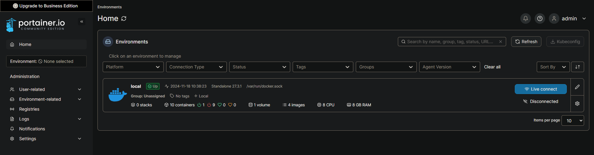
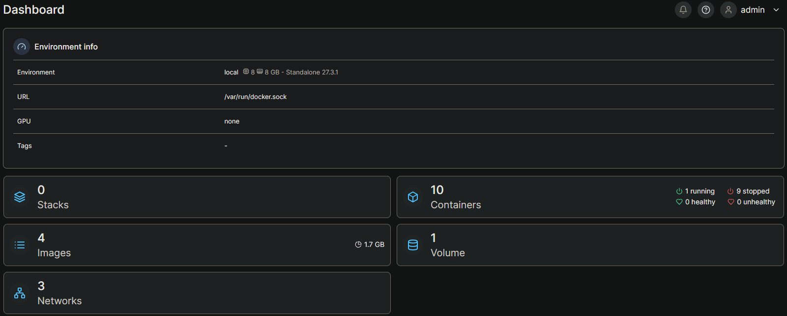
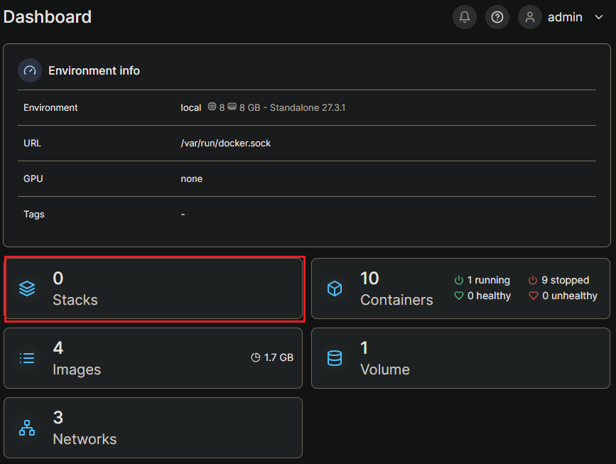
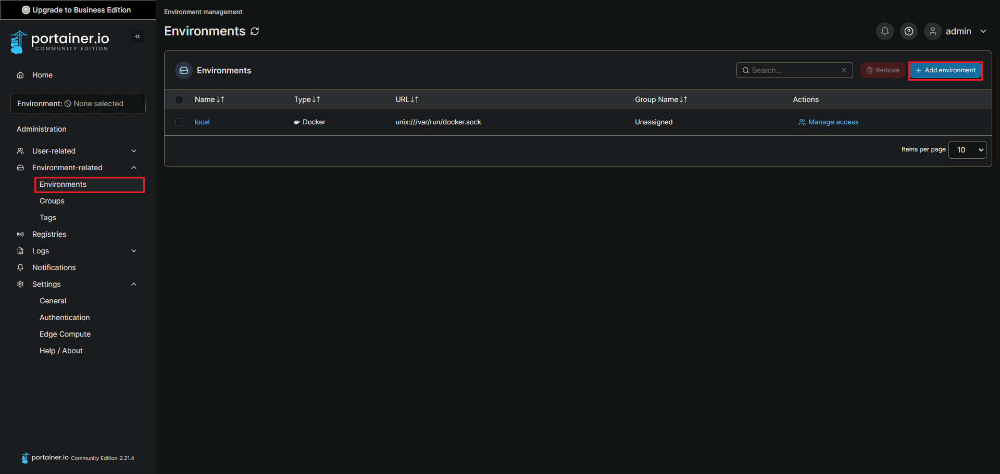
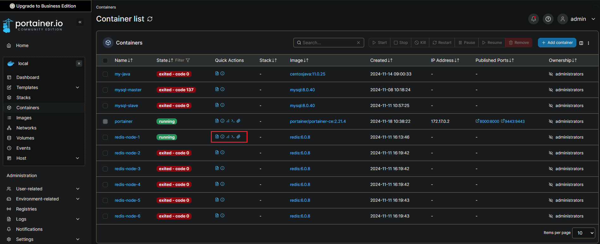

## 概述

1. `輕量級`的容器管理工具，專門設計用來簡化 Docker 環境的管理。

2. 提供了一個直觀的網頁圖形化界面（Web UI），讓用戶可以更容易地`監控`和操作 Docker 容器、影像、網路、卷等資源。


<br/>

<br/>

## 安裝在 Linux 上

安裝

```sh
docker run -d -p 8000:8000 -p 9443:9443 \
--name portainer --restart=always \
-v /var/run/docker.sock:/var/run/docker.sock \
-v portainer_data:/data \
portainer/portainer-ce:2.21.4
```

訪問服務 https://localhost:9443/ ，第一次訪問，需要設定 admin 密碼。

登入後，可看到以下介面。



<br/>

可以看到 `local` 主機上的資訊，點進去顯示 Dashboard。



<br/>

Dashboard 中的 Stack，指的就是 docker-compose。



<br/>

以上是只有一台主機上的監控，若要添加新的環境，可以在新增監控的主機。



<br/>

被監控的主機上，需要安裝 `portainer agent`。

<br/>

<br/>

容器的命令都已圖形化，這排功能鍵可以使用。

由左到右分別是 logs、inspect、stats、exec、attach。



<br/>