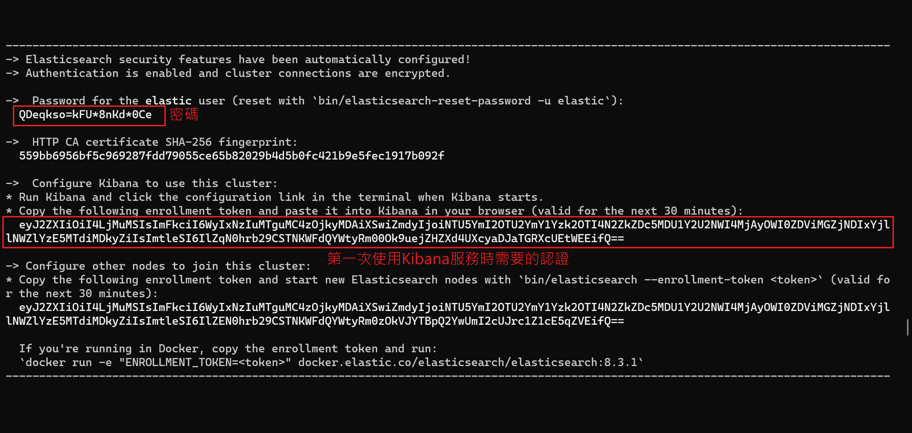
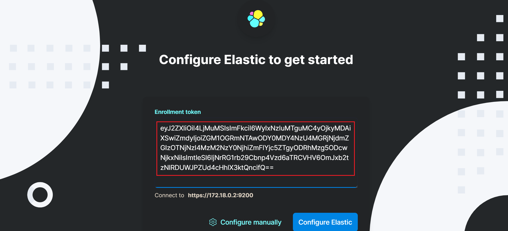
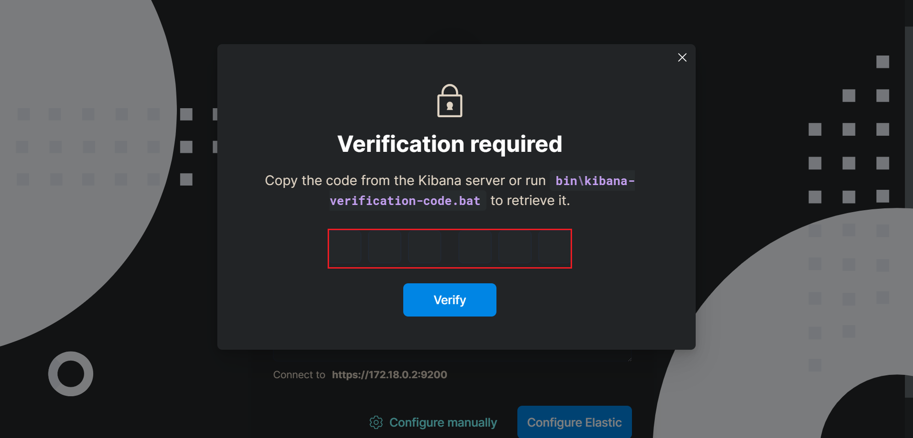
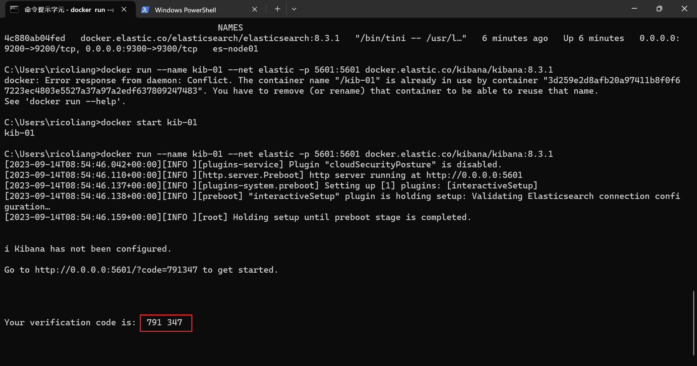
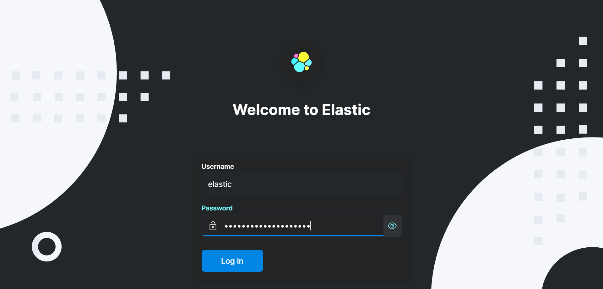

## 在 Windows 使用 docker 啟動 ES

步驟: 

1. 安裝 docker desktop (需要先安裝WSL)，並為 elastic 建立一個新的 network

    ```sh
    docker network create elastic
    ```

2. 抓取 docker image，版本可以查看 [官網](https://www.docker.elastic.co/r/elasticsearch)

    ```sh
    docker pull docker.elastic.co/elasticsearch/elasticsearch:8.3.1
    ```

3. 下載好 Image 後，啟動 container。

    ```sh
    docker run --name "ES-SERVER" --net elastic -p 9200:9200 -p 9300:9300 -t docker.elastic.co/elasticsearch/ -e "discovery.type=single-node" elasticsearch:8.3.1
    ```

    補充: 

    * `75082a00ae85` 是 image ID
    * `-d` : 在後台運行
    * `-p` : ES 默認使用9200端口提供 HTTP 訪問，9300端口提供節點間通信
    * `-e "discovery.type=single-node"` : 環境參數，用於設置 ES 的節點發現類型為單節點，這樣 ES 將以單節點模式運行
    * `-e "xpack.security.enabled=false"` : 可選，環境參數，表示停用安全設定，不需帳密即可存取 ES 服務，但是如果要使用 Kibana，就需要使用帳密模式。

4. 如果產生此錯誤，則需要去 docker-desktop 調整記憶體大小

    ```sh
    ERROR: Elasticsearch exited unexpectedly, with exit code 78
    ```

    ```sh
    # 調整方式
    wsl -d docker-desktop

    sysctl -w vm.max_map_count=262144

    exit
    ```

5. 啟動後，可以在瀏覽器 localhost:9200 測試是否正常，或是使用指令檢查

    ```sh
    curl http://localhost:9200/?pretty
    ```
    ```sh
    {
        "name" : "92682a776219",
        "cluster_name" : "docker-cluster",
        "cluster_uuid" : "nq9tUKnDQAydIN0sbWwt6A",
        "version" : {
            "number" : "8.3.1",
            "build_type" : "docker",
            "build_hash" : "b9a6b2867996ba92ceac66cb5bafc6db25e7910e",
            "build_date" : "2022-06-29T18:39:55.731992798Z",
            "build_snapshot" : false,
            "lucene_version" : "9.2.0",
            "minimum_wire_compatibility_version" : "7.17.0",
            "minimum_index_compatibility_version" : "7.0.0"
        },
        "tagline" : "You Know, for Search"
    }
    ```


<br/>

<br/>

## 在 Windows 使用 docker 啟動 Kibana

步驟: 

1. 需要先啟動 ES 服務，第一次啟動 ES 時，並會產生以下認證訊息，等一下會用到。

    

    <br>

2. 開始安裝下載 Image 及啟動 Container

    ```sh
    docker pull docker.elastic.co/kibana/kibana:8.3.1

    docker run --name kib-01 --net elastic -p 5601:5601 docker.elastic.co/kibana/kibana:8.3.1
    ```

    <br>


3. 啟動 Kibana 後，連線至 `http://localhost:5601` ，把剛剛 ES 服務產生的 token 貼過來認證，並按下 Configure Elastic。

    

    <br/>

4. 需要再輸入一次驗證碼，驗證碼會顯示在 Kibana 服務的 LOG 上。

     

    <br/>

     

    <br/>

5. 此時跳轉到登入畫面，把步驟1的帳號密碼貼入

     

    <br/>

6. 登入後，即可進到服務內。


<br/>

<br/>

## Reference

> Docker ES 安裝 https://elasticstack.blog.csdn.net/article/details/99413578

> Docker Kibana 安裝 https://elasticstack.blog.csdn.net/article/details/130921373