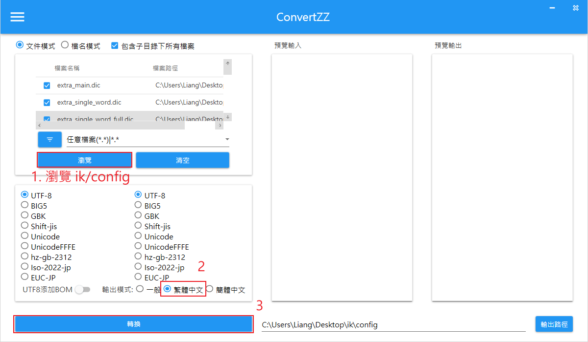

# IK分詞器

## 安裝

參考 README 有指令可以安裝
https://github.com/infinilabs/analysis-ik

<br/>

<br/>

## 簡體中文轉繁體中文
1. 下載 ConvertZZ  
    https://github.com/flier268/ConvertZZ/releases

2. 下載後打開，右鍵選 `文件/檔名轉換`

3. 選擇 ik/config 路徑

    

4. 轉換完成後，把 ik 整個目錄放到 es 的外掛路徑下

    ```sh
    /usr/share/elasticsearch/plugins/
    ```

5. 重啟 ES

    ```sh
    systemctl restart elasticsearch
    ```

<br/>

<br/>

## IK分詞器
有分為2種

- `ik_smart`，自動分
- `ik_max_word`，切分最細


<br/>

<br/>

## 拓展字典 / 停用字典

編輯配置檔 `IKAnalyzer.cfg.xml`
```sh
vim /usr/share/elasticsearch/plugins/ik/config/IKAnalyzer.cfg.xml
```


再配置檔中，加上 `ext_dict.dic` 和 `ext_stopwords.dic` 這兩個字典
```xml
<?xml version="1.0" encoding="UTF-8"?>
<!DOCTYPE properties SYSTEM "http://java.sun.com/dtd/properties.dtd">
<properties>
        <comment>IK Analyzer 擴充套件配置</comment>
        <!--使用者可以在這裡配置自己的擴充套件字典 -->
        <entry key="ext_dict">ext_dict.dic</entry>
         <!--使用者可以在這裡配置自己的擴充套件停止詞字典-->
        <entry key="ext_stopwords">ext_stopwords.dic</entry>
        <!--使用者可以在這裡配置遠端擴充套件字典 -->
        <!-- <entry key="remote_ext_dict">words_location</entry> -->
        <!--使用者可以在這裡配置遠端擴充套件停止詞字典-->
        <!-- <entry key="remote_ext_stopwords">words_location</entry> -->
</properties>
```

並在 config 路徑下建立檔案
```sh
touch ext_dict.dic
touch ext_stopwords.dic
```

編輯拓展字典
```
vim ext_dict.dic
```

編輯停用字典
```
vim ext_stopwords.dic
```

重啟 ES
```sh
systemctl restart elasticsearch.service 
```