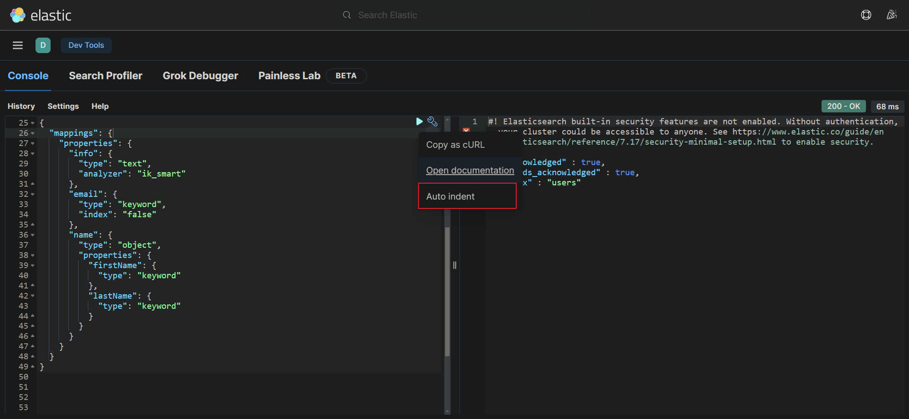
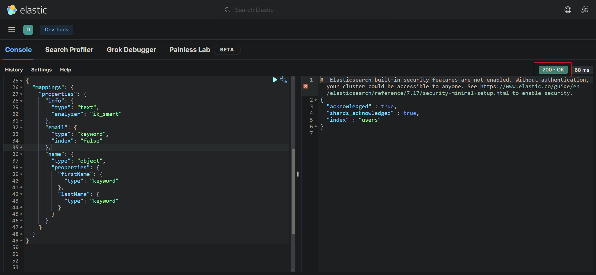
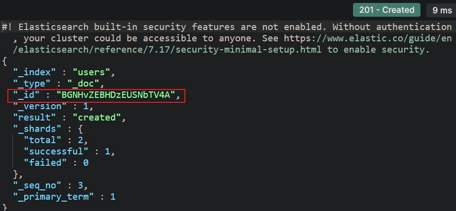

# 名詞解釋


|ES|RDS|說明|
|--|--|--|
|Table|Index| document 的集合類似資料表 |
|Row| Document| 一筆筆的數據，都是 JSON 格式 |
|Column| Field| 欄位的名稱|
|Schema|Mapping| document中的約束 |
|SQL|DSL|是ES提供的JSON風個的請求語句，用來操作ES，實現CRUD|

<br/>

<br/>

## 創建索引庫
創建index(索引庫)，對於一般的資料庫來說，就是指創建資料表的意思，新增是用 `PUT` 方法。

注意，用 `PUT` 的原因是因為 PUT 在 restful 中為 `idempotent`，發送了 n 次的請求，都只會創建一個 index。

```JSON
PUT /users // index名稱
{
    "mappings": {
        "properties": {
            "info": { // field名稱
                "type": "text",
                "analyzer": "ik_smart"
            },
            "email": { // field名稱
                "type": "keyword",
                "index": "false" // 不參與搜索，不見建立倒排索引
            },
            "name": { // field名稱
                "type": "object", // field是物件
                "properties": { // 子屬性，嵌套寫法
                    "firstName": {
                        "type": "keyword"
                    },
                    "lastName": {
                        "type": "keyword"
                    }
                }
            }
        }
    }
}
```

<br/>

點選此按鈕，可以 format json




送出，可以看到建立完成



<br/>

<br/>

## 查詢/刪除 索引庫
查詢索引庫語法，符合 restful。
```JSON
GET /users
```

刪除索引庫語法
```JSON
DELETE /users
```

<br/>

<br/>

## 修改索引庫
1. 在 ES 中，是禁止修改索引庫，原因是倒排索引在建立後，假如要修改一個 Field，會導致原有的倒排索引失效。

2. 雖然 mapping 一旦建立後無法修改，但是`可以添加新的 Field`。

    * 注意，新 Field 的名稱不可跟舊的 Field 相同，否則會被認為是修改原 mapping，會報錯。

    ```json
    // users 為索引庫名稱
    PUT /users/_mapping
    {
        "properties": {
            "newField": { // 新field名稱
                "type": "integer"
            }
        }
    }
    ```


<br/>

<br/>

## 新增/查詢/刪除 文檔(document)


### 新增 document DSL
* 使用 `POST` 請求
* `文檔ID`必須寫在路徑中，以符合 restful。
    * 若不填寫`文檔ID`，ES 會自動產生一組。


```json
// users 為索引庫名稱
POST /users/_doc/1
{
    "info": "我愛JAVA爪哇",
    "email": "java@google.com",
    "name": {
        "firstName": "王",
        "lastName": "老"
    }
}
```

若不填寫 document id，ES會自動產生一組。


<br/>

<br/>

### 查詢 document DSL
查詢使用 `GET`，依 id 查詢
```json
GET /users/_doc/1
```

若要查詢所有的 document，使用 `_search` 
```json
GET /users/_doc/_search
```


<br/>

<br/>

### 刪除 document DSL
刪除使用 `DELETE`
```json
DELETE /users/_doc/1
```

<br/>

<br/>

### 修改 document DSL
修改有2種方式

1. `全量修改`
    
    * 會先查詢 id 是否存在，存在會刪除後再新增，不存在會直接新增，所以`既能修改也能新增`。
    * 即 `updateOrCreate` 方式，效率較低(因為要先查詢)。

    * 和`新增document`的語法幾乎相同，只是動作為 `PUT`。

    ```json
    PUT /users/_doc/1
    {
        "info": "testtest123",
        "email": "test@test.com",
        "name": {
            "firstName": "姥姥王",
            "lastName": "老"
        }
    }
    ```

2. `增量修改`

    * 修改指定欄位值。

    * 使用 `POST`，原因猜測是 ES 不支援 PATCH，故使用 POST

    * 使用 `_update` 關鍵字和`document id`

    ```json
    POST /users/_update/1
    {
        "doc": {
            "email": "updateEmail@google.com"
        }
    }
    ```