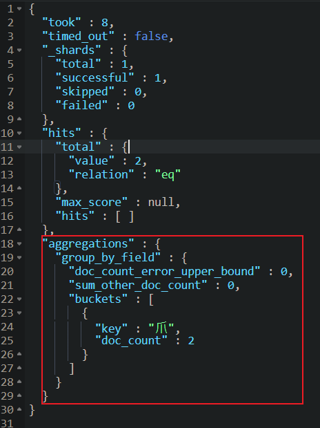
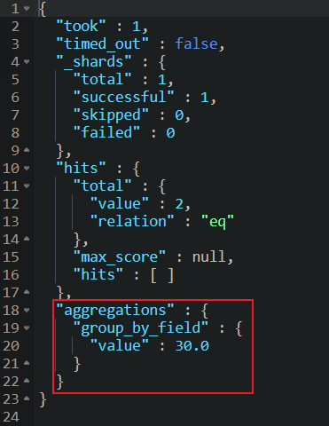

## 聚合查詢

### 分組聚合

用於對查詢結果進行分組、計算和匯總。透過聚合，可以從資料中取得統計資料、直方圖、平均值、最大值、最小值、計數等。

```json
GET /users/_search
{
  "aggs": {              // 聚合查詢關鍵字
    "group_by_field": {  // 欄位名稱，可隨便取
      "terms": {         // 聚合方式，terms 表示[分組聚合]
        "field": "name.firstName"   // 分組欄位
      }
    }
  },
  "size": 0    // 不返回原始數據，僅返回聚合結果
}
```

結果如下



<br/>

### 統計聚合

```json
GET /users/_search
{
  "aggs": {              // 聚合查詢關鍵字
    "field_average": {   // 欄位名稱，可隨便取
      "avg": {           // 聚合方式，avg 表示取平均
        "field": "age"   // 欄位
      }
    }
  },
  "size": 0    // 不返回原始數據，僅返回聚合結果
}
```

結果如下



<br/>