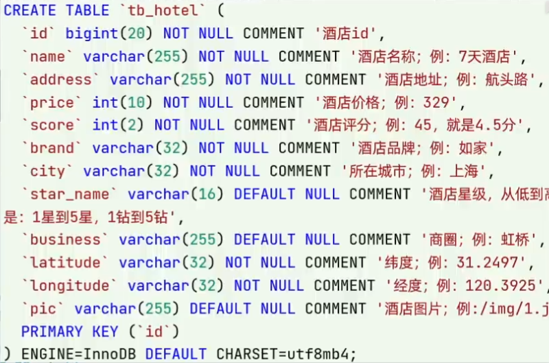
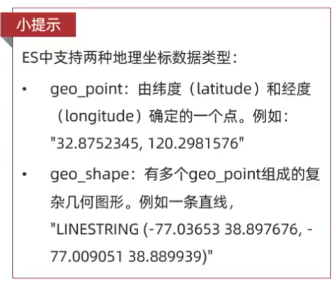
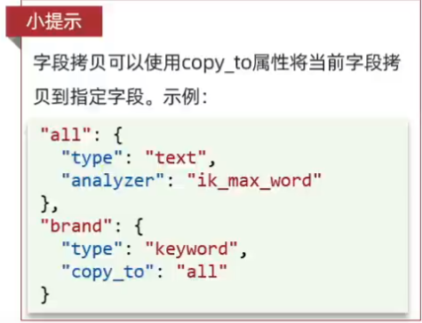

## 概述

* 官方提供各種語言的客戶端，用來操作 ES。

    * Java RestClient，以 Java 為例，有包含

        * Low Level REST Client
        * High Level REST Client，為 Low 版本的封裝


* 客戶端的本質就是組裝 DSL 語句，通過 HTTP 發送給 ES。


<br/>

<br/>

## 範例

將 mysql 中的資料表，轉為 es 的索引庫



<br/>

### 建立index

```json
# id 在 ES 中會被定義為字串，並且不可分割，故為 keyword
# address 假設不會被搜尋，故也不需要index
# ES 中的地理座標數據類型有2種(geo_point 和 geo_shape)，geo_point一個欄位包含了經度/緯度兩個數據
PUT /hotel
{
  "mappings": {
    "properties": {
      "id": {
        "type": "keyword"
      },
      "name": {
        "type": "text",
        "analyzer": "ik_max_word",
        "copy_to": "all"
      },
      "address": {
        "type": "keyword",
        "index": false,
        "copy_to": "all"
      },
      "price": {
        "type": "integer"
      },
      "score": {
        "type": "integer"
      },
      "brand": {
        "type": "keyword",
        "copy_to": "all"
      },
      "city": {
        "type": "keyword"
      },
      "starName": {
        "type": "keyword"
      },
      "business": {
        "type": "keyword"
      },
      "location": {
        "type": "geo_point"
      },
      "pic": {
        "type": "keyword",
        "index": false
      },
      "all": {
        "type": "text",
        "analyzer": "ik_max_word"
      }
    }
  }
}
```

<br/>

補充: ES 的地理座標數據類型有2種



<br/>

ES 提供了一個特殊用法 `copy_to`

* copy_to 為 Mapping 中的一個用法，可以將一個欄位的值複製到另一個`虛擬欄位`。這樣可以透過一個新的欄位來實現多個欄位的組合搜索，而不必單獨搜索每個欄位。常用於需要對多個欄位進行組合搜尋的場景。

* copy_to 會額外建立一個倒排索引，將複製進來的欄位內容一起建立。

* 舉例: 因為多個欄位一起做動態搜尋時，會比較有效率，所以可以將 `name`、`address`、`brand` 等欄位複製到 `all` 欄位中，這樣搜尋 `all` 時，就可以搜尋到此3個欄位的內容。

    

    ```json
    # 完整寫法
    # all 的名稱可以隨便取
    "all": {
        "type": "text",
        "analyzer": "ik_max_word"
    },
    "name": {
        "type": "text",
        "analyzer": "ik_max_word",
        "copy_to": "all"
    },
    "address": {
        "type": "keyword",
        "index": false,
        "copy_to": "all"
    },
    "brand": {
        "type": "keyword",
        "copy_to": "all"
    }
    ```