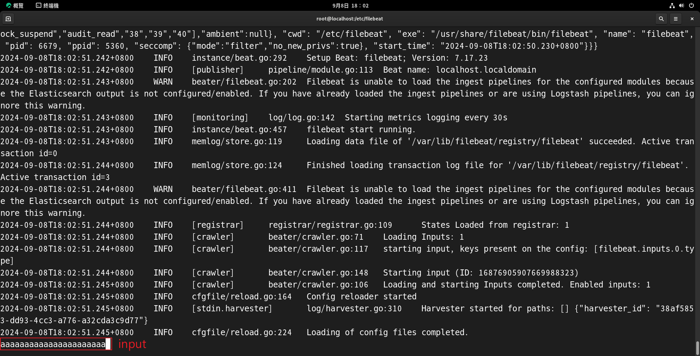
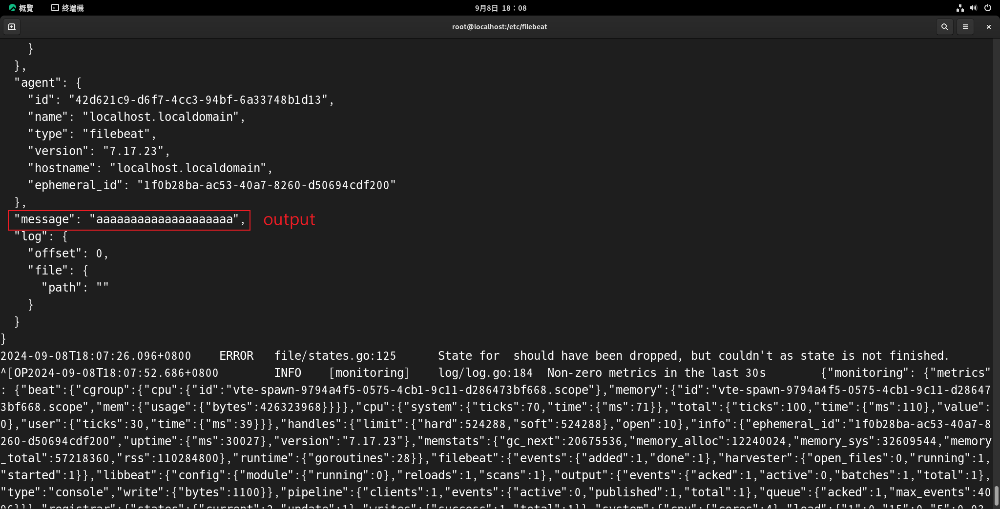

## 基礎配置

配置檔案在 `/etc/filebeat/filebeat.yml`


<br/>

<br/>

## 測試 input / output 

`可以當作 debug 模式`:  
在測試 input / output 時，會用此方式在 console 中手動輸入日誌，並將日誌全都輸出在 console 中，方便偵錯。

```yml
# filebeat.yml 配置

# 輸入
filebeat.inputs:
- type: stdin

# 輸出
output.console:
  pretty: true
```

接著 shell 輸入以下指令
```sh
# -e，將日誌輸出到標準輸出（stdout），即直接在命令行或終端中顯示日誌信息，而不是寫入到日誌文件中。

# -c，config，使用哪一個配置檔
filebeat -e -c /etc/filebeat/filebeat.yml
```

接下來可以在 console 中輸入以下 



filebeat 會在 console 中返回 json 資料，`message` 屬性為剛輸入的資料，其他的都是一些元數據或是其他日誌資訊。




<br/>

<br/>