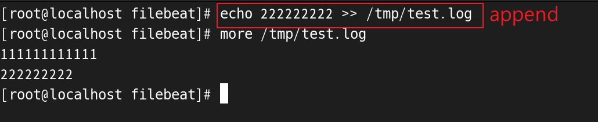
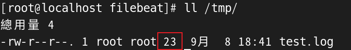
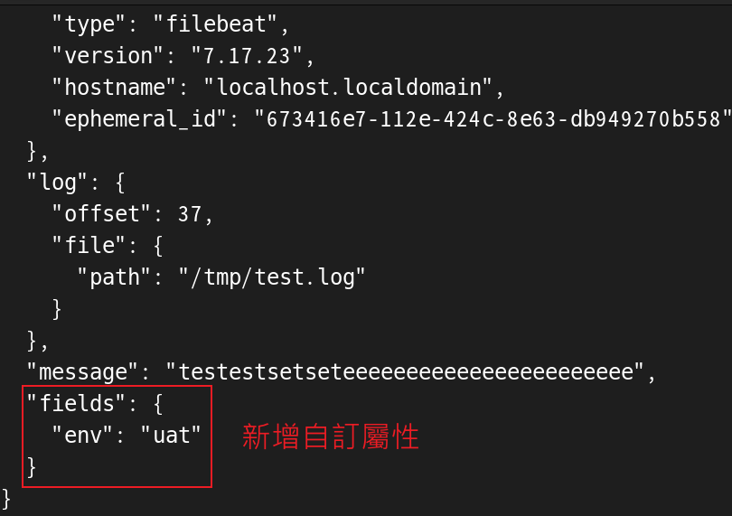
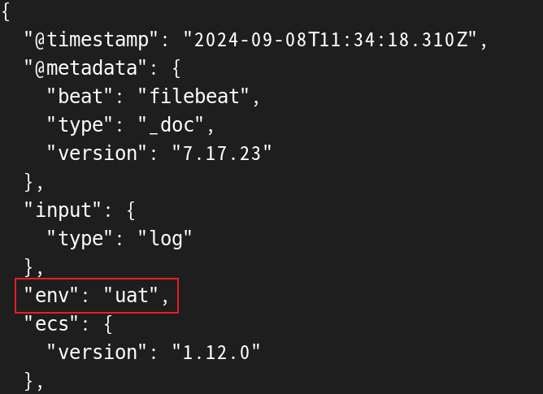
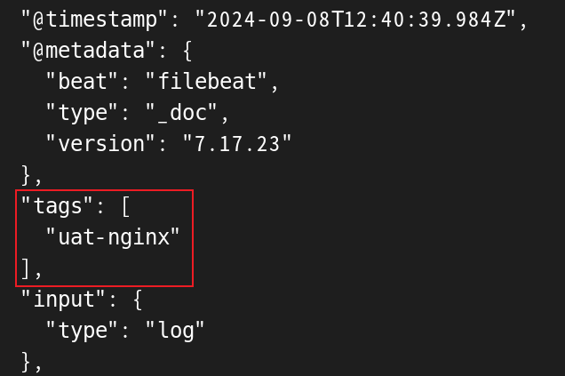

## 概述

重點: 
1. filebeat 讀取日誌檔案是 `按行讀取`。

    * 只要日誌不換行，就會被 filebeat 當作該筆日誌還沒寫完，就不會動作直到日誌中出現換行。

2. 偏移量的檔案放在 `/var/lib/filebeat/registry/filebeat` 目錄下的 JSON 檔。

    * 日誌中已經被 filebeat 讀取過的行，就不會再輸出了，只有新產生的行才會輸出。

3. 配置中的 `type: log`，有經過改進，新的寫法是讀取檔案可以改用 `type: filestream`，有更佳的性能。

    * 註冊檔案 (Registry File) 也是記錄偏移量，路徑同上。

<br/>

<br/>

## 輸入為 log 配置

輸入使用 log 檔案，輸出先使用 console 作為偵錯模式
```yml
# filebeat.yml

# 輸入
filebeat.inputs:
- type: log
  paths:
    - /tmp/test.log

# 輸出
output.console:
  pretty: true
```

測試一下，pipeline 是否正常

```sh
filebeat -e -c /etc/filebeat/filebeat.yml
```

若 /tmp/test.log 中的文字輸出在 console，代表成功。

<hr>

<br/>

若再將一筆數據寫進日誌檔案中，




<br/>

<br/>

## 偏移量紀錄

filebeat 會記錄 input 的日誌檔案，已經處理到哪一行了，並將處理過的日誌文件的位置和偏移量寫進到
`/var/lib/filebeat/registry/filebeat` 
下的 JSON 檔案中。

下次要再讀取 log 檔案時，就不必從頭開始讀取。

### 查看 registry 檔案

``/var/lib/filebeat/registry/filebeat``目錄下，有2個檔案，進入 `log.json`

```json
// 只取最新一筆
{"op":"set","id":42}
{"k":"filebeat::logs::native::16838529-64768","v":{"id":"native::16838529-64768","prev_id":"","offset":23,"type":"log","source":"/tmp/test.log","timestamp":[2061887315913,1725792819],"ttl":-1,"FileStateOS":{"inode":16838529,"device":64768},"identifier_name":"native"}}
```

<br/>

* `source` 屬性，代表讀取的日誌檔案 `/tmp/test.log`。

* `offset` 屬性，代表讀取的日誌檔案的偏移量 `23`。

<br/>

使用 `ll` 可以看到檔案的偏移的大小即為 `23 Byte`




<br/>

<br/>

### 偏移量解釋
這樣的設計方式，是防止一種情境，當 filebeat 服務掛掉，重新讀取日誌文件時，若沒有紀錄偏移量，會導致 filebeat 從頭再讀一次日誌檔案，`導致輸入的數據會重複`，所以要將偏移量做持久化。

<br/>

<br/>

### 刪除偏移量紀錄檔案
若想要重新輸出 log 檔案，可以將紀錄偏移量的檔案刪除，下次輸出時，就會讀取整份 log 檔案。

```sh
rm -rf /var/lib/filebeat/*
```


## 輸入為多個 log 配置 / 其他配置


### fields 屬性
為每筆數據定義`自定義屬性`，這些屬性會被添加到輸入收集的每個事件中。

```yml
# 輸入
filebeat.inputs:
- type: log 
  enabled: false 
  paths:
    - /var/log/system.log
    - /var/log/wifi.log
  tags: ["uat-service-1"]  
- type: log 
  enabled: true # 是否啟用，默認true
  paths:
    - "/var/log/docker/*/*.log" # 可以使用 `*` 作為通配符，抓取日誌
  fields: # 添加欄位名稱
    env: uat
  fields_under_root: true # 欄位是否宣告在 root 下
  tags: ["uat-service-2"]

# 輸出
output.console:
  pretty: true
```


<br/>

輸出後，多出一個 `fields` 欄位，用來傳遞參數



<br/>

`fields_under_root: true`，會將屬性宣告在最外面一層。



<br/>

<br/>


### tags 屬性

日誌數據添加 `tags` 屬性。可以用來對日誌進行分類或標識，並且在發送到 Elasticsearch 或 Logstash 之後，這些標籤可以用於進行更細粒度的查詢或過濾

```yml
# 輸入
- type: log 
  paths:
    - "/var/log/nginx/*/access.log"
  tags: ["uat-nginx", "公司系統", "RD"] # 可以添加多個

# 輸出
output.console:
  pretty: true
```

<br/>



<br/>

<br/>

### 注意 : `fields` 和 `tags` 在 JSON 中的型別是不同的。

* `fields`: key-value，可以更客製化欄位。
* `tags`: array，簡單的標記。