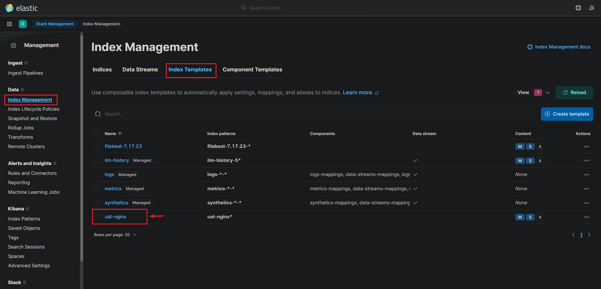

## 輸出配置到 Elasticsearch

自定義 ES 索引名稱，`output.elasticsearch.index` 屬性來定義

根據官方文檔，需要使用自定義index，需要配置以下，缺一不可
1. `ILM` (Index Lifecycle Management) 關閉。

2. 配置 `setup.template.name`和`setup.template.pattern` 兩個屬性。

<br/>


```yml
# 輸入
filebeat.inputs:
- type: log
  paths:
    - /tmp/test.log

# 輸出
output.elasticsearch:
  enabled: true
  hosts: ["localhost:9200", "10.10.20.177:9230"]
  index: "uat-nginx-%{+yyyy.MM.dd}"

# 設置索引模板的名稱
setup.template.name: "uat-nginx"
# 設置索引模板的匹配模式
setup.template.pattern: "uat-nginx*"
# 關閉索引的生命週期管理
setup.ilm.enabled: false
```

<br/>

以上配置完可以查看是否 Index Template 有正常加載。




<br/>

<br/>


## 在 Kibana 查看數據是否成功儲存至 ES

### 建立 Discover
1. 左邊工具列 > Management > Stack Management
2. Index Management > Reload indices，查看index是否有被載入。
3. 左邊工具列 > Kibana > Index Patterns > Create index pattern
4. 填寫 index name / 選擇 @Timestamp > Create index pattern 。

5. 左邊工具列 > Discover

### 刪除數據
1. 左邊工具列 > Index Management 
2. 勾選索引 > Manage index 

3. Delete index

<br/>

<br/>

## 輸出配置到 Elasticsearch，依照 tags 拆成不同的索引

上面的範例只能建立單個索引，若需要依照條件建立不同索引，需要使用 `fields` 或 `tags` 配置，以下使用 `fields` 和 `tags` 作範例。


`fields` 範例

```yml
# 輸入
filebeat.inputs:
- type: log
  paths:
    - /tmp/app1.log
  fields:
    env: uat-app1

- type: log
  paths:
    - /tmp/app2.log
  fields:
    env: uat-app2

# 輸出
output.elasticsearch:
  enabled: true
  hosts: ["localhost:9200"]
  indices:
    - index: "uat-app1-%{+yyyy.MM.dd}"
      when.equals:
        fields.env: "uat-app1"

    - index: "uat-app2-%{+yyyy.MM.dd}"
      when.equals:
        fields.env: "uat-app2"

# 設置索引模板的名稱
setup.template.name: "uat-nginx"
# 設置索引模板的匹配模式
setup.template.pattern: "uat-nginx*"
# 關閉索引的生命週期管理
setup.ilm.enabled: false
```

`tags` 範例

```yml
# 輸入
filebeat.inputs:
- type: log
  paths:
    - /tmp/app1.log
  tags: ["uat-app1"]

- type: log
  paths:
    - /tmp/app2.log
  tags: ["uat-app2"]

# 輸出
output.elasticsearch:
  enabled: true
  hosts: ["localhost:9200"]
  indices:
    - index: "uat-app1-%{+yyyy.MM.dd}"
      when.contains:
        tags: "uat-app1"

    - index: "uat-app2-%{+yyyy.MM.dd}"
      when.contains:
        tags: "uat-app2"

# 設置索引模板的名稱
setup.template.name: "uat-nginx"
# 設置索引模板的匹配模式
setup.template.pattern: "uat-nginx*"
# 關閉索引的生命週期管理
setup.ilm.enabled: false
```
```

<br/>

<br/>