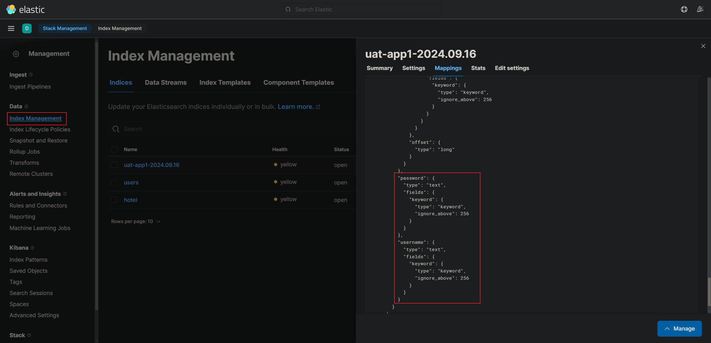
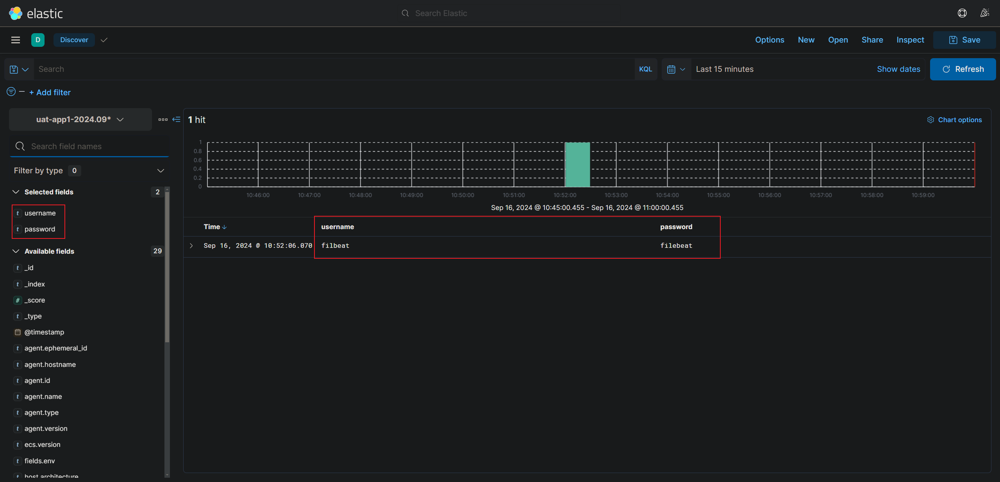
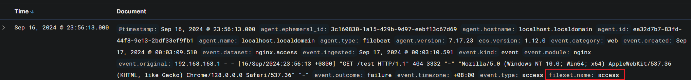

## 依照 JSON 欄位儲存至 ES

filebeat 搜集到的日誌，依照 JSON 屬性名稱區分為不同欄位儲存在 ES 中，不要將所有的日誌字串都丟進 `message` 欄位中儲存

<br/>

<br/>

## 配置流程

因為不想將所有的日誌都塞進 message 欄位中，故可以使用以下設定。

以下設定成功，`就不會有 message 欄位了`。

1. nginx 配置輸出格式調整為 JSON

    [nginx 輸出 json 格式的日誌](../../Nginx/2_基礎配置.md#日誌使用-json-格式輸出)

2. `filebeat.yml` 配置

    ```yml
    # type=filestream
    - type: filestream
      path:
        - /var/log/nginx/access.log
      # 配置解析器
      parsers:
        # filebeat能夠解析結構化的JSON日誌
        # filebeat逐行處裡日誌，因此JSON解碼僅在每條日誌中只有一個JSON物件時才有效
        - ndjson:
          keys_under_root: true
    ```
    ```yml
    # 使用舊的type=log
    - type: log
      path:
        - /var/log/nginx/access.log
      json.keys_under_root: true
    ```

3. (選)刪除 registry 檔案

    ```sh
    rm -rf /var/lib/filebeat/*
    ```

4. 需要在 Kibana `Index Management` 把舊的 Index 刪除。

5. 再輸出一次

    ```
    filebeat -e -c /etc/filebeat/filebeat.yml
    ```

6. 可以看到新的 Index mappings 中，有定義自訂的屬性名稱。

    

    

    <br/>

    <br/>

7. 可以再使用 append 的方式測試

    ```sh
    echo '{"username":"filbeat", "password":"filebeat"}' >> /tmp/app1.log
    ```

<br/>

<br/>

## Module 配置

### 什麼是 module

就是 filebeat 提供的一個隨開即用的模塊，以 nginx 為例，不用再去設定 `filebeat.input`，直接開啟模塊功能，即可搜集日誌。


使用了集成的 nginx modules，就不需要再設置 `filebeat.input`。

<br/>

<br/>

### 配置方式

1. filebeat.yml

    ```yml
    filebeat.config.modules:
      path: ${path.config}/modules.d/*.yml
      reload.enabled: true # 設為 true
    ```


2. 其中的 `${path.config}`，指的是 `/etc/filebeat`

    ```sh
    # 查看 filebeat 有關的目錄
    systemctl cat filebeat.service
    ```


3. 可使用指令查看，modules 有什麼功能，可以看到有 `enabled` / `disabled` 

    ```sh
    # 查看當前啟用/停用模塊
    filebeat modules list

    # 查看 filebeat modules 其他指令
    filebeat modules -h
    ```

4. 啟用 nginx 模塊，其實就是把 `/etc/filebeat/modules.d` 路徑下的 `nginx.yml.disable` 檔案改名成 `nginx.yml`

    ```sh
    filebeat modules enable nginx
    ```

5. 設置 `/etc/filebeat/modules.d/nginx.yml`

    ```sh
    vim /etc/filebeat/modules.d/nginx.yml
    ```

    ```yml
    - module: nginx
      # Access logs
      access:
        enabled: true
        var.paths: ["/var/log/nginx/access.log"]

      # Error logs
      error:
        enabled: true
        var.paths: ["/var/log/nginx/error.log"]
    ```

6. 但是這樣設定，index template 會被自動指定為 `filebeat-7.17.23-2024.09.16` 這個格式，所以還要再回 `filebeat.yml` 配置 indices

    ```yml
    output.elasticsearch:
      enabled: true
      hosts: ["localhost:9200"]
      indices:
        - index: "uat-nginx-access-%{+yyyy.MM.dd}"
          when.contains:
            fileset.name: "access"
        - index: "uat-nginx-error-%{+yyyy.MM.dd}"
          when.contains:
            fileset.name: "error"

    setup.template.name: "uat-nginx"
    setup.template.pattern: "uat-nginx*"
    setup.ilm.enabled: false
    ```

    其中的 `fileset.name` 屬性名稱，可以查看 mappings

    

    <br/>

    <br/>