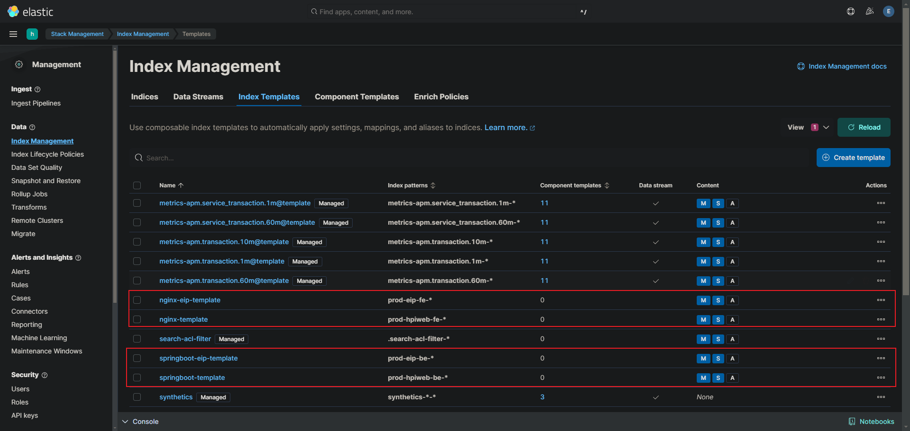
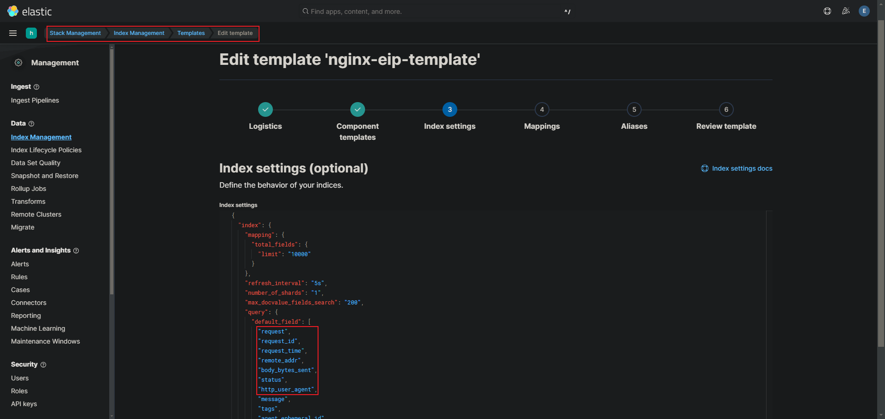
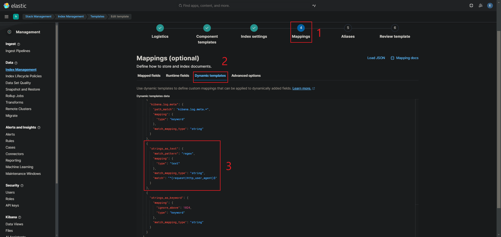

## 索引模板 Index template

是一種預先定義的配置，用於在新建立的索引時自動套用特定的設定和映射規則。它允許你在創建索引時無需手動指定配置，從而保持一致性和簡化流程。

舉例，當使用 filebeat，將日誌搜集進索引時，會需要一個模板來讓這些索引可以自動產生，不必額外去寫索引的 mappings 設定，等於是一個索引的公版。

<br/>

<br/>

## filebeat 配置

filebeat.yml `第一次搜集`時，若沒有預先定義索引模板，則需要配置以下，這些配置就會自動生成索引模板。

```yml
# 輸入
filebeat.inputs:
- type: log
  paths:
    - /tmp/test.log

# 輸出
output.elasticsearch:
  enabled: true
  hosts: ["localhost:9200", "10.10.20.177:9230"]
  index: "uat-nginx-%{+yyyy.MM.dd}"

# 設置索引模板的名稱 (當第一次搜集日誌， ES 中沒有模板時，需要做以下配置)
setup.template:
  name: "uat-nginx"       # 設置索引模板的名稱
  pattern: "uat-nginx*"   # 設置索引模板的匹配模式
setup.ilm.enabled: false  # 關閉索引的生命週期管理
```

`setup.template` 配置在建立索引模板後，就可以註解掉了，因為不需要再建立索引模板了。


filebeat 將資料傳遞給 ES 時，就會一同建立索引模板，在 Kibana 中就可以看到。




<br/>

<br/>

## 名詞解釋

* Component Template: 由於索引模板欄位眾多，因此可以將索引模板的欄位拆分成多個小的模板，用來組合，增加靈活性，而這個被拆分的小模板，就是 Component Template。

* Dynamic Template: 若搜集的日誌欄位太多，故 ES 提供了一個了動態映射的功能，可以不用寫 mappings 配置，而是在創建索引模板時會自動分析欄位，並轉換成相對應的類型，如 keyword, Integer 等等。

    * 舉例，filebeat.yml 設定可以使用 parser 來將日誌的屬性名稱轉換為 ES 的欄位名稱。

        ```yml
        filebeat.inputs:
        - type: filestream
          id: prod-hpiweb-fe
          enabled: true
          paths:
            - /opt/openresty/nginx/logs/access.log
          tags: ["fe"]
          parsers:
            - ndjson:
              target: "" # 新屬性，空字串代表屬性放在 root 下
              overwrite_keys: true
              add_error_key: true
        ```

    * 使用動態模板產生的欄位，都會被設置為 Keyword，這樣就無法使用分詞查詢，一定要用完整的資料才能查詢，很不方便。以下設定將特定欄位轉換為 Text 類型。

        

        <br/>

        


        第三步驟，加入的配置一定要寫在 `strings_as_keyword` 屬性之前，否則欄位會先被轉為 keyword。

        ```yml
        {
            "strings_as_text": {
            "match_pattern": "regex",
            "mapping": {
                "type": "text"
            },
            "match_mapping_type": "string",
            "match": "^(request|http_user_agent)$" # 指定 request 和 http_user_agent 欄位被轉換為 text 類型
            }
        }
        ```