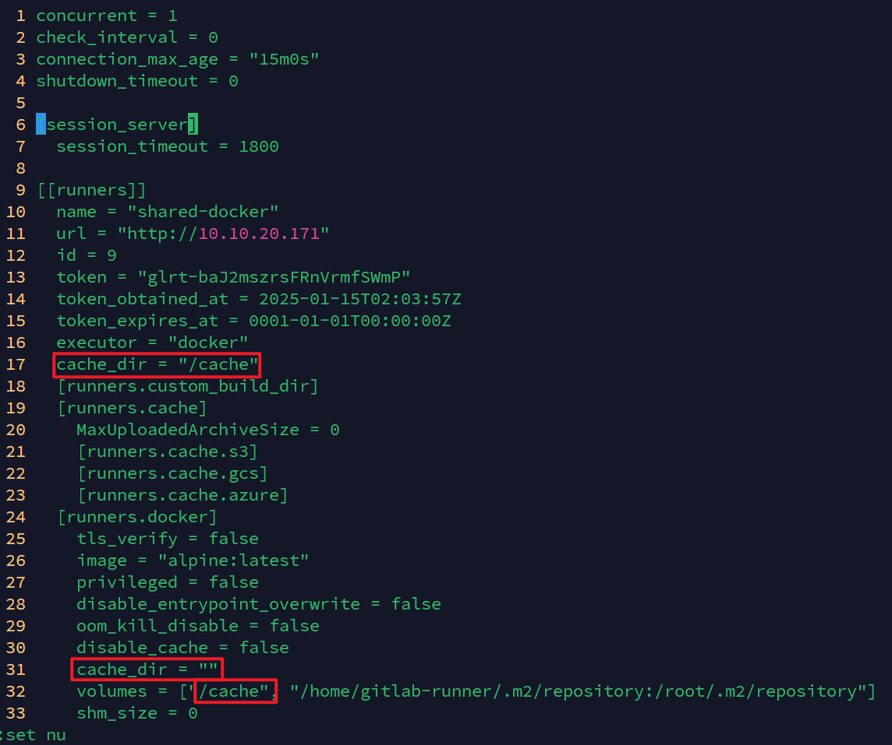
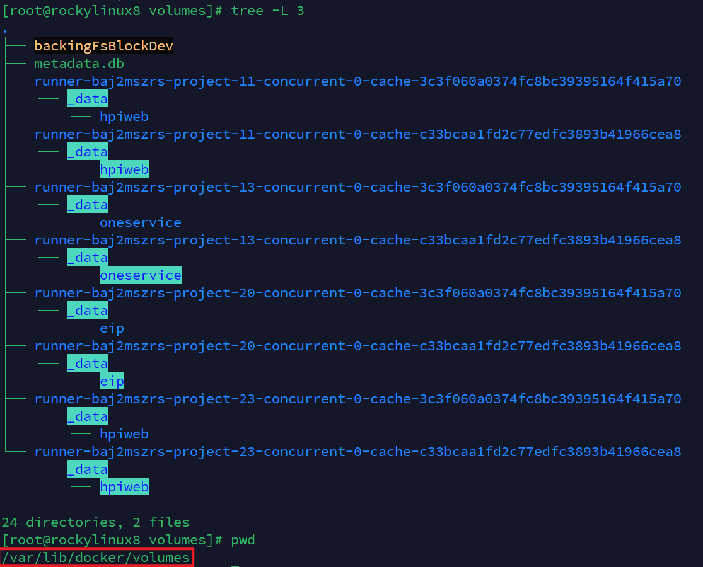

## 配置

 * 分成 develop 和 main 分支，依照 `tags` 去區分要去觸發哪一個 gitlab-runner。

 * (選擇配置) 如果有權限管理上的問題，需要在 gitlab-runner 上的 vm 上設定 gitlab-runner 這個用戶的 sudo 權限。

    ```sh
    # 設置用戶的 sudo 權限，以免權限過大。
    visudo
    ```
    ```conf
    ## 使用 sudo，可以不用詢問密碼的指令
    ## gitlab-runner

    gitlab-runner ALL=(ALL) NOPASSWD: 
    /usr/bin/systemctl start web.service, 
    /usr/bin/systemctl stop web.service, 
    /usr/bin/systemctl restart web.service, 
    /usr/bin/systemctl status web.service, 
    /usr/bin/systemctl start nginx.service, 
    /usr/bin/systemctl stop nginx.service, 
    /usr/bin/systemctl restart nginx.service, 
    /usr/bin/systemctl status nginx.service, 
    /opt/web/update.sh, 
    /opt/openresty/nginx/update-hpiweb-prod.sh
    ```

<br/>

配置，後端使用 springboot / java 11

```conf
# build 階段，使用掛載的方式，將 maven 依賴持久化在 vm 主機上，否則每次 build 階段都會去下載依賴
# 這邊沒有寫冒號路徑，指的就是容器內的路徑
[runners.docker]
  volumes = ["/cache", "/root/.m2/repository"]
```

```yml
stages: 
  - build
  - scan
  - deploy

build:
  image: maven:3.9.6-eclipse-temurin-11
  tags:
    - shared-docker
  stage: build
  artifacts:
    paths:
      - target/web.jar
    expire_in: 3 days
  script:
    - mvn clean package -DskipTests
  rules:
    - if: '$CI_COMMIT_BRANCH == "main"'
    - if: '$CI_COMMIT_BRANCH == "develop"'

scan:
  image: sonarsource/sonar-scanner-cli:latest
  tags:
    - shared-docker
  stage: scan
  dependencies:
    - build
  variables:
    SONAR_USER_HOME: "${CI_PROJECT_DIR}/.sonar"
    GIT_DEPTH: "0"
  cache:
    key: "sonar-cache-$CI_COMMIT_REF_SLUG"
    paths:
      - "${SONAR_USER_HOME}/cache"
  script:
    - sonar-scanner
      -Dsonar.host.url=$SONAR_HOST_URL
      -Dsonar.projectKey=$WEB_BE_PROJECT_KEY
      -Dsonar.token=$WEB_BE_TOKEN
      -Dsonar.java.binaries=target
      -Dsonar.java.source=11
      -Dsonar.sources=src/main
      -Dsonar.sourceEncoding=UTF-8
      -Dsonar.exclusions=src/test/**
  allow_failure: true
  rules:
    - if: '$CI_COMMIT_BRANCH == "develop"'
    - if: '$CI_COMMIT_BRANCH == "main"'

deploy:
  tags:
    - shared-shell
  stage: deploy
  dependencies:
    - build
  script:
    - cp -rf target/web.jar /opt/ansible/artifacts/web/web.jar;
    - if [[ "$CI_COMMIT_BRANCH" == "develop" ]]; then
        ansible-playbook /opt/ansible/deploy/web/uat-web-be.yml;
      elif [[ "$CI_COMMIT_BRANCH" == "main" ]]; then
        ansible-playbook /opt/ansible/deploy/web/prod-web-be.yml;
      fi
  rules:
    - if: '$CI_COMMIT_BRANCH == "develop"'
    - if: '$CI_COMMIT_BRANCH == "main"'
```

配置 前端使用 vue + node 22

```yml
stages: 
  - scan
  - build
  - deploy

scan:
  image: sonarsource/sonar-scanner-cli:latest
  tags:
    - shared-docker
  stage: scan
  variables:
    SONAR_USER_HOME: "${CI_PROJECT_DIR}/.sonar"
    GIT_DEPTH: "0"
  cache:
    key: "sonar-cache-$CI_COMMIT_REF_SLUG"
    paths:
      - "${SONAR_USER_HOME}/cache"
  script:
    - sonar-scanner 
      -Dsonar.host.url=$SONAR_HOST_URL
      -Dsonar.projectKey=$EIP_FE_PROJECT_KEY
      -Dsonar.token=$EIP_FE_TOKEN
      -Dsonar.sources=.
      -Dsonar.exclusions=**/node_modules/**,**/*.spec.js,**/__tests__/**
      -Dsonar.javascript.lcov.reportPaths=coverage/lcov.info
      -Dsonar.typescript.lcov.reportPaths=coverage/lcov.info
  allow_failure: true
  rules:
    - if: '$CI_COMMIT_BRANCH == "develop"'
    - if: '$CI_COMMIT_BRANCH == "master"'

build:
  image: node:22
  tags:
    - shared-docker
  stage: build
  cache:
    key: node_modules-$CI_COMMIT_REF_SLUG
    paths:
      - node_modules/
  script:
    - npm install
    - npm run build:dev
  artifacts:
    paths:
      - dist/
    expire_in: 3 days
  rules:
    - if: '$CI_COMMIT_BRANCH == "develop"'
    - if: '$CI_COMMIT_BRANCH == "master"'

deploy:
  tags:
    - shared-shell
  stage: deploy
  dependencies:
    - build
  script:
    - cp -rf dist /opt/ansible/artifacts/eip/;
    - if [[ "$CI_COMMIT_BRANCH" == "develop" ]]; then 
        ansible-playbook /opt/ansible/deploy/eip/uat-eip-fe.yml; 
      elif [[ "$CI_COMMIT_BRANCH" == "master" ]]; then
        ansible-playbook /opt/ansible/deploy/eip/prod-eip-fe.yml;
      fi
  rules:
    - if: '$CI_COMMIT_BRANCH == "develop"'
    - if: '$CI_COMMIT_BRANCH == "master"'
```

<br/>

<br/>


## 坑 配置

若 gitlab-runner 使用 docker 類型的，當使用 cache 時，依照官方文件，會把 cache 儲存在此路徑，供 container 掛載。

> https://docs.gitlab.com/ee/ci/caching/#where-the-caches-are-stored

<br/>

而且 `/etc/gitlab-runner/config.toml` 配置需要如下




<br/>

```conf
[runners]
  cache_dir = "/cache" # 宿主主機中存放緩存的路徑

  [runners.docker]
    cache_dir = "" # runner容器中存放緩存的路徑(預設就是/cache)

    # 容器中的掛載路徑，但不知為啥會掛載到宿主主機的 /var/lib/docker/volumes/xxx
    # 用來將容器中的 cache 持久化到宿主機上。(以下都是容器中的目錄)
    volumes = ["/cache", "/root/.m2/repository"]
```


<br/>

<br/>

