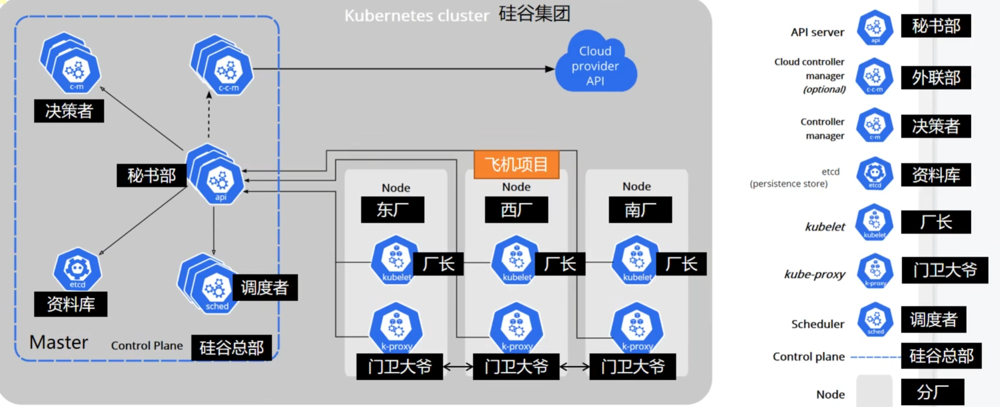

## 為什麼要用雲平台

1. 環境統一

2. 按需收費

3. 即開即用

4. 穩定性強

 

 

## 公有雲 v.s. 私有雲

公有雲: 由第三方服務提供商擁有 (如AWS、Azure、GCP)。

1. 成本低

2. 無須維護

3. 幾乎無限制的可擴展性(依照業務滿足需求)

4. 高可靠性

---

私有雲: 由單個組織或企業擁有，部署在本地或專用數據中心。

1. 初期成本高

2. 需自行維護

3. 可擴展性有限，受硬件和內部資源的限制。

4. 由組織內部或外包的IT團隊負責管理和維護。

 

 

## K8S 解決了什麼問題

簡單來說，K8S 就是分佈式系統的管理框架。

1. 服務發現、負載均衡

2. 存儲編排: 

    - 當啟動服務A時，服務A會向K8S要存儲空間，當要刪除服務A時，會一併把關聯的存儲空間刪除，不會有遺留的資料。

3. 自動化部署、Rollback

    - 支持部署後回到上一個版本。

4. 自動化完成裝箱計算

5. 自我修復

    - 防止微服務的雪崩效應

6. 密鑰與配置管理

    - 儲存敏感資訊

    - 儲存配置，有點類似 spring cloud config

 

 

## 架構

 

 

* 左邊是 master 節點，右邊是其他 worker 節點。

    * Pod 可以存在於 master 或 worker node
    
    * Master 既可以作為 master node，也可以成為 worker node。

* Kubernetes Cluster = `N 個 Master Node` + `N 個 Worker node`

    * 當 Master 掛掉以後，其他的 Master Node 有投票機制，將會選出新的 Master Node 繼續管理 Worker Node。

    * 這邊 N 大於 1。

* 這張圖會比較好理解，搭配下方的角色。

    

    * Master Node 內的服務要互相呼叫，都必須透過 API Server。

    * Master Node 和 Worker Node 呼叫，是透過 API Server 和各節點的 kubelet。

    * 外部請求要訪問 Worker Node 上的服務，只能由 kube-proxy。

 

 

### Master node

1. 集群管理與控制:

    * 資源調度：將應用（Pod）調度到合適的 Worker Node 上。
    
    * 監控健康狀態：監控節點、Pod 和其他資源的狀態，確保集群運行正常。

    * 配置管理：管理用戶提交的 YAML 或 JSON 文件中定義的資源（如 Pod、Service 等）。

2. API 請求處理(`kube-apiserver`) : 所有來自用戶或集群內部的 API 請求（例如通過 kubectl 提交的操作）都會經過 Master Node 的 kube-apiserver 。

    * 驗證請求（身份驗證與授權）。

    * 處理並將操作寫入 etcd（集群的數據存儲）。

    * 分發操作給其他組件執行，例如調度器或控制器。

3. 資源調度(`kube-scheduler`) : 將未綁定的 Pod 調度到合適的 Worker Node 上 。

    * 根據資源需求（如 CPU、內存）。

    * 根據策略（如親和性、反親和性）。

4. 集群數據存儲(`etcd`) : etcd 是分佈式數據存儲，存儲了 Kubernetes 集群的所有狀態和配置信息：

    * 所有資源對象（Pod、Service、Deployment 等）的描述。

    * 集群的運行狀態。

5. 控制器運行(`kube-controller-manager`)

    * Replication Controller：確保指定數量的 Pod 運行。

    * Node Controller：監控節點是否正常。

    * Endpoint Controller：更新 Service 與 Pod 的關聯。

* 包含的組件有

    1. kube-apiserver : 秘書，決策者的決定，由祕書來執行；對 Worker Node 的統一窗口。

    2. kube-scheduler : 調度者

    3. etcd : 資料庫

    4. kube-controller-manager : 決策者

    5. cloud-controller-manager

### Worker node 

* 包含的組件有

    1. kubelet : 廠長

        * 負責 Pod 的生命週期管理。
        
        * 與 API Server 通信，接收調度到本節點的 Pod 訊息，並依照定義的規格啟動和管理 Pod。

        * 定期將節點的狀態（包括資源使用、Pod 狀態等）回報給 API Server。

    2. kube-proxy : 警衛大哥

        * `每個節點的 kube-proxy 需要互相保持同步`，當外來請求來時，才知道要轉給哪個節點。
        
        * 網路代理元件，負責節點上的網路流量管理。

        * 維護 Kubernetes 的 Service 和 Pod 網路規則，使外部流量能夠存取 Pod，並確保 Pod 間通訊順暢。

    3. container runtime : 

        * 可以是 `docker`，但逐漸棄用，Kubernetes 只需要容器執行時的功能，而 docker 的其他功能（如映像建置）在 Kubernetes 環境下並不需要，反而增加了複雜性和資源消耗，使用更輕量的 `containerd` 或 `CRI-O`。

        * Kubernetes 的 Pod 是運行在容器中的，而容器的創建、啟動、停止等操作由容器運行時完成。

        * 容器運作時負責從容器映像倉庫（如 Docker Hub）拉取映像，並在節點上執行容器。

--- 

* 附加組件 (可自定義是否要安裝)

    1. Kube-dns

    2. Ingress controller

    3. Heapster

    4. Dashboard

    5. Federation

    6. Fluentd-elasticsearch

 

 