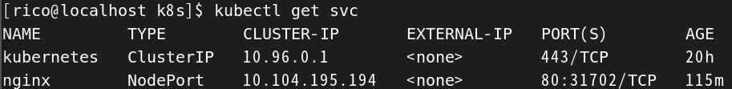

## 啟動

啟動可以使用 docker, vitualbox, vmware, kvm2 這幾個驅動來啟服務。

1. 使用 Docker 驅動啟動

    不推薦使用 root 用戶來開啟，指令建議使用一般用戶，並加上 docker 群組的權限。

    ```sh
    # 先把 user 加入倒 docker 群組中
    usermod -aG docker user

    # groups user

    # 使用 user 來啟動 minikube
    minikube start --driver-docker
    ```


2. 查看 minikube 狀態

    ```sh
    minikube status
    ```

3. 查看節點 (Nodes)

    ```sh
    kubectl get nodes
    ```

4. 查看所有 Pod

    ```sh
    kubectl get pods -A
    ```

5. 查看日誌

    ```sh
    minikube logs
    ```


<br/>

<br/>

## 啟動一個 Pod

1. 以 nginx 為例，須新增一個 Pod 配置檔案。

    ```yml
    # nginx.yml
    apiVersion: v1
    kind: Pod
    metadata:
    name: nginx
    labels:
        app: nginx
    spec:
    containers:
    - name: nginx
        image: nginx:latest
        ports:
        - containerPort: 80
    ```

2. 使用 kubectl 創建 Pod
    
    ```sh
    kubectl apply -f /opt/k8s/nginx-pod.yml
    ```

3. 查看是否建立，建立需要時間

    ```sh
    kubectl get pods
    ```

4. 將 Pod 暴露給外部訪問

    ```sh
    kubectl expose pod nginx --type=NodePort --port=80 --target-port=80
    ```

5. 查看服務的外部端口

    ```sh
    kubectl get svc
    ```

    

    <br/>

    這邊顯示的 CLUSTER-IP，是給集群內部的訪問 IP。

6. 查看集群 IP，這個 IP 就是集群的對外 IP，上圖看到的 80 port，就是訪問的端口。

    ```sh
    minikube ip
    ```

    或是可以直接查看 nginx 服務的 url

    ```sh
    minikube service nginx --url
    ```

    <br/>

7. 訪問 nginx

    ```sh
    curl -X GET http://192.168.49.2:31702
    ```
