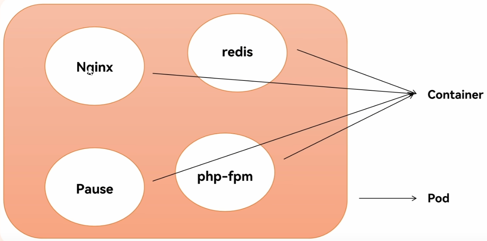
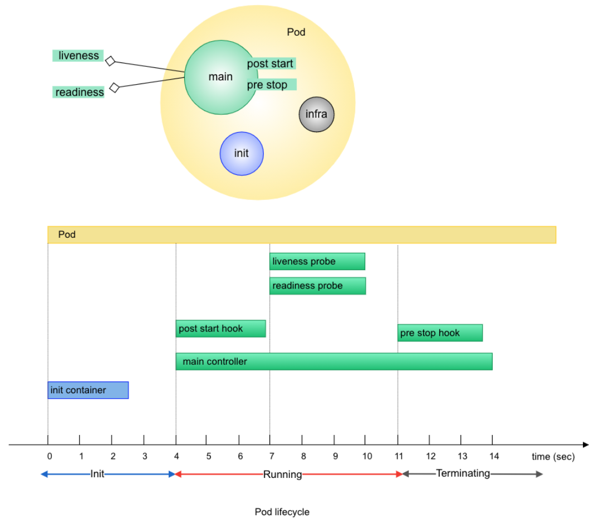
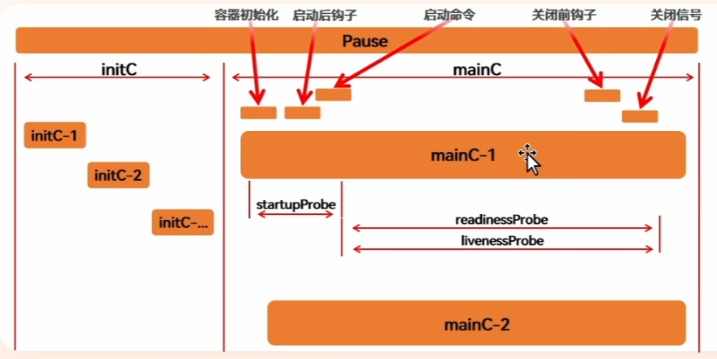

# Pod

1. 可以理解為`容器組`。

2. 每個 Pod 裡都有一個 `pause` 容器。

3. 其他容器會和 pause 容器共享同一個 `Namespace`，包含 `Network`, `PID`, `IPC`。

    - 如果 app 容器重啟，Pod 的網路不需要跟著重建，因為 Network Namespace 是由 pause 容器持有。

    - Namespace 就是 Linux 用來把「系統資源的視野隔離」的機制。容器看起來像一台獨立的電腦，其實大家還是共用同一台 Linux Kernel，只是透過 Namespace 讓它「看不到」其他容器的東西。

<br/>

<br/>

## Pause 

1. Pod內部第一個啟動的容器

2. 初始化網路

3. 掛載這個Pod內其他容器的 volume

4. 回收殭屍 Process。

    - pause 會被指派為 PID=1，且和其他容器共享 PID，所以才可以做這件事。

    


## 查看 pod 狀態

`-n` 指定 namespace，若不指定就是 namespace=default

```sh
# 兩者等價
kubectl get pod
kubectl get pod -n default
```

`-A` 指定所有 pod
```sh
# 查看所有
kubectl get pod -A
```

`-l` 指定 label
```
kubectl get pod -l app=nginx
```


`-o` output 輸出

查看更多資訊 (常用)

```
kubectl get pod -o wide
```

查看資源的 manifest  (常用) 

```
kubectl get pod nginx-pod -o yaml
```

`--show-labes` 顯示標籤

```
kubectl get pod --show-labes
```

`-w` watch 模式，資源變化才會顯示，不用一直刷
```
kubectl get pod -w
```

<br/>

<br/>

## 進入 Pod 內部的容器

可以直接從 master 中去查看 pod，底層是呼叫 api server 去溝通 work node 

```sh
# -i 互動模式
# -t 配置 TTY
# -c 指定查看的容器名稱(可以從 manifest 去找)
# -- 指定執行的命令

# nginx-pod 是建立的 pod 名稱

kubectl exec -it nginx-pod -c myapp -- /bin/bash
```

<br/>

<br/>

## 查看 Pod 中容器的日誌 (DEBUG 常用)

`-c` 指定容器名稱

```
kubectl logs nginx-pod -c nginx
```


## 查看 resources 描述 (DEBUG 常用)

```
kubectl describe pod nginx-pod
```


<br/>

<br/>

## Pod 生命週期



1. Init Container 啟動

* 負責準備工作。
* 一定先於一般 Container 執行。
* 多個 Init Container 依序執行(阻塞式)，只要有個 Container 返回碼不為0，則判定失敗，則會不斷重啟，直到所有成功為止。
* 執行完就會結束，不會繼續存在。


2. Main Container 啟動

* 執行實際應用程式，例如 nginx、Java App。
* 執行是並行，多個 Container 一起執行。
* 通常會持續運行。
* 可以選擇搭配 hook, probe 使用。


--- 

3. Hook

    * 有兩種 hook，類似 aop 概念。

    * 由 `kubelet` 負責執行。

    * inic container 和 main container 都可以設定 hook。

        ```yaml
        spec:
          initContainers: # init container
            - name: init
              image: busybox
              lifecycle:
                postStart:
                  exec:
                    command: ["echo", "init start"]
          containers:   # main container
            - name: nginx
              image: nginx
              lifecycle:
                postStart:
                  exec:
                    command: ["echo", "start"]
        ```


    1. Post Start Hook

        - 不保證一定在 Container 的主程式開始執行之後才執行；它是由 kubelet 在 Container 建立後觸發，Hook 與 Container 的 ENTRYPOINT/CMD 啟動之間沒有嚴格先後保證。

        - 不能保證順序，所以會執行輔助類型的動作，不會執行必要的動作。


    2. Pre Stop Hook

        - Container 終止前執行，用於清理、通知、Graceful Shutdown。

---

4. Probe 

    1. Startup Probe 啟動探測

        - 目的: 判斷容器中的應用是否已經啟動。
        - 預設: 沒有強制性要定義，不定義就不檢查。
        - Startup Probe 成功之前，Liveness Probe 和 Readiness Probe 不會執行。
        - Startup Probe 連續失敗達到 failureThreshold → Kubelet 終止 Container → 依 restartPolicy 決定後續行為。

    2. Liveness Probe 存活性探測

        - 目的: 判斷 Container 是否正常運作。
        - 預設: 沒有強制性要定義，不定義就不檢查。
        - Liveness Probe 連續失敗達到 failureThreshold → Kubelet 終止 Container → 依 restartPolicy 決定後續行為。

    3. Readiness Probe 就緒性探測

        - 目的: 判斷容器是否準備好提供服務。
        - 預設: 預設為就緒；pod 內所有的 container 判定為 就緒，此 pod 才能被判定為就緒。
        - 如果探測失敗，EndpointSlice Controller 將該 Pod 的 Endpoint 標記為不可用。
        - 如果失敗，不接收 Service 流量，不會殺死容器。


    - 補充: 

        - 由 `kubelet` 負責執行，可併行查多個 main container；但不會檢查 init container，因為 init container 屬於一次性工作不需要判斷健康狀態。

        - 當所有的 container 就緒性探測都就緒了，代表此 pod 內也都通過，而後才允許負載均衡器將此 pod 提供訪問。

        - 執行流程

            

        
        - 三種 probe 的檢查，都可以只檢查某個API，例如 `/health`，但差別是處裡的方式不同。

            - Startup 持續失敗 → 重啟

            - Liveness 失敗 → 重啟

            - Readiness 失敗 → 不送流量

    
    - 實作的探測方式

        1. HTTP GET

            用途: 測試 web api；HTTP返回狀態碼在 200~399 範圍內，判定成功。

            ```yaml
            livenessProbe:
              httpGet:
                path: /health
                port: 8080
            ```

        2. TCP Socket

            用途: 測試 DB、TCP Server。

        3. Exec

            用途: 檢查檔案、程序、指令結果。

            ```yaml
            # 會進入容器執行 cat /tmp/healthy；Exit Code=0 為成功
            livenessProbe:
              exec:
                command:
                  - cat
                  - /tmp/healthy
            ```

        4. gRPC

            用途: gRPC 服務。