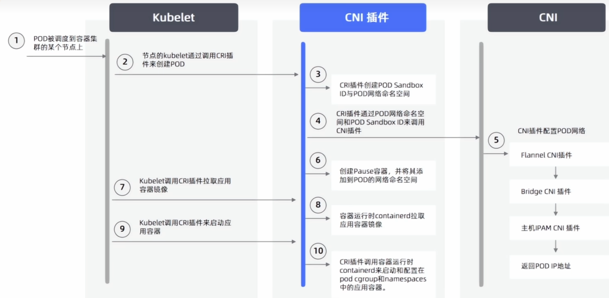

# Network

## CNI 規範
CNI（Container Network Interface）是一套定義`Container Runtime` 與`網路 Plugin` 之間介面的規範。

CNI 使用符合 CNI 規範的網路插件來為 Kubernetes cluster 提供網路能力。

路徑
* `/opt/cni/bin` : 用來存放各式各樣的 CNI 解決方案的執行檔。

* `/etc/cni/net.d/` : 用來存放當前要提供給 CNI 使用的設定檔案。

 

 

## 為什麼網路要設計成插件，直接內建不好嗎?

* 因為 Container 的網路需求很多，而且網路方案的實作方式差異很大。把網路設計成 Plugin，可以讓 Container Runtime 不需要綁死某一種網路技術，核心思想就是`解耦`。

* k8s 並沒有提供預設的 CNI，而是定義出 CNI「該做甚麼、該如何做」，只要滿足這些規範，人人都可以按照這些規範來開發 CNI，並且以「插件(Plugins)」的形式讓使用者彈性的挑選，最終部署在 cluster 中。

 

 

## CNI插件分類

1. Main Plugin
主要負責實際建立與設定 Container 的網路。

    * bridge
    * ipvlan
    * macvlan
    * ptp
    * host-device

2. IPAM Plugin
專門負責 IP 位址管理。

    * host-local
    * dhcp

3. Meta Plugin
不是直接提供主要網路功能，而是用來組合、修改或管理其他 CNI Plugin。

    * portmap
    * bandwidth
    * tuning
    * firewall

4. Windows Plugin

5. 第三方 Plugin

    * Flannel
    * Calico
    * Cilium : 市佔率最高
    * OVN

 

 

## 調用流程

