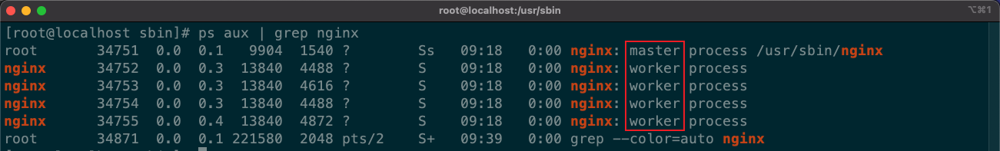
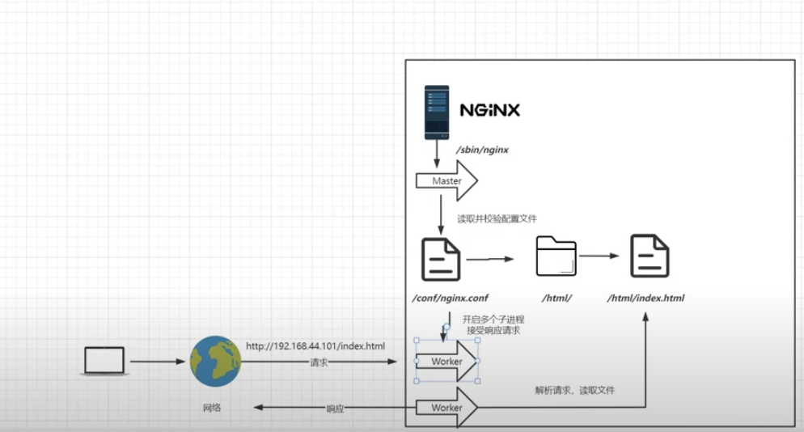

# 架構

## 架構圖

1. nginx 在啟動時，已經不是多線程(thread)；而是多進程(process)。

2. nginx 在啟動時，會以主進程(master)，啟動；而接收請求的是子進程(worker)。

    

     

    

     

3. 主進程(master)：
    * 不處理業務，用來協調子進程。

    * 啟動時會讀取 `nginx.conf` 配置檔，並產生子進程。
    
    * 當使用 `systemctl reload nginx.service`，主進程不會被 KILL，而會讀取新的配置檔，產生新的子進程，舊的子進程會被 KILL。

4. 子進程(worker)：

    * 真正處理請求的是子進程。

