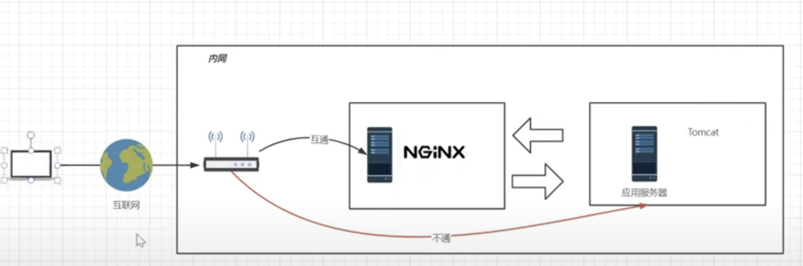
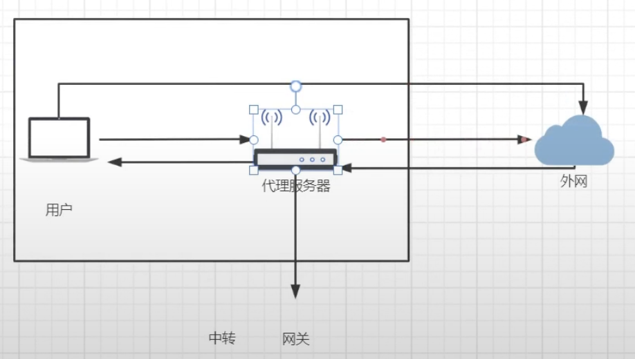

# 反向代理

1. Client端無法直接訪問到後端服務器，請求需要給 nginx 轉發，過一手才會轉發給後端服務器。

    

2. 反向代理是一種代理伺服器，它接收客戶端的請求，然後將這些請求轉發給一個或多個後端伺服器進行處理，並將後端伺服器的回應傳回給客戶端。反向代理伺服器在客戶端和後端伺服器之間起到中間人的作用，能夠提供負載平衡、安全性、快取等多種功能。

3. 反向代理的帶寬，決定了整個後端系統的帶寬，因為請求總是第一個訪問反向代理，當反向代理阻塞了，反向代理內的服務器就算帶寬在大，也會卡在反向代理。

    * 同理，正向代理服務器(可以理解為網關)，網關的帶寬也決定了Client端的使用速度。

        

4. 反向代理還有一個優點，可以不暴露後端服務器的真實 url。

    * 舉例，API url 為 /user/getList，直接暴露給外網或許不是很好，可以將 url 設為 /user/100，並用 nginx 轉發給 API。

    * 有時候因為 SEO 的權重，真實 url 會改寫成可以為 SEO 加分的 url。

 

 

