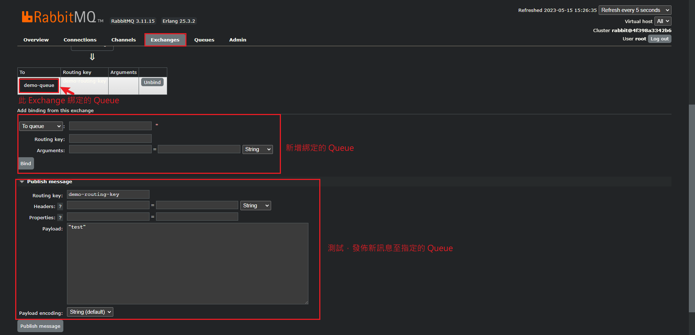

## 消息中間件 概念
* MQ，消息隊列，儲存消息的中間件。
* 實現中間件的前提: 需要遵守相同的協議(如:AMQP)或規範，才能達成通信。

* 優點: 

    1. 將 Producer 和 Consumer 解耦。
    2. Producer 和 Consumer 不需要知道雙方的實際的位置(如：IP address)，只要將資料往 MQ 送就好。
    3. 即使 Consumer 短暫的無法提供服務也沒關係，MQ 可以將資料暫存起來，等待 Consumer 重新上線時再送過去。
    4. 比起持續 Polling 的方式相對有效率的多。
    5. 提供了一個可靠的方式，讓訊息傳遞 & 工作處理兩件事情可以用非同步的方式進行。
    6. 當單一 Consumer 不足以完成所有工作時，可以很容易的增加 Consumer 數量進行水平擴展。

<br/>

<br/>

## 角色

以下四種角色都包含在 RabbitMq 的消息實體中 (a.k.a. Broker)

1. 生產者 Producer

    * 負責丟訊息到 Queue 中
    * 若有定義 Exchange，則丟給 Exchange 決定要給誰
    
2. 交換機 Exchange 
    
    * 用來決定 Producer 給的資料要丟給哪一個 Queue
    * 與 Queue 的關係為一對多

3. 隊列 Queue

    * 負責存放所需要的資料
    * 跟資料結構的 Queue 一樣，有先進先出 (FIFO) 特性
    * 每個 Queue 都會有他的名字當 id

4. 消費者 Consumer

    * 負責接收來自 Queue 的訊息


<br/>

<br/>

## 其他名詞解釋


* Connection 
    * Connection 是指客戶端與 RabbitMQ 服務器之間的 TCP 連接。
    * 由於 `應用程式` 和 `Broker` 之間是以物理TCP的方式進行連接，且每次連接花費的開銷很大，故每次初始化應用程式時只會做一次 Connection，並在同一條 Connection 中設立許多的 `Channel`。
    * 一個 Connection 可以支持多個 Channel，每個 Channel 可以在 Connection 上打開一個或多個消息隊列，進行消息的發送和接收。
    * 真正向 Broker 發送消息的是 Channel 而不是 Connection。

* Virtual Host
    * 一個 Broker 中有許多的 Virtual Host，每個 Virtual Host 都有獨立的 Exchange 和 Queue。
    * Virtual Host 是一個完全獨立的消息代理環境，每個 Virtual Host 可以有自己的用戶、權限、策略等。

* Binding

    * 指 Exchange 和 Queue 之間的連線。


<br/>

<br/>


## MQ 模式

主要有以下幾種方式，第3種開始有交換機加入。

1. `Direct(Hello world)`: 最簡單的模式，只會有一個 Producer 負責發送 message 到 Queue 裡。一個 message 只會有一個 Consumer 去處理，否則會造成重複處理。

    

    <br/>

2. `Work Queues`: 跟 Direct 模式很像，但是差別是 Worker 模式中會同時有多個 Consumer 會去消費 Queue 裡的 message，增加 message 消化的速率，同 Direct 模式，一個 message 只會有一個 Consumer 去處理。

    如圖，每一個 consumer 是競爭關係，第一條消息是C1消費，第二條就會輪到C2，輪流消費。

    

    <br/>

3. `Publish/Subscribe`:  Producer 把 message 丟給 Exchange，再交由 Exchange 去決定要把這個 message 丟給哪個 Queue


    

    <br/>

    此模式底下就有3種類型，用來表示`交換機要用什麼樣的規則把 message 丟到想要丟的 Queue 裡面`。

    - direct: 把消息交給符合指定 routing key 的 Queue
    - fanout: 廣播，將消息交給所有綁定到交換機的 Queue
    - topic: 把消息交給符合 routing pattern（路由模式） 的 Queue

    <br/>

4. `Routing`: 當 Producer 把 message 丟給 Exchange 時，同時要在這個 message 上面帶上一個 routing key，而 Exchange 就會根據這個 routing key，將 message 丟到指定的 Queue 上。

    同一個 routing key 可以綁到 n 個 Queue 上，一對多綁定。

    

    <br/>

5. `Topic`: 用到了 Exchange 的 topic type，用法基本上跟 Routing 模式一樣，只是 routing key 進化成可以使用模糊綁定(類似 regular expression)而已，設定 binding 規則，丟給符合的 Queue。

    

    <br/>

<br/>

<br/>

## 後台應用程式



<br/>

<br/>

## Terminal指令
```sh
# 查看狀態
rabbitmqctl status
```

<br/>

<br/>

## Reference

> 安裝 https://kucw.github.io/blog/2020/11/rabbitmq/

> 各種參數 https://godleon.github.io/blog/ChatOps/message-queue-concepts/