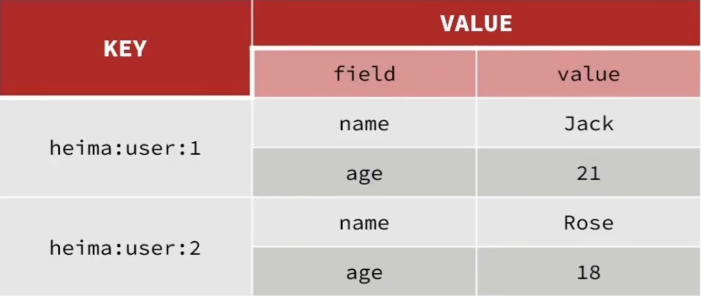
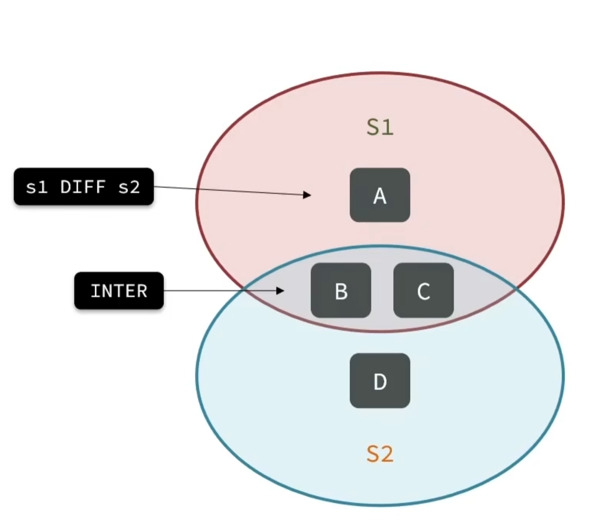

## String
依據String的類型，又可以分為3種

* String
* int
* float

不管是哪種格式，底層都是以 byte 儲存。

<br/>

<br/>

## String的指令: 

`set / get / del`，更新 / 查詢 / 刪除
```sh
# 新增或修改
set name rico

# 查詢
get name

# 刪除(可刪多筆)
del name1 name2 name3

> (integer) 1 # 返回刪除的數量
```

<hr>

`MSET` : 批量添加多個String類型的資料

`MGET` : 輸入多個key，一次可以取多個value


```sh
# 格式為 mset k1 v1 [k2 v2...]
mset k1 v1 k2 v2
```
```sh
# 取多個值
mget k1 k2
```

<hr>

`INCR`，increase，可以將String類型中，int的類型自增1 (只有 int 類型的適用，float 類型會報錯)

```sh
set age 18

incr age # 返回 (Integer) 19
```

`INCRBY`，同上，但可以指定增加多少數字
```sh
set age 18
incrby age 2 # 返回 (Integer) 20

# 如果要自減，可加負號
incrby age -2
```

`DECR` : 同INCR規則，自減1

`DECRBY` : 同INCRBY，自減n

<hr>

`INCRBYFLOAT`，只適用於 integer, float。當已經變成浮點數，就無法再用 INCR, INCRBY 等方法。

```sh
set f1 1.14

# 必須指定增長多少
incrbyfloat f1 3.14
```

<hr>

`SETNX`，添加一筆String類型的資料，若key已經存在，則不執行 (檢查後新增)

```sh
set age 18

setnx age vvv # 返回 (integer) 0，key已存在時，不覆蓋
```

有2種新增方式，以下2種等價
```sh
#1 使用 setnx
setnx age 18

#2 nx寫在後面
set age 18 nx
```

<hr>

`SETEX`，新增一筆資料，並設置expire時間

```sh
# 格式 SETEX key seconds value
SETEX token 60 cd1a5
```

一樣可以把 ex 拆開來寫，等價
```sh
SET token cd1a5 ex 60
```

<br/>

<br/>

## Hash
Hash 資料結構，為無序的字典，value 中分為 `field` 和 `value`



<br/>

`HSET` : 添加或修改 hash 類型的 key, field, value

`HGET` : 獲取 hash 類型的 value (需輸入 key 和 field)

`HMSET` : 批量添加 hash 類型資料

`HMGET` : 批量獲取 hash 類型資料

```sh
# HSET key field value
HSET heima:user:1 name Jack
HSET heima:user:1 age 21

# HGET key field
HGET heima:user:1 name

# HMSET key field value [field value...]
HMSET heima:user:2 name Rose age 18 # 一次存進多個 field

# HMGET key field [field...]
HMGET heima:user:1 name age
```

<hr>

`HGETALL` : 獲取 hash 類型中，key 的所有 field 和 value

`HKEYS` : 獲取一個 hash 類型中，key 的所有 field

`HVALS` : 獲取一個 hash 類型中，key 的所有 value

```sh
# HGETALL key
HGETALL heima:user:1 # 返回 k1 v1 k2 v2，鍵值交互返回

# HKEYS key
HKEYS heima:user:1 # 返回 k1 k2 ...

# HVALS key
HVALS heima:user:1 # 返回 v1 v2 ...
```

<hr>

`HINCRBY` : 讓 hash 類型的 field 自增指定數字 (value 必須為 Integer 才能自增)


```sh
# HINCRBY key field
HINCRBY heima:user:2 age 3 # age值增加3
```

<hr>

`HSETNX` : 添加一個 hash 類型，指定 key 的 field 值，`field 必須尚未建立，否則不執行`。

```sh
# HSETNX key field
HSETNX heima:user:1 age 18 # 已經存在此 field，所以不執行
HSETNX heima:user:1 sex female # 會執行
```

<br/>

<br/>

## List
與 java 中的 `LinkedList` 類似，可以視為一個雙向鏈表結構，可支持`正向查詢`和`反向查詢`。

Redis List 特點還有以下幾點:

1. 有插入順序
2. 元素可以重複
3. 插入和刪除快速
4. 查詢速度一般(需遍歷)

<br/>

<br/>

`LPUSH` : 向 List 左側(頭部)插入一個或多個元素

`LPOP` : 移除並返回列表左側的`第一個`元素，沒有則返回 nil。

`RPUSH` : 向 List 右側(尾部)插入一個或多個元素

`RPOP` : 移除並返回列表右側的`第一個`元素

補充 : `LPOP` 和 `RPOP` 在高版本可以一次取多個元素。

```sh
# LPUSH key element [element...]
LPUSH users 1 2 3 # 因為是從左邊添加元素，所以 List 順序會是 3 -> 2 -> 1 

# LPOP key
LPOP users # 呈上，返回元素 3，而 List 剩下 2 -> 1

# RPUSH key element [element...]
RPUSH users 1 2 3 # List 順序為 1 -> 2 -> 3

# RPOP key
RPOP users 
```

`LRANGE` : 返回索引(index)範圍內的所有元素，常用*

```sh
# LRANGE key start end
LRANGE users 0 -1 # 取全部 list 元素
```

<hr>

`BLPOP` : (b，block 阻塞) 和 LPOP 類似，只不過在沒有元素時可以指定等待時間，若時間到還沒有元素則返回 nil。

`BRPOP` : 同上。

```sh
# BLPOP key timeout
BLPOP users 10 # 單位為秒

# BRPOP key timeout
BRPOP users 10
```

<br/>

<br/>


## Set
Redis 的 Set 結構與 Java 的 HashSet 類似，可以看做是一個 value 為 null 的 HashMap，因為也是一個 Hash表，因此具備與 HashSet 類似的幾個特徵。

1. 無序
2. 元素不可重複
3. 查找快
4. 支持交集、聯集、差集 (Redis Set 才有)


<hr>

`SADD key member...` : 向 Set 中添加一個或多個元素

`SREM key member...` : 移除(Remvoe) Set 中的指定元素

`SCARD key` : 返回 Set 中元素的個數

`SISMEMBER key member` : 判斷一個元素是否存在於 Set 中 (is member)，返回 1 或 0

`SMEMBERS key` : 獲取 Set 中所有元素。

```sh
# SADD
SADD set1 a b c

# SREM
SREM set1 a b

# SCARD
SCARD set1

# SISMEMBER
SISMEMBER set1 a

# SMEMBERS
SMEMBERS set1 # 返回的是無序的集合
```

<hr>

以下為集合之間的命令，返回的也都是 Set

`SINTER key1 key2...` : 返回 key1 與 key2 兩個 Set 的交集

`SDIFF key1 key2...` : 返回 key1 與 key2 兩個 Set 的差集 (圖中的A)，`key1 key2 順序不可錯`

`SUNION key1 key2...` : 返回 key1 與 key2 兩個 Set 的聯集，會自動去除重複的元素。



```sh
# 舉例
# Set1 = {a, b, c}
# Set2 = {b, c, d, e, f}
SADD set1 a b c
SADD set2 b c d e f

# set1 set2 交集
SINTER set1 set2

# set1有，但set2沒有的元素(即 set1 與 set2 差集)
SDIFF set1 set2

# set1和set2，總共有哪些元素(聯集)
SUNION set1 set2

# 判斷 c 是否為 set1 的元素
SISMEMBER set1 c
```

<br/>

<br/>

## SortedSet
Redis SortedSet 是一個可排序的集合，與 Java 中的 TreeSet 類似，但底層資料結構差異卻很大。

SortedSet 中的每一個元素都帶有一個 `Score` 屬性，可基於此屬性對元素排序，底層的實作是一個`跳表(SkipList)` 加 `Hash表`。

具有以下特性:

1. 可排序。
2. 元素不重複。
3. 查詢速度快(Hash Table)。

<br/>

<br/>

以下為 SortedSet 指令: 

`ZADD key score member [score member...]` : 添加一格或多個元素到 SortedSet，如果已存在則改為更新其score值。

`ZREM key member [member...]` : 刪除 SortedSet 中的一個指定元素。

`ZSCORE key member` : 獲取 SortedSet 中指定元素的 score。

`ZRANK key member` : 獲取 SortedSet 中指定元素的排名。

`ZCARD key` : 獲取 SortedSet 中的元素總數。

`ZCOUNT key min max` : 統計 score 值在範圍內的元素總數。

`ZINCRBY key increment member` : 讓 SortedSet 中的指定元素自增，increment 為增加大小。

`ZRANGE key min max` : 按照 score 排序後，獲取指定`排名範圍`內的元素。

`ZRANGEBYSCORE key min max` : 按照 score 排序後，獲取指定 `score範圍`內的元素。

`ZDIFF` / `ZINTER` / `ZUNION` : 差集 / 交集 / 聯集。

`注意1` : 所有排名默認都是升序，如果要降序則在命令的 `Z` 改成 `ZREV`；例如 ZRANGE 改成 ZREVRANGE。

`注意2` : ZCOUNT是查個數；ZRANGE是查元素。

```sh
# ZADD
ZADD sortedset1 85 Jack 89 Lucy 82 Rose 95 Tom 78 Jerry 92 Amy 76 Miles

# ZREM
ZREM sortedset1 Tom

# ZSCORE 獲取 Amy 的 score
ZSCORE sortedset1 Amy

# ZREVRANK 獲取 Rose 的排名(排名記得+1)
ZREVRANK sortedset1 Rose

# ZCARD 獲取總學生數
ZCARD sortedset1

# ZCOUNT 獲取80分以下的學生有幾個
ZCOUNT sortedset1 0 80

# ZINCRBY 幫 Amy 分數+2
ZINCRBY sortedset1 2 Amy

# ZREVRANGE 查出成績前3名的同學
ZREVRANGE sortedset1 0 2 # 降序取index 0~2

# ZRANGEBYSCORE 查分數80以下的所有同學
ZRANGEBYSCORE sortedset1 0 80
```