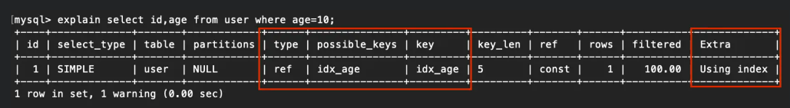
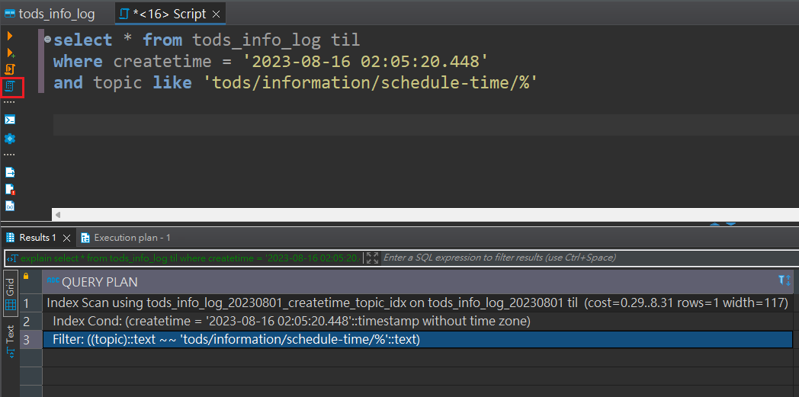
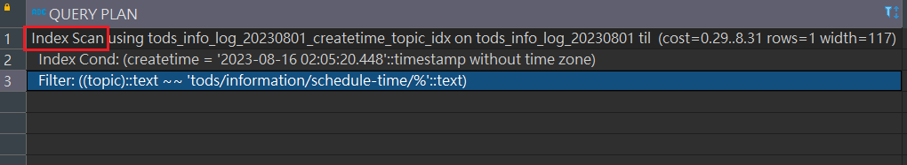
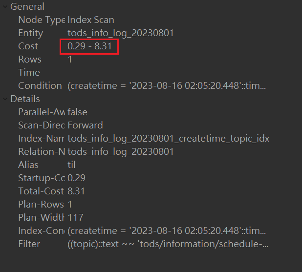

## 最左匹配原理
* 在複合索引中，從最左邊的索引欄位開始匹配。

* 例如 : 索引為 (a, b, c) 欄位，則如果要命中索引，必須先使用 a 欄位的查詢條件，在使用 b，以此類推，否則無法命中索引。

    ```sql
    SELECT * FROM users WHERE a = 1 AND b = 2 AND c = 3;
    ```
* 需要命中索引，有以下幾種組合

    1. a
    2. ab
    3. ac
    4. abc

<br/>

<br/>

## Index 無法生效的n種寫法

* 觀念: 只要對索引欄位做手腳，索引就不會生效。

1. 使用 `NOT`, `!=`, `NOT IN`, `NOT LIKE`

2. 使用函數語句包裝被索引的欄位

    ```sql
    SELECT * FROM users WHERE DATE(created_at) = '2023-01-01';
    ```

3. 資料類型錯誤，若使用錯誤的類型，sql 判斷會做類別轉換，導致索引失效。

4. 使用模糊搜尋並且使用 '%' 開頭，有部分會從字元的最左匹配。

    ```sql
    SELECT * FROM users WHERE name like '%name%';
    ```

5. 使用 NULL，索引通常預設是不支援 NULL，但有些SQL可以將 NULL 納入索引中。

6. 錯誤的使用 OR，如果 OR 條件中，含有沒有被加入索引的欄位，則索引不會生效

    ```sql
    -- indexed_col為索引，unindexed_col非索引
    SELECT * FROM users WHERE indexed_col > 5 OR unindexed_col < 10;
    ```

7. 針對索引欄位做運算，同上，只要對欄位做手腳，索引不會生效。

    ```sql
    SELECT * FROM users WHERE height - 10 > 150;
    ```

8. 複合式索引使用錯誤，若複合索引依照此順序 `INDEX user_index(first_name, last_name, email)` 建立，則在搜尋時，需依照此三個欄位的順序，若使用以下，就會失效

    ```sql
    -- 跳過 last_name，直接接上 email，導致索引失效
    SELECT * FROM users WHERE first_name = 'aaa' AND email = 'aaa@aaa.com'
    ```

    * 所以合法的索引組合有三(才會生效)：

        1. first_name + last_name + email
        2. first_name + last_name
        3. first_name

<br/>

<br/>

## 叢集索引 / 普通索引
在 `InnoDB` 引擎下，分為兩種索引

1. 如果表定義了PK，則PK就是叢集索引。

2. 如果表沒有定義PK，則第一個 not NULL unique 欄位就是叢集索引。

3. 如果前兩項都不成立，InnoDB 会創建一個隱藏的 `row-id` 作为叢集索引。


`叢集索引(clustered index)` : 

* 在一張資料表中，只能有一個叢集索引。
* 是一種特殊類型的索引，決定了資料表在硬碟中的物理排序方式。
* 因叢集索引的葉結點上 (B+Tree) 儲存了 Row Data，即真正儲存資料的地方，因此`使用叢集索引搜尋的速度會高於使用其他索引`。

    


`二級索引(secondary index)` : 

* 二級索引是除了叢集索引之外的其他索引，用於加速對資料表的查詢。
* 一張資料表可以有多個二級索引，這些索引不會影響資料表的物理排序方式，而是只影響查詢性能。
* 在 InnoDB 中，普通索引的葉節點存儲PK值。而在 MyISAM 中，普通索引葉節點存儲 Row Data 的位址。

<br/>

<br/>

## 回表查詢
解釋: 由於`二級索引`中，並沒有 Row Data 資料，所以查到二級索引的葉結點後，又會再去查一次`叢集索引`，最終找到叢集索引的葉結點，等於是查了兩個 B+ Tree，這樣會造成性能比掃全表還低。

如下圖(MySQL)，使用 EXPLAIN，只要 Extra 欄位是 NULL 代表沒有索引覆蓋。


解決方式: `索引覆蓋 (Covering index)`
* 只需要在一個二級索引上就能獲取 SQL 所需的所有列的數據，無須回表，速度更快。
* 例如：`select id, age from user where age = 10;`，id是叢集索引，age是二級索引，這樣因為所查的欄位資料在二級索引都可以查到，所以不用回表。

    

<br/>

* 補充: 
    1. 複合索引也可以來實現索引覆蓋。
    2. 若查詢條件中有PK，則直接使用 Clustered Index 的索引樹做查詢，這樣就不會回表。
    3. SQL 會自行判斷是否要使用索引，`通常在數據量小的表，掃全表反而會比索引要快`，因為當索引需要回表查詢時，至少會產生2次IO。


<br/>

<br/>

## 在 DBeaver 中查看 EXPLAIN (PostgreSQL)
使用 EXPLAIN 按鈕



<br/>

是否有使用索引，有使用索引會顯示 `Index Scan`，若是掃全表會顯示 `Seq Scan`




<br/>

<br/>

`Cost` : 搜尋成本，非秒數，左邊的數值為 startup cost/time，代表該節點取到第一行資料所花的時間/開銷，右邊的則是該節點執行完畢所需的時間/開銷。

`Rows` : 預估的回傳的行數，使用 ANALYSE 分析後，為實際回傳的行數。




## References

> https://ithelp.ithome.com.tw/articles/10272380?sc=iThelpR

> https://medium.com/johnliu-%E7%9A%84%E8%BB%9F%E9%AB%94%E5%B7%A5%E7%A8%8B%E6%80%9D%E7%B6%AD/database-%E5%85%AB%E5%80%8B-index-%E7%B4%A2%E5%BC%95-%E7%84%A1%E6%B3%95%E7%94%9F%E6%95%88%E7%9A%84-sql-%E5%AF%AB%E6%B3%95-cdc7d2e72f51

> PostgreSQL Scan的四種類型 https://oldmo860617.medium.com/%E4%BB%A5-postgressql-%E7%82%BA%E4%BE%8B%E4%BA%86%E8%A7%A3%E8%B3%87%E6%96%99%E5%BA%AB%E7%9A%84-query-plans-abd8b5f54c66