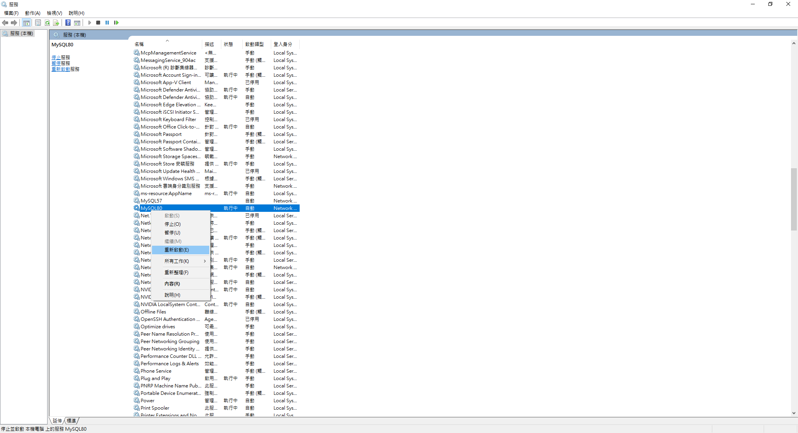
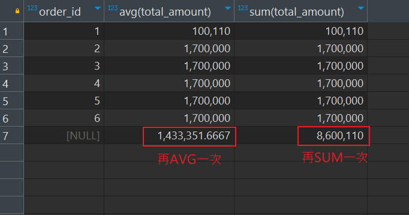

# Windows安裝路徑
以下為MySQL默認安裝路徑
1. DB 安裝在: `C:\ProgramData\MySQL\MySQL Server 8.0\Data`
2. DBMS 安裝在: `C:\Program Files\MySQL\MySQL Server 8.0`

<br/>

<br/>

# 重啟 MySQL Server (windows)

開啟服務，並右鍵重啟



<br/>

<br/>

# 複習 JOIN 種類

7種JOIN的方式


<br/>

<br/>

# Group by 報錯

select 中出現的`非函數的欄位`，必須要聲明在 GROUP BY 中；反之， GROUP BY 中聲明的欄位可以不出現在SELECT中。

```sql
-- 正常情況
select department_id, user_id, avg(salary)
from `employees` 
group by department_id, user_id;

-- 錯誤
select department_id, user_id, avg(salary)
from `employees` 
group by department_id;

-- 正確(但可讀性不好)
select avg(salary)
from `employees` 
group by department_id, user_id;
```

<br/>

<br/>

# Group by 使用 WITH ROLLUP
使用 WITH ROLLUP 會在多一行資料，將所有 GROUP BY 的資料再作一次總運算



```sql
select order_id, avg(total_amount), sum(total_amount) 
from `order` 
group by order_id with rollup;
```


`注意` : 使用 WITH ROLLUP 就不能再使用 ORDER BY，否則報錯。


<br/>

<br/>

# DDL / DML / DCL / DQL

`DDL` (Data Definition Language) : 用於定義資料庫結構，包括表格、索引、檢視、觸發器等

- CREATE
- ALTER
- DROP


`DML` (Data Manipulation Language) : 操作會影響資料庫中的記錄和資料值，而不是資料庫結構

- INSERT
- UPDATE
- DELETE

`DCL` (Data Control Language) : 用來控制資料表、檢視表之存取權限，提供資料庫的安全性。

- GRANT 賦予使用者使用權限
- REVOKE 取消使用者的使用權限
- COMMIT 完成交易作業
- ROLLBACK 交易作業異常，將已變動的資料回復到交易開始的狀態

`DQL` (Data Query Language) : 負責進行資料查詢，不會對資料本身進行修改的語句

- SELECT

<br/>

<br/>

# HAVING 和 WHERE 比較
1. 當過濾條件中，有聚合函數，則此過濾條件必須聲明在 HAVING 中，使用 WHERE 會報錯。
2. 當過濾條件中，沒有聚合函數，則此過濾條件可以聲明在 WHERE 或 HAVING 中，但建議聲明在 WHERE 中，因為執行效率較好。

    ```sql
    -- 正確
    select department_id, MAX(salary)
    from employees
    where department_id in (10,20,30,40);
    group by department_id
    having max(salary) > 10000;

    -- 可以過，但效率不好
    select department_id, MAX(salary)
    from employees
    group by department_id
    having max(salary) > 10000 and department_id in (10,20,30,40);
    ```

    呈上，原因是 WHERE 是先篩選後連接 (HAVING相反)，可以先有效的減少數據量。


<br/>

<br/>

# SQL 執行順序

SQL 語法如下
```sql
SELECT ...
FROM ...
JOIN ... ON ...
WHERE ...
GROUP BY ...
HAVING ...
ORDER BY ...
LIMIT ...
```

但 SQL 在執行順序上，有所不同，
```sql
-- 順序由上至下執行
FROM ... 
JOIN ... ON ...
WHERE ... 
GROUP BY ... 
HAVING ... 
SELECT ... 
DISTINCT ... 
ORDER BY ... 
LIMIT
```

結論: 
1. 解釋了為何非聚合函數盡量使用 WHERE 而非 HAVING，因為 WHERE 可以先在查詢時(遍歷表)時，就先將不符合的資料剔除，大幅減少 GROUP BY 運算的資料量。

    ```
    where --> group by --> having
    ```

2. 解釋了為什麼 WHERE 不能使用聚合函數；因為尚未經過 GROUP BY，所以運算後的資料根本還沒運算出。


3. 解釋了為什麼 WHERE 中不能使用 SELECT 中`欄位的別名`，而 ORDER BY 卻可以使用

    ```sql
    -- 會報錯
    select username, user_age as age
    from user
    where age > 10;

    -- 正確
    select username, user_age as age
    from user
    order by age;
    ```

    因為，`where 在執行時，select 的別名尚未聲明`。

    ```
    where --> select --> order by 
    ```

<br/>

<br/>

# SQL 執行原理(虛擬表)
步驟:

1. 此步驟會執行 FROM 和 JOIN，如果是多表聯查，會經歷以下

    1. 先通過 CROSS JOIN 笛卡爾乘積，獲得虛擬表`vt1-1`。

    2. 透過 ON 篩選，在 vt1-1 基礎上進行篩選，獲得虛擬表 `vt1-2`。

    3. 添加外部行(將表B聯表至表A)，如果是 LEFT JOIN、RIGHT JOIN、 FULL JOIN，就會涉及到外部行，也就是表 vt1-2 的基礎上增加外部行，獲得虛擬表 `vt1-3`。

    4. 當操作的是2張以上的表，還會重複以上 1~3 步驟，得到最終原始數據，虛擬表 `vt1`。

2. 拿到 vt1 之後，在此基礎上進行 `WHERE 階段`，將 vt1 過濾篩選，得到 `vt2`。

3. 進入 `GROUP BY 和 HAVING 階段`，以 vt2 為基礎進行分組和過濾，得到 `vt3` 和 `vt4`。

4. 當完成條件篩選後，就可以提取欄位，進入到 `SELECT 和 DISTINCT 階段`。

5. SELECT 和 DISTINCT 後，得到中間虛擬表 `vt5-1` 和 `vt5-2`。

6. `ORDER BY 階段`，得到 `vt6`。

7. `LIMIT 階段`，得到 `vt7`，即最終返回。

