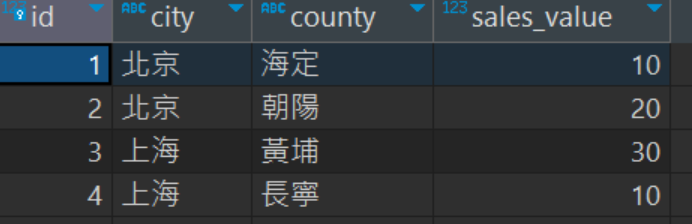
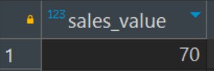
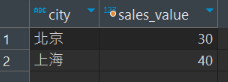
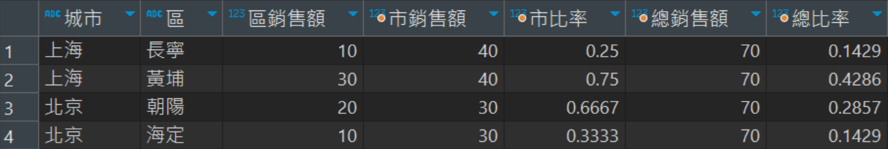
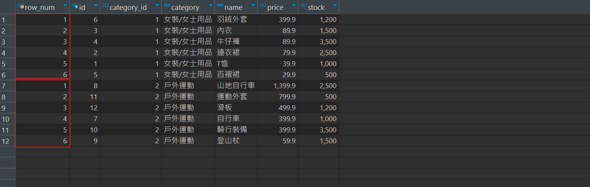
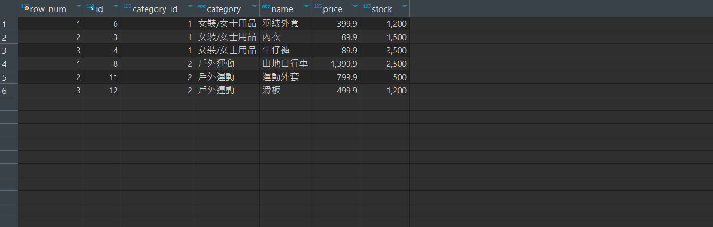
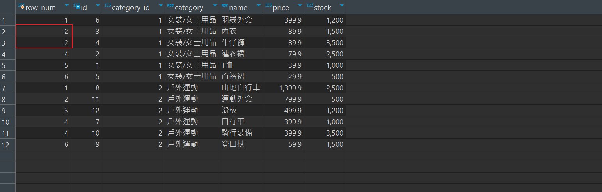
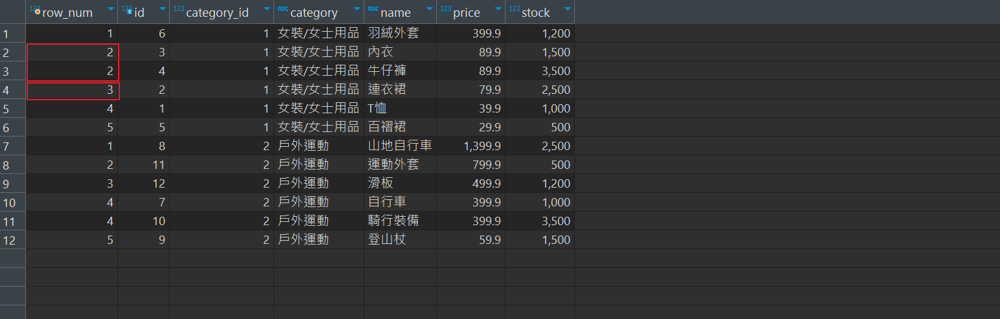

# 窗口函數 Window Function

1. MySQL 8.0 之後的新功能
2. 通常`聚合函數`會將每一組的資料統合成一筆資料，但有些時候，還是會需要保留每一筆資料的`原始資料`，而不是看到每一組資料統合的結果，在這種情況，就會用到窗口函數。

3. 假設，資料表中有100筆資料，聚合函數分組後，剩下10筆資料(分成10組)；但窗口函數分組後，還是有100筆資料，只是多加了一個用窗口函數建立的`組別`欄位，類似下表。

    |col1|col2|col3|col4|`組別欄位`
    |--|--|--|--|--|
    |1|1|1|1|`A組`
    |2|2|2|2|`A組`
    |3|3|3|3|`A組`
    |4|4|4|4|`B組`
    |5|5|5|5|`B組`

4. 窗口函數分為 
    * 排名函數（Ranking Functions） : 都是用來計算每一筆資料在窗口之內的排名。這三個函數的不同處在於它們如何處理平手的情況。

        1. `RANK()`: 傳回結果集中的排名，相同值將得到相同的排名，且下一個排名將被跳過。

        2. `DENSE_RANK()`: 類似於RANK()，但不跳過相同值的排名。

        3. `ROW_NUMBER()`: 傳回結果集中的唯一行號。

    * 分析函數（Analytic Functions）

        1. `LEAD()`: 取得指定偏移量後的行的值。 

        2. `LAG()`: 取得指定偏移量前的行的值。 
        3. `FIRST_VALUE()`: 傳回在分組中的第一行的值。 
        4. `LAST_VALUE()`: 傳回在分組中的最後一行的值。 
        5. `PERCENT_RANK()`: 計算某行在結果集中的百分比排名。
    
    * 聚合函數（Aggregate Functions）

        1. `SUM() OVER()`: 返回窗口中值的總和。

        2. `AVG() OVER()`: 返回窗口中值的平均值。
        3. `MIN() OVER()`: 返回窗口中值的最小值。
        4. `MAX() OVER()`: 返回窗口中值的最大值。

5. 語法: 使用 `OVER()` 來設定窗口的定義。OVER()包含以下兩個主要的元素

    * `PARTITION BY`： 設定每個窗口內的資料是如何分割的。跟 GROUP BY 很類似。這個元素不是一定需要的。當我們的窗口是包含所有的資料時，就不需要用到 PARTITION BY。

    * `ORDER BY` : 設定在每個窗口內的資料是如何排列的。雖然這個語法並非必須，不過在大部分的情況下，我們會需要設定結果是如何排列的。

<br/>

<br/>

### 為何要使用窗口函數

假設，有一張表 sales



若需要求每個 city 和 county 的市占比例，照傳統做法，會做幾個步驟: 

1. 創建臨時表a

    ```sql
    CREATE TEMPORARY TABLE a
    SELECT SUM(sales_value) AS sales_value
    FROM sales;
    ```

    

    <br/>

2. 創建臨時表b

    ```sql
    CREATE TEMPORARY TABLE b
    SELECT city, SUM(sales_value) AS sales_value
    FROM sales
    GROUP BY city;
    ```

    

    <br/>

3. 查詢 (sales, a, b 三張表 JOIN)

    ```sql
    select s.city as 城市, s.county as 區, s.sales_value as 區銷售額,
    b.sales_value as 市銷售額, s.sales_value / b.sales_value as 市比率,
    a.sales_value as 總銷售額, s.sales_value / a.sales_value as 總比率
    from sales s 
    join b on (s.city=b.city)
    join a
    order by s.city, s.county;

    SELECT city, SUM(sales_value) AS sales_value
    from sales
    GROUP BY city;
    ```

    結果:

    

這樣的方式太過冗長，若使用開窗函數，可以簡化成:

```sql
select 
    city as 城市, 
    county as 區, 
    sales_value as 區銷售額,
    SUM(sales_value) over(partition by city) as 市銷售額,
    sales_value / SUM(sales_value) over(partition by city) as 市比率,
    SUM(sales_value) over() as 總銷售額,
    sales_value / SUM(sales_value) over() as 總比率

from sales
order by city, county;
```

<br/>

<br/>

# 排名函数（Ranking Functions）


### ROW_NUMBER()函數
用來計算每一筆資料在窗口之內的排名。


舉例
```sql
-- goods 表中，商品依照 category_id 分類，並依照價格排序
select row_number() over(partition by category_id order by price desc) as row_num,
id, category_id, category, name, price, stock
from goods;
```



<br/>

<br/>

```sql
-- 呈上，只取每個 category_id 中的前3個商品
select *
from (
	select row_number() over(partition by category_id order by price desc) as row_num,
	id, category_id, category, name, price, stock
	from goods
) t
where row_num <=3;
```



<br/>

<br/>

### RANK()函數
用來計算每一筆資料在窗口之內的排名，排名相同時，會將下一個排名跳過；例如有2筆資料並列第1名，則下一個排名為3。

```sql
-- goods 表中，商品依照 category_id 分類，並依照價格排序
-- 與上面 ROW_NUMBER() 幾乎一樣
select rank() over(partition by category_id order by price desc) as row_num,
id, category_id, category, name, price, stock
from goods;
```

可以看到，並列第2名，就沒有第3名了


<br/>

<br/>

### DENSE_RANK()函數
類似於RANK()，但不跳過相同值的排名；例如有2筆資料並列第1名，則下一個排名還是為2。

```sql
-- goods 表中，商品依照 category_id 分類，並依照價格排序
select dense_rank() over(partition by category_id order by price desc) as row_num,
id, category_id, category, name, price, stock
from goods;
```



<br/>

<br/>

### cume_dist()函數
用於計算某一行在分組或視窗中的累積分佈值。這個函數傳回一個介於0和1之間的值，表示在目前行之前的所有行中的相對位置；假如有5個組，排名第1返回 1/5 = `0.2`，排名第2返回 2/5 = `0.4`，以此類推。

```sql
-- goods 表中，商品依照 category_id 分類，顯示當前排名的累積分布(排名介於0~1之間)
select cume_dist() over(partition by category_id order by price asc) as cd,
id, category, name, price 
from goods;
```

<br/>

<br/>

# 參考數據

先將以下表建立、插入，以例子來說明。
```sql
-- 建表
create table goods (
	id INT primary key auto_increment,
	category_id INT,
	category VARCHAR(15),
	name VARCHAR(30),
	price DECIMAL(10,2),
	stock INT,
	upper_time DATETIME
);

-- 插入數據
insert into goods(category_id, category, name, price, stock, upper_time)
values
(1, '女裝/女士用品', 'T恤', 39.90, 1000, '2023-11-13 00:00:00'),
(1, '女裝/女士用品', '連衣裙', 79.90, 2500, '2023-11-13 00:00:00'),
(1, '女裝/女士用品', '內衣', 89.90, 1500, '2023-11-13 00:00:00'),
(1, '女裝/女士用品', '牛仔褲', 89.90, 3500, '2023-11-13 00:00:00'),
(1, '女裝/女士用品', '百褶裙', 29.90, 500, '2023-11-13 00:00:00'),
(1, '女裝/女士用品', '羽絨外套', 399.90, 1200, '2023-11-13 00:00:00'),
(2, '戶外運動', '自行車', 399.90, 1000, '2023-11-13 00:00:00'),
(2, '戶外運動', '山地自行車', 1399.90, 2500, '2023-11-13 00:00:00'),
(2, '戶外運動', '登山杖', 59.90, 1500, '2023-11-13 00:00:00'),
(2, '戶外運動', '騎行裝備', 399.90, 3500, '2023-11-13 00:00:00'),
(2, '戶外運動', '運動外套', 799.90, 500, '2023-11-13 00:00:00'),
(2, '戶外運動', '滑板', 499.90, 1200, '2023-11-13 00:00:00');
```

<br/>

<br/>

# Reference

> https://www.1keydata.com/tw/sql/window-functions.html