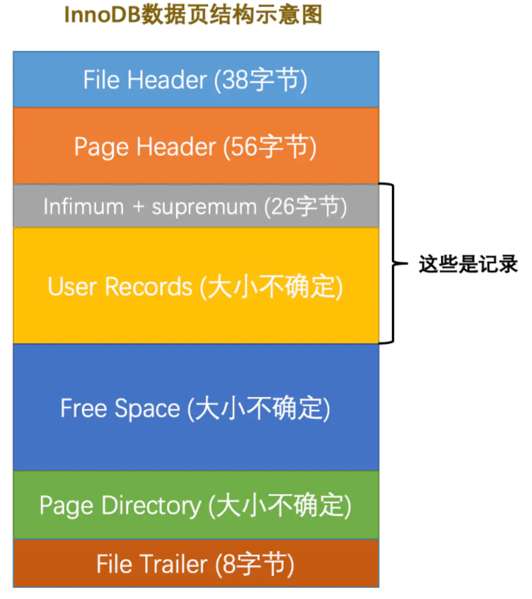

# 面試題

### 為什麼建表時，加上 `not null default ''` ?

 不想讓表中出現 null 值。

---

### 為什麼盡量不要出現 null 值?

第一，不好比較，比較時只能透過 is null 和 is not null 來比較，碰到運算符通常返回 null；第2，效率不高，`影響索引效果`。

---

### 存儲引擎是否可以任意挑選?

`外鍵約束(Foreign key)不能跨引擎使用`。MySQL 支持多種存儲引擎，照理說每一張表都可以指定一個不同的存儲引擎，兩張表如果是使用不同的存儲引擎，則外鍵約束無法建立。

---

### 為了減少 I/O，索引樹會一次性載入嗎?

一次性載入整顆索引樹數據量太大，不可能，載入的方式為`逐一的載入每個數據頁(page)`，即每次載入索引的單個節點。

---

### B+ Tree 的儲存能力如何? 為何一般查找一筆紀錄最多只需1~3次硬碟 I/O?

InnoDB 儲存引擎的每頁(page)的大小為16KB，一般主鍵欄位的類型為 INT (4 Byte) 或 BIGINT (8 Byte)，指針類型一般大小也為4或8個 Byte，也就是說一個頁(B+ Tree中的一個節點) 中大約儲存了 `16KB / (8B + 8B)`，也就是 1000 左右，代表一頁(非葉節點)中約可以儲存 1000 筆。

若樹高為3層，理論上可儲存 1000 * 1000 * 1000 筆紀錄 (葉節點可能儲存不到 1000 筆)，但也有幾億筆了，相當足夠。

實際情況中，MySQL InnoDB 存儲引擎的設計是根節點萬年不動，`根節點是常駐於記憶體中的`，所以不需要 I/O，所以`樹高3層的索引，每次查找時會有2次 I/O`。

故，2~4 層的索引，每次查找只需 1~3 次 I/O。

---

### 為何 B+ Tree 比 B-Tree 更適合作為資料庫索引的結構?

1. `B+ Tree 有更小的樹高`，代表硬碟 I/O 次數更低，B+ Tree的非葉節點不保存數據，儲存的 Key 更多，能讓樹更"矮胖"。

2. `查詢效率更穩定`，每次查找的路徑長度都相同，會讓每一筆數據查詢效率相當。

3. `更適合範圍查找`，B+ Tree 葉節點有 Linked List 結構，可直接遍歷 Linked List 查找下一筆，不需再從根節點重新查找下一筆。

---

 

 

### 比較 Hash索引 和 B+ Tree索引的區別

1. `範圍查找` : Hash 索引進行範圍查找效率低下，因為 Hash索引指向的數據是無排序的，而 B+ Tree 因為葉節點有 Linked List，範圍查找效率高。

2. `聯合索引最左匹配原則` : Hash索引不支持此原則，因為 Hash索引會把聯合索引字串合併再去計算 Hash 值，而 B+ Tree 可以使用單一索引(最左) 或是聯合索引，都可命中索引。

3. `ORDER BY 排序` : 同第一點，Hash索引不支持排序，因本身資料結構就無排序，但 B+ Tree 可以。

4. `模糊查詢` : Hash索引不支持，因為無法改動任何一個字，只能精準查詢，B+ Tree 可以(只能字尾 % 結尾)。

5. InnoDB、MyISAM 不支持 Hash索引；只有 Memory、NDB 等引擎支持 Hash索引。

---

### InnoDB 中，B+ Tree 查詢的步驟為何?

1. 第1次I/O，從硬碟載入 B+ Tree 的根節點，在記憶體中查看根節點的`頁目錄(Page Directory)`，使用`二分搜尋(Binary Search)`，比較頁目錄中組別的最小值，最終找到是哪一組，找到下一個子節點，若非葉節點，則繼續查找直至葉節點。

2. 經過n次I/O，找到葉節點後，從硬碟中將此葉節點整個載入到記憶體中，因為`頁是I/O載入的最小單位`。

3. 在記憶體中，從頁目錄的 `Slot` 中，使用`二分搜尋`找到範圍相符的組別，最後從組別中通過`鏈表遍歷`的方式最終查詢到紀錄。

    * 由於一頁的資料還是太多，因此在一頁中的`頁目錄page directory` 結構中，會將資料分組(大致分組，主要是加快查詢速度)，並且使用 slot 來儲存每組偏移量最大的位址。

        

        
    

--- 

### 緩衝池在更新數據時的步驟?

* 對數據進行修改的時候，首先會對緩衝池中的數據進行修改，然後數據會以`一定頻率更新到硬碟上`，並不是每次操作更新，都會立即進行硬碟回寫。

* 當緩衝池不夠用時，需要釋放一些不常用的`頁`，此時 MySQL 就可以強制使用 CheckPoint 的方式，將不常用的`髒頁(Dirty Page)`回寫到硬碟上，而後再從緩衝池中釋放這些頁面。`髒頁`指的是緩衝池中被修改過的頁，與硬碟中的頁不一致。

 

 

### 說明適合使用索引和不是和索引的情境?

[索引的使用原則](../進階2_索引結構/08_索引使用原則.md)

 

 

### 常見的SQL優化語法

[優化舉例](../進階4_優化/1_優化方向.md#下sql的幾個觀念)

 

 

### 什麼是 ICP 索引下推?

[解釋](../進階4_優化/7_索引下推.md)

 

 

### 解釋正規化

一般來說，正規化目的是將 table schema 欄位標準化的一個標準。

1NF主要是確保每筆數據的`原子性`；2NF、3NF是解決欄位相依性的問題。

通常正規化只會做到頂多BCNF，否則數據過於碎片化，造成查詢時效率不好。

[解釋](../進階5_正規化/1_第123BC_NF_正規化.md#)