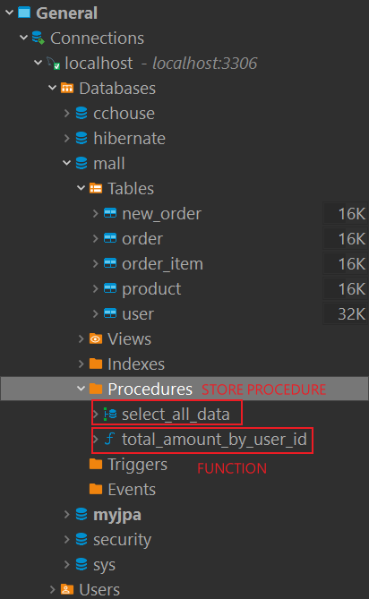

# 函數 Function

函數可以對數據進行各種處理操作，MySQL支持自定義函數，定義好後，調用方式語調用MySQL的系統函數一樣。


### 函數 Function 建立
```sql
CREATE FUNCTION 函數名 (參數名, 參數類型...)
RETURNS 返回值類型
[characteristics ...] 

BEGIN
        函數內容 -- 函數中一定有RETURN語句
END
```

範例
```sql
DELIMITER //

CREATE FUNCTION func1()
RETURNS int     -- 返回單行int數據
        DETERMINISTIC 
        CONTAINS SQL
        READS SQL DATA 
BEGIN
    RETURN (SELECT total_amount  FROM new_order WHERE user_id  = 6 limit 1);
END //

DELIMITER ;
```

<br/>

<br/>

### FUNCTION 儲存位置

CREATE成功後，會和 STORE PROCEDURE 一樣，放在`Procedures`這個物件下。



<br/>

<br/>

### 函數FUNCTION 調用

使用 `SELECT + 函數名稱` 來調用
```sql
SELECT email_by_name();
```

<br/>

<br/>

### Store Procedure 和 Function 比較

||關鍵字|調用語法|返回值|應用場景|是否可用在query查詢|Transaction控制|
|--|--|--|--|--|--|--|
|Store Procedure|PROCEDURE|CALL + SP名稱()|理解為有0個或多個|一般用於更新|否(因為沒有返回值)|允許使用 Commit、Rollback|
|Function|FUNCTION|SELECT + 函數名稱()|只能是一個|一般用於查詢結果為一個值的時候|是|一般情況下不允許使用|