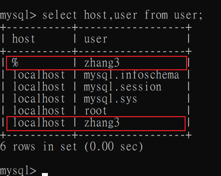
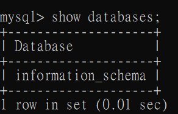
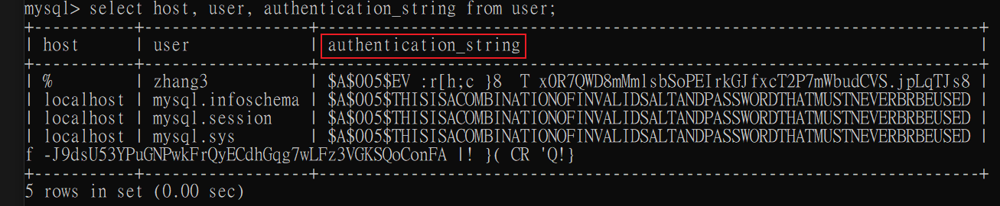
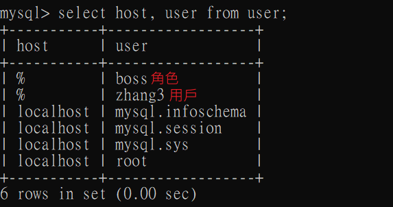

# 用戶管理

1. MySQL 用戶分為`普通用戶`和`root用戶`。

    * root用戶: 為超級管理員，擁有所有權限，包括創建用戶、刪除用戶和修改用戶密碼等管理權限。

    * 普通用戶: 只擁有被授予的權限。

2. MySQL提供了許多語句來管理用戶帳號，用來處理上述權限管理。

3. MySQL數據庫的安全性需要通過帳戶管理來保證。

<br/>

<br/>

### 創建用戶

1. 用戶都是存放在 mysql 資料庫中的 user 資料表。

    ```sql
    -- 使用 mysql 資料庫
    use mysql
    -- 查看
    select host,user from user;
    select * from user\G    -- \G倒置查看，cmd中欄位太多會亂
    ```


2. 創建用戶，`host + user` 不可重複，重複時會報錯。

    `host + user` 為 user 表的聯合主鍵。

    ```sql
    -- 創建 host 為任意(以百分比符號%表示)，user 為 zhang3 的用戶
    create user 'zhang3' identified by 'abc123';

    -- 創建 host 為 localhost，user 為 zhang3 的用戶
    create user 'zhang3'@'localhost' identified by 'abc123';
    ```


    


3. 創建完，使用新用戶登入，會發現只有 information_schema 資料庫的權限。

    ```sh
    # 登入mysql
    mysql -uzhang3 -pabc123
    ```

    

<br/>

<br/>


### 更新用戶名
此功能基本比較少用，因為只能修改 user 表中的使用者名稱。 主鍵是 `host + user`，所以 where 條件要設好。
```sql
update user set user = 'wang5' where user = 'zhang3' and host = '%';
```

### 刪除用戶
相當於刪除 user 表中的數據。

```sql
-- host沒指定的話，是預設刪除 'zhang3'@'%'
drop user 'zhang3';

-- 刪除指定 host + user 用戶
drop user 'zhang3'@'localhost';
```

`注意:` 不推薦使用 DELETE ... FROM 的方式刪除，因為會有殘存資料沒有刪除乾淨，所以最好是使用 DROP。

<br/>

<br/>

### 記得刷新權限

若`修改用戶名`或是`刪除用戶名`之後，必須要下此命令，刷新權限。
```sql
-- sql
flush privileges;
```

<br/>

<br/>

### 修改自己的密碼
先登入需要修改的用戶，再修改密碼
```sql
alter user user() identified by 'abcabc';
```

補充: 密碼是儲存在 `authentication_string` 這個欄位中，並且有經過加密處裡。



<br/>

<br/>

### 修改別的用戶密碼
需要透過 root 修改其他的用戶密碼。建議 user 和 host 都要指定

```sql
alter user 'zhang3'@'%' identified by 'abcabc';
```

<br/>

<br/>

---

<br/>

<br/>

# 權限管理

簡單理解就是，MySQL 只允許做權限以內的事情，例如只允許 SELECT 操作，就不能另外執行 UPDATE 操作。

### 授予權限

給用戶授權的方式有2種:

1. 賦予用戶授權角色

2. 直接授權給用戶

<br/>

<br/>

### MySQL 權限大致分類

|種類|設置權限|
|--|--|
|表權限|Select, Insert, Update, Delete, Create, Drop, Grant, References, Index, Alter|
|列權限|Select, Insert, Update, References|
|過程權限|Execute, Alter Routine, Grant|

<br/>

<br/>

### 權限設置原則

1. 指授予能`滿足需要的最小權限`。

2. 創建用戶的時候，`限制用戶的登入主機(host)`。

3. 為每個用戶設置`滿足密碼複雜度的密碼`。

4. 定期清理不需要的用戶，回收權限或刪除用戶。

<br/>

<br/>

### 查看權限列表
查看所有可用的權限列表
```sql
-- 顯示 MySQL 資料庫伺服器上可用的全域權限清單。
show privileges;
```

`查看用戶被授予的權限` (常用)
```sql
-- 當前用戶
show grants;
-- 指定用戶
show grants FOR '用戶名'@'主機名';
```

<br/>

<br/>

授權命令: 

```sql
-- 授權
GRANT 權限1, 權限2... ON 數據庫名稱.表名稱 TO 用戶名@用戶地址 [identified by '密碼'];

-- 補充: 若沒有該用戶，則會自動創建一個
```

舉例
```sql
-- dbtest資料庫中，賦予 select, update 權限給 zhang3
grant select, update on dbtest.* to 'zhang3'@'%';

-- dbtest資料庫中，賦予所有權限給 zhang3
grant all privileges on dbtest.* to 'zhang3'@'%';

-- 所有資料庫中，賦予所有權限給 zhang3
grant all privileges on *.* to 'zhang3'@'%';
```

`注意` : 預設是只有 root 才有賦予權限的能力，如果需要`賦予權限`的權限，需要添加 `WITH GRANT OPTION` 選項:

```sql
-- 這樣 zhang3 也有賦予其他用戶權限的能力
grant all privileges on *.* to 'zhang3'@'%' with grant option;
```


<br/>

<br/>


### 撤銷權限
```sql
REVOKE 權限類型 ON 數據庫名稱.表名 FROM '使用者名稱'@'主機';
```

舉例

```sql
revoke update, delete on *.* from 'zhang3'@'%';
```

<br/>

<br/>

# 權限控制實現原理

1. MySQL 透過`權限表`來控制用戶對資料庫的訪問，權限表放在 `mysql` 這個資料庫中。

2. 有關的表有以下幾個:

    * user : 用戶帳號和權限資訊。
    
    * db : 資料庫層級的授權。
    
    * tables_priv : 表層級的授權。
    
    * columns_priv : 列層級的授權。

    * procs_priv : 過程權限(Store Procedure, Function等權限)。

3. 在 MySQL 服務啟動時，會將上述這些表加載到記憶體當中。


<br>

<br/>

# 資料庫訪問控制流程

正常情況下，分為兩個階段: `連接核實階段` 和 `請求核實階段`。

### 連接核實階段
1. 用戶連接 MySQL 時，用戶會提供用戶名、主機地址、用戶密碼，MySQL 收到用戶請求後，會使用 `user 表中的 host , user , authentication_string 這三個欄位去檢查用戶端提供的訊息`。


2. 如果檢查失敗則拒絕訪問，若檢查成功，則接受連接，進入`請求核實階段`等待用戶請求。

### 請求核實階段
1. 在此階段，每個請求訪問時，服務器都會檢查請求要執行什麼操作、是否有足夠的權限操作，故`服務器就會依據範圍去讀取 user , db , tables_priv , columns_priv 等表`，檢查是否有權限。

2. 由 user 表先檢查，若有權限直接允許執行，若沒權限則往下一張 db 表查，查詢粒度由範圍大至小為: 

    1. user : 用戶帳號和權限資訊。
    
    2. db : 資料庫層級的授權。
    
    3. tables_priv : 表層級的授權。
    
    4. columns_priv : 列層級的授權。


<br/>

<br/>


# 角色管理

角色是 8.0 後引入的功能，在 MySQL 中，`角色是權限的集合`，可以為角色添加或移除權限，而用戶可以被賦予角色。

角色的優點是`方便管理擁有相同權限的用戶`。


<br/>

<br/>

### 創建角色 + 賦予角色權限 + 賦予用戶角色
創建使用 `create role` 關鍵字
```sql
create role 角色名稱[@主機地址];
```

步驟
```sql
-- 創建 manager 角色
create role 'manager'@'%';

-- 賦予角色權限
grant all privileges on dbtest.* to 'manager'@'%';

-- 賦予用戶角色
grant 'manager'@'%' to 'zhang3'@'%';
```

流程到這邊，還不會啟用，原因是 `MySQL 預設用戶在被賦予角色後，需要進行手動啟用`，如下:

```sql
-- 方法1 手動指定用戶啟用(建議)
set default role all to 'zhang3'@'%';

-- 方法2 將自動啟用開啟
set global activate_all_roles_on_login = ON;

show variables like 'activate_all_roles_on_login';
```

設定完後，用戶需要重新登入才能看到新設定的權限，可以使用 `select current_role()` 檢查是否成功。


<br/>

<br/>

### 查看當前角色
查看當前角色，呈上，假如尚未手動啟用角色則會顯示 `none`
```sql
select current_role();
```

<br/>

<br/>

### 設置強制的角色(Mandatory Role)
強制給每個創建的用戶一個預設角色，不需要手動配置。`強制角色無法被 REVOKE 或 DROP`，此功能較少使用。

```sql
-- my.ini 配置文件
[mysqld]
mandatory_roles='role1,role2@localhost,role3@%';
```


<br/>

<br/>

### 查看角色目前有的權限
和查看用戶語法一樣，直接用角色名去查
```sql
-- 查看角色
show grants for 'manager'@'%';

-- 查看用戶
show grants for 'zhang3'@'%';
```

`注意`: 角色和用戶相同，共用儲存在 user 資料表當中。
```sql
select host, user from user;
```




<br/>

<br/>

### 撤銷角色權限
```sql
revoke all privileges on dbtest.* from 'manager'@'%';
```

<br/>

<br/>

### 撤銷用戶的角色
用戶本身不能撤銷自己的角色
```sql
revoke 'manager'@'%' from 'zhang3'@'%';
```

<br/>

<br/>

### 刪除角色
```sql
drop role 'manager'@'%';
```
