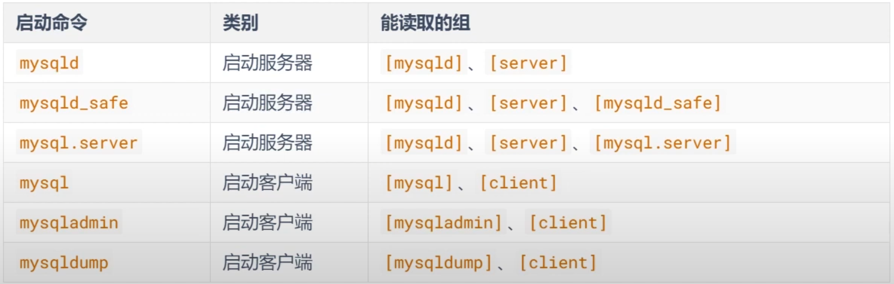

# 配置文件

### 概述
1. 此筆記以 8.0 版本為主
2. 配置文件是以 key value 的格式，中間使用等號連接。


### 文件路徑

* Linux: `/etc/mysql/my.cnf`

* Windows: `C:\ProgramData\MySQL\MySQL Server 8.0\my.ini`


### 啟動命令

以下是啟動命令能讀取的選項組

* [server] 選項的配置，只作用於服務器端。
* [client] 選項的配置，只作用於客戶端。




<br/>

<br/>

### 優先級1

若出現相同的 key，後面的覆蓋前面的設定

```ini
[server]
default-storage-engine=InnoDB

[mysqld]
default-storage-engine=MyISAM
```

以上舉例，[server] 組別的，還是會使用 InnoDB，但 [mysqld] 組別，使用 MyISAM。

### 優先級2
啟動時的命令行優先級大於my.ini配置文件

```ini
# 配置文件
[server]
default-storage-engine=InnoDB
```
```sh
# CLI
mysql.server start --default-storage-engine=MyISAM
```

以上舉例，會設定為 CLI 的設定。

<br/>

<br/>

