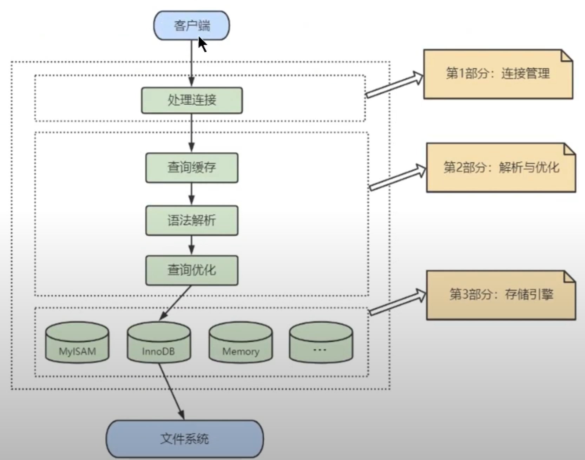
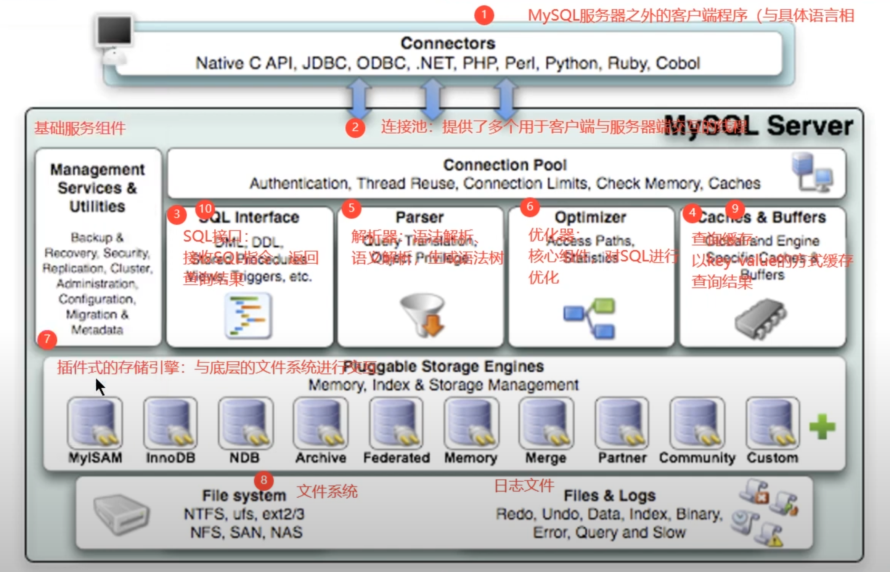
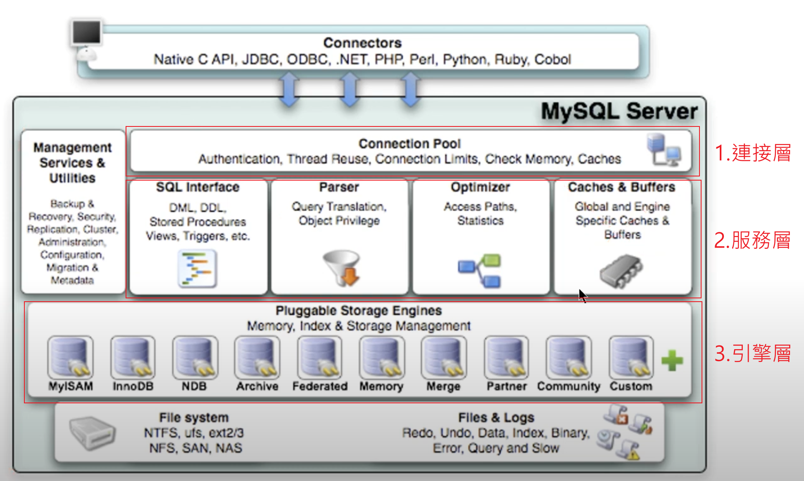
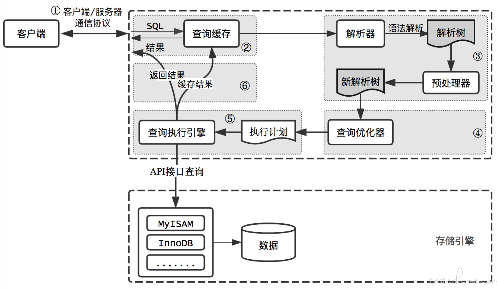

# 架構

### 概述

1. MySQL 是一個典型的 C/S 架構，即 Client/Server，服務器端 Process 為 `mysqld`。

2. 不論 Client 和 Server 之間是採用哪一種協議，最後時限的效果都會是 `Client端向Server端發送一段SQL語句(字串)，Server端處理後再向Client端發送一段處理結果(字串)`，都是字串。

3. Server端流程可拆解為3部分:

    

    <br/>

4. Server端的內部可再細分為幾個功能區塊:


    

    <br/>

    * 第4步驟，在查詢之前先找 Cache 是否有資料。

    * 第9步驟，找到查詢結果後，會先將結果儲存到 Cache 中保存。

    * 補充: 版本 8.0 是沒有`查詢緩存Query Caches`，只有版本 5.7 才有，故 `MySQL8.0 沒有第4、9步驟`。

<br/>

<br/>


### 3層架構

依照功能，分為3層




<br/>

<br/>

### 1. 連接層

客戶端訪問 MySQL 服務，第一件事情就是建立 TCP 連接，經過3次握手建立連接成功後，服務器端會對 TCP 傳輸過來的帳號密碼做驗證、權限獲取。

* 用戶驗證不通過，會返回 Access denied for user 錯誤，客戶端程序會結束執行。

* 用戶驗證通過，會從權限表查出帳號擁有的權限與連接關聯，放在服務器的記憶體當中，之後的權限判斷邏輯，都會依照此時讀取到的權限。

連接池(Connection Pool) 以`長連接`的方式和客戶端進行連接，減少每次連接所帶來的成本問題。

連接池在TCP連接後，會從線程池中分配一個 `Thread` 給此連接池。

<br/>

<br/>

### 2. 服務層

此層主要負責核心的功能，分幾個組件

`SQL Interface`

* 接收用戶的SQL指令，並且返回用戶需要的查詢結果，例如 SELECT ... FROM 就是調用 SQL Interface。

* MySQL 支援 DDL、DML、Store Procedure、View、Trigger、Function 等多種SQL語言Interface。


`Parser解析器`

* SQL指令傳遞到解析器時，會被驗證和解析，並創建`解析樹（Parse Tree）`，以及根據數據字典去豐富查詢解析樹，最後會`驗證該客戶端是否具有執行該查詢的權限`，創建解析樹後，會對SQL查詢進行語法上的優化，進行查詢重寫。

* 若發現有語法問題，則流程不會再繼續，會返回 SQL syntax 錯誤。

`Optimizer查詢優化器`
* SQL語句再語法解析後，查詢之前會使用查詢優化器確定SQL語句的執行路徑，並生成一個`執行計畫(Execution Plan)`。

* 執行計畫會表明要`使用哪些索引進行查詢`(全表檢索還是索引檢所)、表之間JOIN的順序、最後會依照執行計畫中的步驟調用存儲引擎提供的方法來真正執行查詢。

`Query Caches 查詢緩存`

* 此機制是由一系列的小緩存組成的。例如: 表緩存、紀錄緩存、key緩存、權限緩存。

* `查詢緩存可以在不同客戶端之間共享`。

* 從 MySQL 5.7.20 開始，不推薦使用查詢緩存，並在 MySQL 8.0 中刪除，原因是命中率極低。

<br/>

<br/>

### 3. 引擎層 Storage Engine

`插件式的存儲引擎`架構下，可以依據業務的需求去選擇適合的存儲引擎，是很彈性的，其他的資料庫就不一定是這樣的架構。

開源的 MySQL 還允許開發人員設置自己的存儲引擎。

插件式的存儲引擎，真正的負責了 MySQL 中數據的存儲和提取，`對物理層級的底層數據執行操作`(即硬碟上的資料)。

可以使用以下的指令查看當前版本支持的存儲引擎:

```sql
show engines;
```

查看真正資料存儲的路徑
```sql
show variables like 'datadir';

-- Linux 返回 /var/lib/mysql
-- Windows 返回 C:\ProgramData\MySQL\MySQL Server 8.0\Data\
```


<br/>

<br/>

# MySQL執行流程


### 流程圖



<br/>

<br/>

### MySQL8.0 緩存區被移除原因

先講結論，`緩存弊大於利，緩存失效的情況非常頻繁`。

原因3點如下: 

1. 緩存區是把整個 SQL語句(字串)作為一個 Key，所以當 SQL 語句多了一個空白鍵，也會被判定是不相同的 Key，非常難命中。

    ```sql
    -- SQL1
    SELECT * FROM employees;
    -- SQL2
    SELECT * FROM employees ;
    ```
    故上述 SQL1 和 SQL2 不會使用相同的緩存。

2. 若 SQL 語句中包含類似 NOW 函數，使用緩存就沒有意義，因為結果每次查詢都不一樣。

3. 當資料被修改時 (INSERT、UPDATE、DELETE、TRUNCATE TABLE、ALTER TABLE、DROP TABLE、DROP DATABASE)，緩存中的資料會被刪除，以保證資料不是返回舊的，但這樣一來，對於`更新壓力大的資料庫`，命中緩存的機率又更低了。