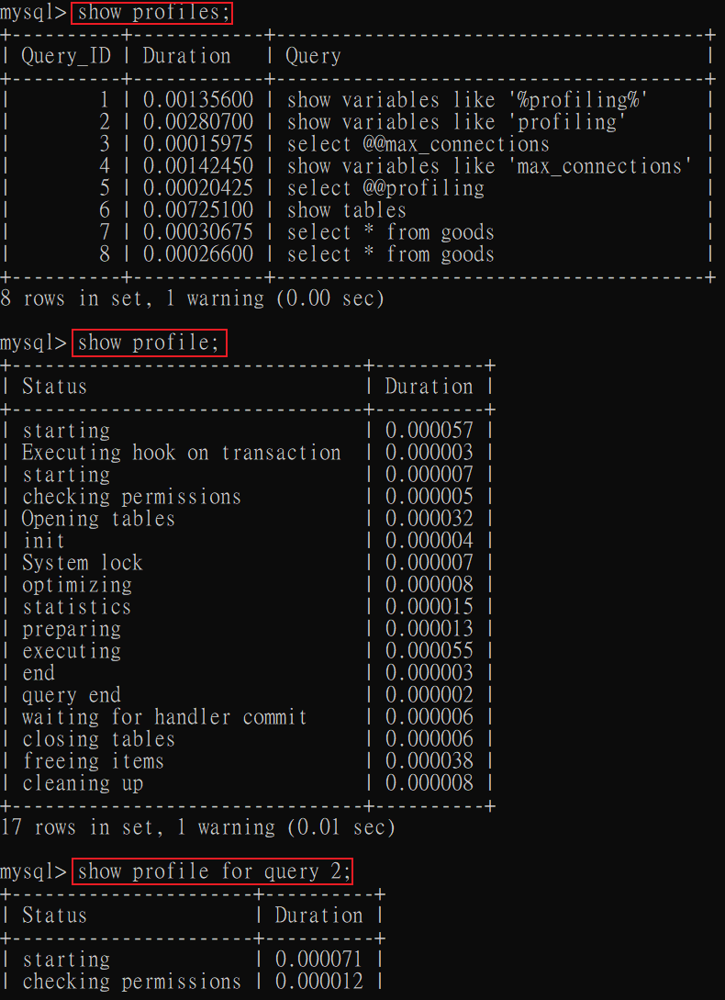

# MySQL執行原理

### 確認 profiling 是否開啟

在MySQL中，`SHOW PROFILES` 語句用來顯示查詢中各個階段的耗時，開啟方式是將 `profiling` 系統變數設為 `1`。

可以使用以下語句查詢當前變數
```sql
-- #1
show variables like 'profiling';

-- #2
select @@profiling;
```

將此功能打開
```sql
set profiling=1;
```

<br/>

<br/>

### 查看性能分析

將 profiling 系統變數開啟後，使用以下指令

```sql
-- 查看所有的分析報告
show profiles;

-- 查看最新一筆的分析報告
show profile;

-- 指定查看某一筆分析報告
show profile for query 2;
```




<br/>

<br/>

可以利用以下參數來查看其他分析:

```sql
show profile BLOCK IO, CPU for query 7;
```

type:
* ALL: 顯示所有資訊
* BLOCK IO: 顯示IO相關
* CONTEXT SWITCHES: 上下文切換相關
* CPU: 顯示CPU相關
* IPC: 顯示發送和接收相關
* MEMORY: 顯示記憶體相關
* PAGE FAULTS: 顯示葉面錯誤相關
* SOURCE: 顯示 Source_function, Source_file, Source_line 相關
* SWAPS: 顯示交換次數相關