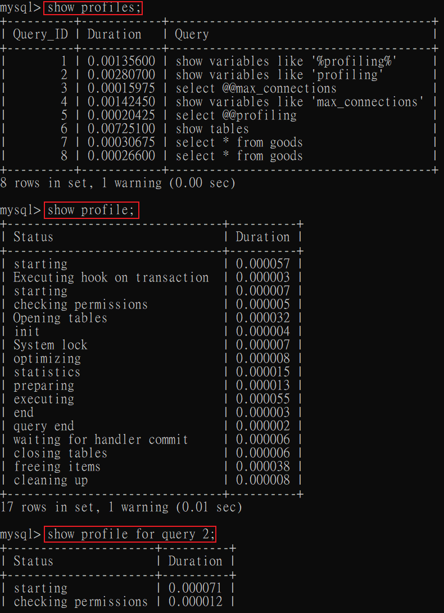

# MySQL性能分析

### 概述
性能分析的目的是 `反映時間更快`、`吞吐量更大`。

<br/>

<br/>

### DBMS的優化步驟


<br/>

`週期性波動`: 因為事件或時間產生的狀況，如雙11活動。

<br/>

<br/>

### 查看系統性能參數

MySQL 中，使用 `SHOW STATUS`，查詢相關的`性能參數`、`執行頻率`。

```sql
-- 查詢語法
SHOW [GLOBAL | SESSION] STATUS LIKE '參數';
```

以下是常用的參數:

* Connections : 連接服務器的次數。

* Uptime : 服務器的上線時間。
* Slow_queries : 慢查詢的次數。
* Innodb_rows_read : select查詢返回的行數。
* Innodb_rows_inserted : 執行 insert 操作，插入的行數。
* Innodb_rows_updated : 執行 update 操作，修改的行數。
* Innodb_rows_deleted : 執行 delete 操作，刪除的行數。
* Com_select : 查詢操作的次數。
* Com_insert : 插入操作的次數。
* Com_update : 更新操作的次數。
* Com_delete : 刪除操作的次數。

<br/>

<br/>

### 統計SQL查詢成本

一條SQL再執行前需要確定`執行計畫`，如果存在多種執行計畫，服務器會計算每個計畫所需要的成本，從中選`成本最小`的為最終執行計畫。

可以使用 `last_query_cost` 變數來得到當前查詢的成本，通常也是`評價一個查詢的執行效率`的常用指標。

這個指標對應的是 `SQL語句所需要獲取的頁的數量`。

```sql
-- 查看上一筆SQL執行計畫的成本
show status like 'last_query_cost';
```

有一種情況是成本(頁的數量)大增，但查詢秒數沒有太大變化，原因是已經將頁一次性的載入到緩衝池中。

<br/>

<br/>

### 查詢中各個階段的耗時，確認 profiling 是否開啟

在MySQL中，`SHOW PROFILES` 語句用來顯示查詢中各個階段的耗時，開啟方式是將 `profiling` 系統變數設為 `1`。

可以使用以下語句查詢當前變數
```sql
-- #1
show variables like 'profiling';

-- #2
select @@profiling;
```

將此功能打開
```sql
set profiling=1;
```

<br/>

<br/>

### 查看性能分析

將 profiling 系統變數開啟後，使用以下指令

```sql
-- 查看所有的分析報告
show profiles;

-- 查看最新一筆的分析報告
show profile;

-- 指定查看某一筆分析報告
show profile for query 2;
```




<br/>

<br/>

可以利用以下參數來查看其他分析:

```sql
show profile BLOCK IO, CPU for query 7;
```

type:
* ALL: 顯示所有資訊
* BLOCK IO: 顯示IO相關
* CONTEXT SWITCHES: 上下文切換相關
* CPU: 顯示CPU相關
* IPC: 顯示發送和接收相關
* MEMORY: 顯示記憶體相關
* PAGE FAULTS: 顯示葉面錯誤相關
* SOURCE: 顯示 Source_function, Source_file, Source_line 相關
* SWAPS: 顯示交換次數相關