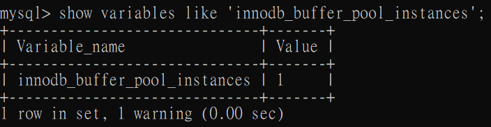

# 緩衝池

### 概述

InnoDB Engine 是以`頁`為單位來管理儲存空間的，每頁在硬碟大小為`16KB`。

每次操作硬碟上的數據時，都會花費大量的 I/O，因此用了緩衝池(Buffer Pool)，DBMS 會向作業系統申請記憶體來作為數據的緩衝池，這樣操作資料都會在記憶體上，節省了大量的時間，訪問成本降低。

這種做法是物理層面的，直接對於 SQL 的查詢性能至關重要。

<br/>

<br/>

### 緩衝池 vs 查詢緩存

兩個是完全不一樣的東西

`緩衝池` = 先將大量硬碟資料預先載入到記憶體當中。

`查詢緩存` = 將查詢到的資料暫時存到記憶體中，結構是 key-value。

<br/>

<br/>

### 緩衝池特性

1. 不管在哪個版本都有，是核心組件。

2. InnoDB 引擎中，有一部分的數據會放到記憶體中，緩衝池則佔了大部分，用來儲存各種數據的緩存。

    
    
    <br/>

3. 緩存原則: 載入至緩衝池的優先級為`使用頻率較高的熱數據`進行加載。

4. `預讀特性`: 由於緩衝池的作用就是減少 I/O，所以在讀取數據的時候，會有高機率一併讀取載入數據`前後的數據`，前提是記憶體允許的情況下。

5. 數據修改時(重要特性): 

    * 對數據進行修改的時候，首先會對緩衝池中的數據進行修改，然後數據會以`一定頻率更新到硬碟上`，並不是每次操作更新，都會立即進行硬碟回寫。

    * 緩衝池會以`CheckPoint機制`將數據回寫到硬碟上，這樣的優點是提升了資料庫的整體性能。

    * 當緩衝池不夠用時，需要釋放一些不常用的`頁`，此時就可以強制使用 CheckPoint 的方式，將不常用的`髒頁(Dirty Page)`回寫到硬碟上，而後再從緩衝池中釋放這些頁面。`髒頁`指的是緩衝池中被修改過的頁，與硬碟中的頁不一致。


<br/>

<br/>

### 查看/設置緩衝池大小
InnoDB，查看緩衝池大小
```sql
-- 單位是 Byte，需要除以 1024 兩次，換算成 MB
show variables like 'innodb_buffer_pool_size';
```

設置緩衝池大小

```sql
-- 256MB
set global innodb_buffer_pool_size=268435456
```


如果使用 MyISAM，只緩存索引，不緩存數據，對應的鍵緩存參數為
```sql
show variables like 'key_buffer_size';
```

<br/>

<br/>

### 多個 Buffer Pool 實例

緩衝池本質是 InnoDB 向 OS 申請的一塊`連續的記憶體空間`。為了解決在多線程下併發的問題，有2種解決方式:

1. 使用加鎖處理，適用於併發量相對低。

2. 將緩衝池拆成多個、小的緩衝池，每個緩衝池稱為一個`實例`，每個都是獨立的，獨立去向 OS 申請記憶體，適用於高併發。

<br/>


使用以下指令查詢實例數量
```sql
-- 緩衝池實例數量，預設為1
show variables like 'innodb_buffer_pool_instances';
```



<br/>

修改實例數量使用 `my.cnf` 配置檔
```ini
[server]
innodb_buffer_pool_instances=2
```

<br/>

`注意1` : 設置完成後，緩衝池總記憶體上限(innodb_buffer_pool_size)不變，每個實例分配的記憶體是 `總記憶體 / 實例數量`。

`注意2`: InnoDB規定，當 innodb_buffer_pool_size 小於 `1GB`，設置多個緩衝池是無效的，還是會默認為1。