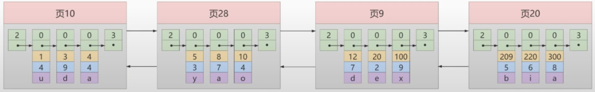

# 索引

### 概述

1. 索引是存儲引擎中，用於快速找到數據紀錄的一種資料結構。

    * MySQL官方對索引的定義為: 索引(Index)是幫助 MySQL 高效獲取數據的`資料結構`。

    * 索引是在存儲引擎中實現的，每種存儲引擎的索引不一定完全相同。

    * 存儲引擎可以定義每個表的`最大索引數量`和`最大索引長度`，所有的存儲引擎支持每個表最少有16個索引，總索引長度至少為256的Byte。

2. 目的是為了避免`全表掃描`，通過索引可以較效率的查找資料。

3. 記憶體的讀取速度遠高於硬碟讀取速度(硬碟讀取 I/O 速度較慢)，所以瓶頸多半會是在硬碟，所以`在記憶體中的演算法優化，效果遠不如在硬碟中減少 I/O 的次數`。

    * 例如: 在記憶體中優化減少了2毫秒，但減少一次硬碟I/O可以減少了20毫秒，代表減少硬碟I/O更能效率的縮短時間。

    * 而索引的目的就是為了減少 I/O 次數。

<br/>

<br/>

### 索引優點

1. `減少資料庫 I/O 操作`，資料庫引擎可以直接跳到索引中儲存的位置，而不是掃描整個表。這降低了磁碟 I/O 操作的次數，提高了查詢效能。

2. `提高唯一性約束`，在某些情況下，索引用於實作唯一性約束，確保表中的某一列或列組不包含重複的值。這有助於維護資料的完整性。

    * 需要注意的是，虽然索引可以具有唯一性，但不是所有索引都是唯一的。

3. `加速聯表操作`，在連接多個資料表的查詢中，索引可以顯著提高連接操作的效能。連接操作通常涉及在兩個表之間匹配關聯列，而索引使得此匹配過程更加迅速。

4. `加速分组(GROUP BY) 和排序 (ORDER BY) 操作`，有序的索引結構使得排序操作更加高效，而且可以更快定位到需要分組的資料。

<br/>

<br/>

### 索引缺點

1. `需要佔硬碟空間`： 可能在大型資料庫中成為一個問題。每個索引都會佔用磁碟空間，因此在設計索引時需要平衡效能需求和儲存成本。

2. `影響更新操作效能`： 當進行插入、更新和刪除操作時，索引需要維護，可能導致額外的效能開銷。寫入操作會導致索引的更新，因此在頻繁進行大量寫入操作的情況下，過多的索引可能會影響效能。

3. `過度索引的問題`： 如果資料庫中存在過多的索引，可能會導致查詢優化器選擇不當的索引，從而降低查詢效能。維護和管理大量索引也可能變得複雜。

<br/>

<br/>

### B+ Tree 設計索引的推導

在 InnoDB 下創建一個索引，行格式 (ROW_FORMAT) 使用 `Compact` 格式。

```sql
create table index_demo(
    c1 INT,
    c2 INT,
    c3 CHAR(1),
    PRIMARY KEY(c1)
) ROW_FORMAT = Compact;
```

下圖為資料行(一筆資料)的組成


* `record_type`: 屬於header的一個屬性
    
    * 0: 普通紀錄
    * 1: 目錄項紀錄
    * 2: 最小紀錄
    * 3: 最大紀錄

* `next_record`: 屬於header的一個屬性，由於頁(page)中的每筆資料，是由 LinkedList 格式串接成的，所以需要有此屬性來表示下一筆資料，即與本筆資料相對的`地址偏移量`。


插入每筆資料時，新插入的資料 PK 值，都必須比上一筆大，以此排序。以下結構是每個頁(page)中，存儲每筆數據的方式。

* 頁和頁之間使用`雙向鏈接串列 Doubly Linked list`，頁中的每筆數據之間使用 `鏈結串列 Linked list`。

* 頁和頁之間，不一定是連續的記憶體位址，所以舉例中，頁的編號不連續。



建立目錄項時，都會定義以下資訊

* `key(紀錄中最小的PK值)`

* `page_no(頁編號)`，即頁的記憶體位址

因此若要找 `PK = 20`，則會直接找目錄項3，因為 `12 < 20 < 209`。


以上整個結構，稱為`索引`。

繼續改良，每個`目錄項`之間，在 insert 或 update 的時候成本較高，所以也適合改成 Linked List 的方式，因此目錄項的格式也換成數據頁的格式，`record_type = 1`代表`目錄項頁`，`record_type = 0`代表`數據頁`。


到此為止，使用此索引結構，查詢 `PK = 20`，只需要 I/O 2次。

* 第1次 : 從硬碟載入頁目錄到記憶體中，找到 `page_no = 9` (因為12 < 20 < 209) 的位址。

* 第2次 : 從硬碟載入數據頁(只載入頁9)，找到 PK = 20 這筆數據。

繼續改良，需要解決另一個問題，當數據太多時，一個目錄頁不夠時，即圖中頁30不夠，需要再生成一個頁32，所以需要`再使用一個總目錄頁來管理目錄頁`。


於是結構變成以下(由下往上)

* 第2層 : 管理目錄頁的目錄頁 (根節點)。

* 第1層 : 目錄頁。

* 第0層 : 數據頁。

其實全都是數據頁，只是 record_type 不同而已。


<br/>

此最終結構，即是 `B+ Tree`，基於此結構，查找任何數據時，`都只需要 3 次 I/O`。

注意: 此結構建立的時候，並非由下而上，而是由根節點而下建立，[這邊補充說明](./05_索引_2.md#innodb-中-b-tree-注意事項)。

<br/>

<br/>

### B+ Tree 不會超過4層的原因

`葉節點`放實體數據，每頁可以放 100 筆。

`非葉節點`不放實體數據，每頁可以放 1000 筆。

所以 B+ Tree 有

* 1層 : 可儲存 `100` 筆紀錄。

* 2層 : 可儲存 1000*100 = `100,000` 筆紀錄。

* 3層 : 可儲存 1000*1000*100 = `100,000,000` 筆紀錄。

* 4層 : 可儲存 1000*1000*1000*100 = `100,000,000,000` 筆紀錄。

4層就可以儲存一千億筆的資料，已經相當夠用。