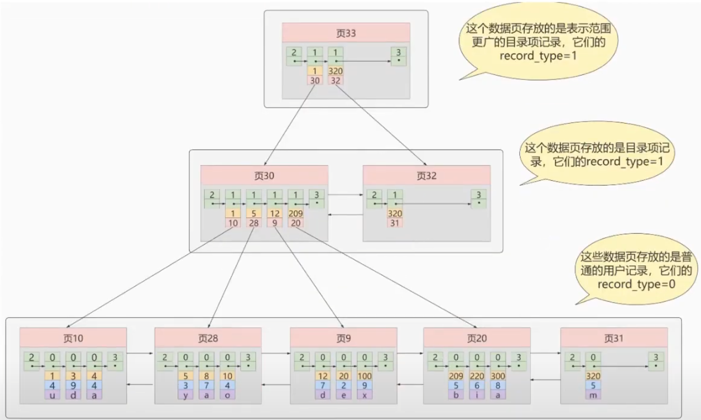

# 資料結構的比較

### 概述
一般在說的演算法比較，O(n^2)、O(log n) 等等，都是在記憶體中的執行的，效能差異頂多幾毫秒、幾十毫秒，而數據是儲存在硬碟中的，從硬碟載入到記憶體中是非常耗時的，比演算法的差異還多很多，所以`硬碟載入到記憶體中的 I/O 次數`才是關鍵，因此 MySQL 中資料結構就是為了減少 I/O 次數。

加速查詢速度的資料結構有2類

1. 樹結構 : 查詢、插入、修改、刪除的平均時間複雜度都是 `O(log2 N)` (底數2)

2. Hash結構 :  查詢、插入、修改、刪除的等值查找時間複雜度為 `O(1)`，範圍查找時間複雜度為 `O(N)`

<br/>

<br/>

## Hash

### Hash結構效率比樹結構高，為什麼不採用Hash?

以下4個原因:

1. Hash 僅能滿足 `=` 、 `<>` 、 `IN` 查詢等精確查找，如果是範圍查找，時間複雜度就會退化成 `O(n)`，而樹結構的有序特性，依然能夠保持 `O(log2 N)` 的高效率。

2. Hash 的儲存方式是沒有排序的，在 ORDER BY 查詢下，還需要重新排序。

3. 使用聯合索引時，Hash 並不適用，因為 Hash 是 Key-Value 結構，也就是將聯合索引合併成一個 Key，但這樣會發生多個 Key 會有同一個 Value 的極端情況發生。

4. 在索引列的重複值如果很多，效率就會降低 (因為遇到碰撞時需要遍歷 Bucket 中的資料)，如: 性別、年齡作為索引時。

<br/>

<br/>

### 哪種存儲引擎中，適用 Hash 索引?

|存儲引擎|MyISAM|InnoDB|Memory|
|--|--|--|--|
|Hash索引|不支持|不支持|`支持`|


`結論`: Hash 索引是對等於 (`==` 和 `<>`)判斷效率高，被用在記憶體的引擎中。

<br/>

<br/>

### InnoDB 本身不支持 Hash 索引，但是提供了 `自適應Hash索引 (Adaptive Hash Index)`

當某個數據經常被訪問，當滿足一定條件時，就會將查詢到的數據頁地址存放到 Hash 表中，作為 Cache。

如下圖，右邊步驟是走 B+ Tree 索引並回表查詢到符合的數據頁，當滿足一定條件時，就會將此數據頁的地址存放到左邊的 Adaptive Hash Index。


<br/>

MySQL中的系統常數設定，此 Hash 功能預設是開啟的

```sql
show variables like '%adaptive_hash_index%';
```


<br/>

<br/>

## 樹種類
`二元樹 Binary Tree`

* 1個節點只能有2個子節點，子節點可以為空。

`二元搜尋樹 Binary Search Tree`

* 為 Binary Tree 的一種
* 左子節點比本節點小，右節點比本節點大

`平衡二元樹 Balanced Binary Tree`

* 為 Binary Search Tree 的一種，改善結構不平衡的問題

* 每個節點的左右兩子樹高度差不超過1，並且兩個子樹都是一個平衡二元樹。

* 常見的實作有: 
    * 紅黑樹 Red Black Tree
    * AVL樹 Adelson-Velsky and Landis Tree


`B Tree`

`B+ Tree`


<br/>

<br/>

## 二元搜尋樹 Binary Search Tree


1. 如果利用二元樹作為索引結構，那`硬碟的 I/O 次數和樹的高度是相關的`。

2. 二元搜尋樹的特點

    * 1個節點只能有2個子節點，子節點可以為空。

    * 左子節點比本節點小，右節點比本節點大 (二元樹 Binary Tree 沒有此規則)。

3. 查詢時，依照每個節點去比大小查詢，時間複雜度為 `O(log2 N)`，

    

4. 此資料結構缺點是，有極端情況，樹會退化成 Linked List，時間複雜度會變成 `O(N)`。

    


<br/>

<br/>

## AVL樹 Adelson-Velsky and Landis Tree

1. 為平衡二元樹的一種，AVL是最早提出的。

2. AVL樹特性:

    * 時間複雜度為 `O(log2 N)`，不會退化

    *  AVL樹透過頻繁旋轉來使樹達到平衡

        > https://blog.csdn.net/Guqing_f/article/details/124295122

3. 缺點，由於每訪問一次節點還是需要再一次硬碟 I/O，所以根本上沒有解決樹太高，產生的高 I/O。

<br/>

<br/>

## B-Tree 

1. B 為 Balance，一個節點可以有多個子節點，故樹高度遠小於平衡二元樹。

2. B-Tree 特性: 

    * 時間複雜度為`O(log2 N)`。

    * 解決了樹太高的問題

    * 每個節點都可以存放數據

3. 缺點:

    * 在每個節點都存放所有數據，搜尋有可能在非葉節點的位置結束，會造成`範圍查找`時效率低需要逐個遍歷

        

    * 資料變大時，非葉節點會塞不下，導致節點儲存的資料筆數不同，不穩定

<br/>

<br/>

## B+ Tree

基於 B-Tree 做了改進，更適合索引系統。

1. 所有數據都存放在葉節點，並用 Linked List 串接起來，改善了 B-Tree 範圍查找的缺點。

2. B-Tree 和 B+ Tree 的比較

    * B-Tree 子節點數量 = 節點中Key的數量 + 1
    * B+ Tree 子節點數量 = 節點中Key的數量

    

3. 優點

    * 查詢效率更穩定，因為數據統一存在葉節點中，每次查找的 I/O 次數都是相同的，

    * 範圍查詢時，效率更高，因為葉節點之間都使用`雙向Linked List`串接，葉節點中的每筆數據也會依序使用`單向Linked List`串接。