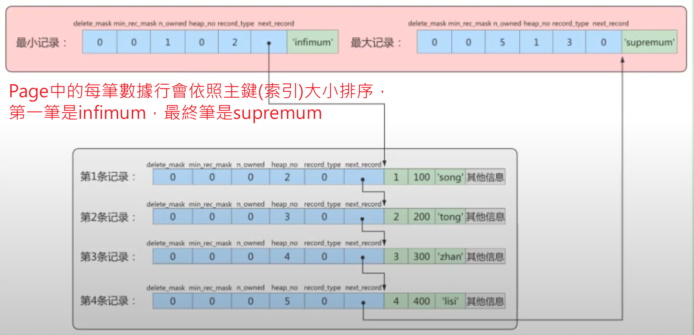

# InnoDB的數據頁

## 概述

1. 為 InnoDB 存儲引擎中的基本單位，用來存放數據，每頁的預設大小為 16 KB；
    
    ```sql
    -- 查看頁容量大小
    show variables like '%innodb_page_size%';
    ```

    補充: 在 ORACLE 中是使用 `Block` 來代表 `Page`。SQL Server 中頁的大小為 8KB。


2. 硬碟將數據載入到記憶體中，或是將記憶體中的數據回寫到硬碟，都是以頁為基本單位，即`I/O的操作最小單位是頁`。

    * 補充: 就算是讀1筆資料，也還是會載入1頁到記憶體中。

3. 頁內部儲存的數據是以`單向Linked List`，而單向鏈表的缺點就是查詢慢，需遍歷查找，時間複雜度 `O(n)`；所以需要`頁目錄`加快查找速度，實現二分法查找，時間複雜度為提升為`O(log n)`。

    


<br/>

<br/>

## 頁的上層結構

`區 Extent`:   

* 比頁大一級的儲存單位，為連續的記憶體區塊，在 InnoDB中，一個 Extent 有 `64個連續的頁`，因此一個 Extent 大小為 16KB * 64 = `1MB`


`段 Segment`:  

* 由一個或多個 Extext 組成，不一定是連續的記憶體區塊，`Segment是資料庫中的分配單位，不同類型的資料庫物件以不同的 Segment形式儲存`。

* 舉例: 創建資料表、索引時，Table、Index 這樣的資料庫物件都會在底層創建一個獨立的 Segment。

<br/>

<br/>


<br/>

<br/>

### 頁的內部結構

依照類型區分，頁常見的有以下幾種類型

* 數據頁 (B+ Tree節點)
* 系統頁
* Undo頁
* 事務數據頁

`16 KB` 大小的空間被劃分成七個部分

|名稱|占用大小|說明|
|--|--|--|
|File Header|38 Byte|描述頁的資訊|
|Page Header|56 Byte|頁的狀態資訊|
|Infimum+Supremum|26 Byte|最小和最大紀錄，這是兩個虛擬的行紀錄|
|User Records|不確定|用戶紀錄，真正用來儲存紀錄的空間|
|Free Space|不確定|空閒紀錄，頁中還沒有被使用的空間|
|Page Directory|不確定|`頁目錄`，儲存用戶紀錄的相對位置|
|File Trailer|8 Byte|文件尾部，驗證頁是否完整|


<br/>

### Header 資訊中有數十項，這邊只舉例幾項

`File Header` :
* 頁和頁之間的雙向鏈表地址，`FIL_PAGE_PREV` 和 `FIL_PAGE_NEXT`。

`Page Header`:
* 紀錄`頁目錄`中Slot數量

* 未使用的空間的最小地址


---

### 為什麼需要頁目錄?

頁中的每筆紀錄是由單向鏈表組成的，優點是插入、刪除快速，但查詢的效率就不高，最差情況時間複雜度為 `O(N)`，即遍歷完整個鏈表。

為了加速查詢，專門記錄一個目錄，通過`二分查找法 Binary Search`，將時間複雜度穩定為 `O(log n)`。

實作方式為:

1. 例如本頁中有1000筆紀錄，分為幾個組，每組取最小和最大值。

    * 這邊不會取的所有紀錄，因為數據量太高，故只取幾組。

2. 頁目錄會儲存`每一組最後一筆紀錄的地址偏移量`，這些地址偏移量會依照先後順序儲存起來。

3. 每組的地址偏移量也稱為 `Slot` (槽)，每個 Slot 相當於指針指向了不同組的最後一筆(最大)紀錄。

4. 當查找時，會先在頁目錄中比大小，看是哪一組，就直接指到那一組再去查找。


<br/>

<br/>

<br/>

<br/>

## 數據行格式

這邊指的是每筆存在數據頁中的單筆數據。

下圖是以 `COMPACT行格式` 舉例結構


<br/>

next_record: 非常重要的屬性，是紀錄紀錄下一筆紀錄`地址偏移量`，紀錄偏移量比較省空間，而非絕對位址。

最終依照主鍵(索引)，串成鏈表，其中最小/最大值會被另外紀錄在 Page 的 `Infimum  + Supremum` 中。



<br/>

由於數據行的單向鏈表結構，在刪除時很方便，會將 `next_record` 指向下一筆紀錄(修改偏移量)，並將刪除的數據行 `delete_mask` 屬性設為 `1`。

這樣並沒有真正將數據刪除，只是排除在鏈表中，因為刪除要移動數據行成本高，若有新的數據行要插入，則會覆蓋掉 delete_mask 被標示為刪除的數據行。

<br/>

<br/>

## Reference

> https://wenb1.github.io/2020/07/25/mysql-innodb-page/