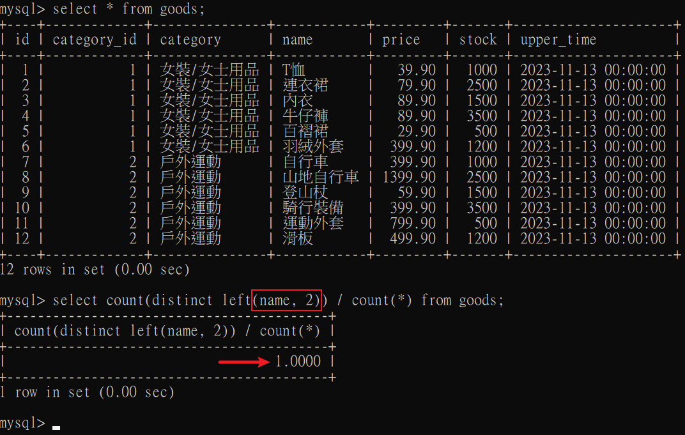

# 索引規範
一張表，索引不宜超過5個 (沒有特別規範，約定成俗)，原因如下

1. 索引佔硬碟空間，不宜過度。

2. 索引會影響 INSERT、DELETE、UPDATE 性能，當以上操作時，索引也必須同時更新。

3. 優化器在執行時，會根每個索引來評估，過多索引會占用優化器生成執行計畫的時間。


結論: 加入索引有好有壞，`提高查詢效率`，但會`降低新增、刪除、更新`性能，並且額外多佔硬碟空間。

<br/>

<br/>


# 適合創建索引的情況

### 1. 欄位中的資料需要有唯一性的需求
Unique Key、Primary Key 這些索引本身可以起到約束(constraint)的作用。因此，假設某個欄位有唯一性的需求，如身分證字號，就可以直接創建`唯一性索引`，或是`主鍵索引`，這樣可以更快速的通過索引查詢。

```
注意: 業務上有唯一性的欄位，即使是聯合欄位，也必須創建唯一索引 (Alibaba規範)。

不要因為創建索引會影響 insert、delete、update 速度，這個速度耗損可以忽略，但提高查詢速度是顯著的。
```

<br/>

<br/>

### 2. 頻繁作為 WHERE 查詢條件的欄位
某個欄位再 SELECT ... WHERE 語句中經常被用到，那就可以新增此欄位為索引，尤其是在數據量大的情況，創建普通索引就可以大幅提高查詢速度。

```sql
-- student_id 可新增普通索引
select course_id, course_name, create_time, student_id
from student_info
where student_id = 123123;
```

```sql
-- index_name 為索引名稱
alter table student_info
add INDEX index_name (student_id);
```

<br/>

<br/>

### 3. 經常 GROUP BY 或 ORDER BY 的欄位

因為`索引已經排好順序`，所以使用 ORDER BY 時候，可以節省排序的時間。
而使用 GROUP BY 時，若已經依照組別排好順序，分組時也會省下分組排序的時間。

`若排序的欄位不只一個，可以在這些欄位建立聯合索引`。

<hr/>

觀念題，如果語句中 student_id 和 create_time 都有設索引，會使用誰?
```sql
select student_id, count(*) as num
from student_info
group by student_id
order by create_time desc
limit 100;
```

會優先使用 group by 的索引，原因是當執行 SQL 語句時，`group by 執行順序在 order by 前面` ([執行順序說明](../進階1/00_雜項.md#sql-執行順序))。

所以上述情境，可以使用 student_id 作為索引；或是使用聯合索引 (student_id, create_time)，順序不可相反。

<br/>

<br/>

### 4. 使用 UPDATE、DELETE ... WHERE 語句的欄位

一般 UPDATE、DELETE 後面都會加上 WHERE 條件，加上索引能加速效率。

原因是需要先根據 WHERE 條件查詢這條紀錄，再對其 UPDATE 或 DELETE。


<br/>

<br/>

### 5. 使用 DISTINCT 欄位，需要創建索引

DISTINCT 是先將查詢到的集合排序後，再去重複，故使用索引排序後，會增加 DISTINCT 的速度。

<br/>

<br/>

### 6. 多表 JOIN 操作時，創建索引注意事項

1. `表的 JOIN 總數，盡量不要超過3張`，因為每多一張表，就等於多了一次嵌套迴圈，數量級會增長太快，嚴重影響性能。

2. `對 WHERE 條件創建索引`，可提升效能(同上述第2點)，尤其是多表時。

3. `對用來連接的欄位創建索引`，並且該欄位在多張表中`類型必須一致`。
    
    * SQL 執行時包含了隱式轉換，例如一個是 int(8)，另一個是 varchar(8)，雖然在 JOIN 時還是可以查出來，因為會用函數將 varchar 轉成 int 類型，`只要用了函數，索引就會失效`。

<br/>

<br/>

### 7. 使用欄位類型"小的"建立索引

類型大小，指的是欄位所佔的數據大小，例如 TINYINT、MEDIUMINT、INT、BIGINT，若此四種類型都能滿足業務需求，那就要選最小的 TINYINT。

* 數據類型越小，在查詢時進行的比較操作就越快。

* 數據類型越小，索引佔的硬碟空間就越小，在一個數據頁內可放得下更多數據，從而減少硬碟 I/O 帶來的性能消耗，也就意味著能將更多的數據頁載入到記憶體中，加快讀寫效率。

<br/>

<br/>

### 8. 使用字串前綴創建索引

當欄位儲存的是`長字串`類型，例如 `BLOG` 或是 `TEXT` 類型，索引占用的儲存空間就越大，這樣很沒效率。

解決方式是擷取字串的前面一部分內容作為索引，稱為`前綴索引`。這樣雖然不能精確的定位到位置，但是可以定位到`相對位置`，並回表查詢到完整的長字串欄位。好處是`節約空間`和`減少長字串的比較時間`。

> 依照 Alibaba [Java開發手冊]，在 varchar 欄位上建立索引時，必須指定索引長度，沒必要對整個字串建立索引。

```sql
-- 建立資料表
create table shop(
    address varchar(120) not null
);

-- 建立前綴索引，取欄位前12個字串
alter table shop add index(address(12));
```

但牽涉到一個問題，擷取的多，達不到節省空間的目的，擷取的少，重複內容又太多，因此可參考以下`區分度公式`，算出來越接近1，代表分辨效果越好，`區分度達到90%，且索引長度為最小`，為評斷標準。

```sql
-- 區分度公式
-- 分子: 取欄位前幾個字串，並且去重複的數量
-- 分母: 所有資料數
select count(distinct left(欄位名, 索引長度)) / count(*)
from xxx_table;
```




<br/>

這邊會衍生出另一個問題，有可能會沒辦法使用此索引欄位排序，因為 address 前12個字串有可能都相同，所以無法支援欄位排序，所以字串長度還需要加上此參考依據。

```sql
select * from shop order by address;
```

<br/>

<br/>

### 9. 區分度高(散列性高)的欄位適合作為索引

`欄位的基數`，指的是欄位中不重複的個數，例如說性別欄位，只能有male、female，基數只有2，區分度低，就不適合作為索引。

可以使用區分度公式來計算

```sql
select count(distinct 欄位) / count(*)
from xxx_table;
```

<br/>

<br/>

### 10. 使用最頻繁的欄位放在聯合索引的左側

基於`最左匹配原則`，增加聯合索引的使用效率。

<br/>

<br/>

### 11. 在多個欄位都要創建索引時，聯合索引優於單個欄位索引

聯合索引可以省下更多空間。

<br/>

<br/>

# 不適合創建索引的情況

### 1. 在 WHERE 中，用不到的欄位

包含 WHERE、GROUP BY、ORDER BY、DISTINCT。

<br/>

<br/>

### 2. 數據量小的表

數據量小的表，查詢索引後，回表查詢，時間有可能比掃全表還長。

<br/>

<br/>

### 3. 有大量重複的欄位，不要建立索引

例如，性別欄位，區分度太低不適合建立，效果極差，會查到一堆一樣的索引數據。

<br/>

<br/>

### 4. 經常更新的表，不適合建立索引

頻繁更新的表，不一定要建立索引，因為更新數據的時候，也需要更新索引，降低更新執行時間。

<br/>

<br/>

### 5. 不建議用無順序的值作為索引(重要)

例如使用 UUID、MD5 等，因為新增資料時，會造成`頁分裂(Page Split)`，即 B+ Tree 不是依照`向右生成`，而是從中插入葉節點中，這樣會導致 INSERT 時速度下降。

<br/>

<br/>

### 6. 刪除不再使用或很少用的索引

刪除不會使用(命中)的索引，節省硬碟空間。

<br/>

<br/>

### 7. 不要定義冗餘或重複的索引

* 冗餘索引，例如 index(a,b,c)，相當於 index(a) + index(a,b) + index(a,b,c)，直接用聯合索引即可。

* 重複索引，例如將 PK 再定義為 unique key 或 index。

<br/>

<br/>
