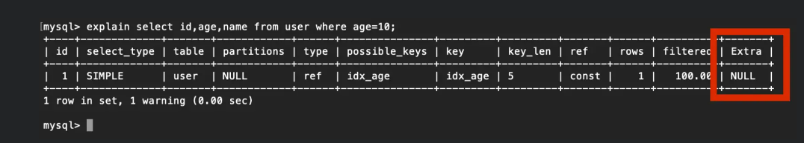

# 索引類型

### 索引類型
1. 普通索引 Index

    * 設定為非 Unique 的欄位值、可以重複。
    * 可以是 null ，一張表可以有多個 Index。
    * 可使用複合索引，將多個欄位合併成索引。

2. 唯一性索引 Unique

    * 使用 UNIQUE 關鍵字設置。
    * 可以是 null 且 unique。
    * 一張表可以有多個 Unique Key。

3. 主鍵索引 PK

    * 是一種特殊的`唯一性索引`。
    * 一定是非 null 且 unique。
    * 一張表只能有一個 Primary Key


### 叢集索引 Clustered Index

1. 叢集索引是一種數據儲存的方式 (B+ Tree) ，此索引即包含了所有資料。

    * 命名叢集，因為每個葉節點中有許多筆資料，綁在一起成一叢的這種結構。

2. 在一張資料表中，只能有一個叢集索引。

3. 是一種特殊類型的索引，決定了資料表在硬碟中的物理排序方式。

4. 因叢集索引的葉結點上儲存了 Row Data，即真正儲存資料的地方，因此`使用叢集索引搜尋的速度會高於使用其他索引`。

    

5. 規則:

    1. 如果表定義了PK，則 PK 就是叢集索引。

    2. 如果表沒有定義 PK，則第一個 not NULL unique 欄位就是叢集索引。

    3. 如果前兩項都不成立，InnoDB 会創建一個隱藏的 `row-id` 作为叢集索引。

6. 結構: 
    
    * 同一層的節點之間，是雙向 Linked List。
    * 葉節點中的 Row Data 之間，是單向 Linked List，由小到大排序。

        

7. 叢集索引並不需要使用 INDEX 語句去創建，InnoDB 會自動建立。


8. 優點: 

    * `訪問速度快`，叢集索引將真實資料存在葉節點，因此叢集索引比二級索引速度更快。

    * 對於`主鍵的排序查找和範圍查找`速度快，因為葉節點的數據已經按照主鍵大小排序。

9. 缺點:

    * `更新主鍵的代價很高`，如果要在葉節點中插入一個主鍵大小介於中間的新資料，而新資料以後的所有舊資料都要一併向後移動，所以對於 InnoDB，一般都會定義為`主鍵不可更新`和`auto_increment`，減少插入成本。

        * 例如，插入一筆新資料，PK = 21，而所有 PK > 21 的所有資料都需要向右移動一位。

        * 呈上，InnoDB下的資料表最好使用`有順序性的主鍵`，不建議選擇無序的UUID、MD5、HASH等字串作為PK，因為資料不是有序的往右長，而是每次插入一筆就要做一次向右遞延，造成性能下降。

    * `二級索引訪問需要兩次索引查找`，第一次二級索引找到主鍵值，需要再回叢級索引中回表查詢。
    

<br/>

<br/>


### 二級索引 Secondary Index

1. 二級索引是除了叢集索引之外的其他索引，用於加速對資料表的查詢。

2. 一張資料表可以有多個二級索引，這些索引不會影響資料表的物理排序方式，而是只影響查詢性能。

3. 在 InnoDB 中，普通索引的葉節點存儲PK值。而在 MyISAM 中，普通索引葉節點存儲 Row Data 的位址。

4. 聯合索引也是二級索引。

5. 結構

    * 使用非 PK 值作為排序依據，會再建立一顆 B+ Tree。
    
    * 葉節點中的資料是 PK 值，而不是真實的資料。

    * 補充，當二級索引沒有指定是Unique時，圖中`非葉節點`的部分畫的不完整，每筆資料中都會再儲存主鍵值，確保每筆資料的唯一性 ([原因第2點](#innodb-中-b-tree-注意事項))。

        

<br/>

<br/>

### 回表查詢
由於`二級索引`中，並沒有 Row Data 資料，所以查到二級索引的葉節點後，又會再去查一次`叢集索引`，最終找到叢集索引的葉節點，等於是`查了兩個 B+ Tree`。

<br/>

<br/>

### 聯合索引
為二級索引的一種，由多個欄位共同組成的索引。

結構:


注意的是，當聯合索引沒有指定是Unique時，圖中`非葉節點`的部分不完整，每筆資料中都會再儲存主鍵值，確保每筆資料的唯一性。

<br/>

<br/>

### InnoDB 中 B+ Tree 注意事項

1. 根節點位置不會變動

    * 先講結果: 一個 B+ Tree 的根節點從創建起，就不會再移動，會因為資料量越來越大，從葉節點轉化為根節點，但物理位置始終不變，`B+ Tree 生成的過程是由上自下生成`。
    
    * 過程: 
        
        * 第0層 : 創建之初是葉節點，儲存真實數據。
        
        * 第1層 : 在資料量越來越大時，會將資料複製一份出去作為新的葉節點，本身會轉化為根節點，此時樹高為2。

        * 第2層 : 將本身資料再複製一份出去作為新的節點，本身再轉化成根節點，此時樹高為3。

2. 非葉節點中的資料必須是唯一的

    * 情境如下，此為一個二級索引，索引欄位(橘黃色)並不是唯一值，當插入一筆資料`索引欄位 = 1`時，頁3會不知道要插入到頁4還是頁5。

        

        <br/>

        解決方式: `在非葉節點中加入主鍵`，讓資料具有唯一性，當插入一筆資料`索引欄位 = 1`時，就會依照主鍵順序去找要插入到頁4還是頁5。

        

3. 一個頁最少儲存2筆紀錄

    * InnoDB 的一個數據頁至少可以存放2筆紀錄，只放一筆紀錄沒有意義。

4. 為什麼不建議使用過長的欄位為主鍵?

    * 因為所有二級索引都會在非葉節點中放入主鍵，以確保數據唯一性，過長的索引會讓二級索引變得過大。

<br/>

<br/>

### InnoDB 和 MyISAM 比較

1. MyISAM 由於是把`索引檔案(附檔名.myi)` 和 `真實數據(附檔名.myd)`分開儲存，所以每次使用索引都必須進行回表操作。

2. MyISAM 索引在葉節點儲存的是`資料位址`，而 InnoDB 索引在葉節點儲存的是`主鍵的值`。

3. MyISAM 的回表操作速度較快，因為是拿地址偏移量(資料位址)直接取資料；而 InnoDB 是獲得主鍵後再去叢集索引中取資料，雖說不慢但還是比不上直接用地址訪問快速。

4. MyISAM 可以沒有主鍵，InnoDB一定要有主鍵。

<br/>

<br/>

### 索引的代價

`空間上的代價`

* 每建立一個索引就要鍵立一個 B+ Tree，每一個樹節點都是一個`數據頁`，一個數據頁在 MySQL 中預設是 16KB，會使用額外的儲存空間。

`時間上的代價`

* 由於葉節點中的 Row Data 是需要按照順序的 (單向 Linked List)，所以每次 insert、update、delete 操作時，都會額外的對需要`紀錄移位`的資料花費額外的時間，如果建立多個索引，就會額外的有這些性能負擔。

<br/>

<br/>


### 沒有命中索引問題

如下圖，使用 EXPLAIN，只要 Extra 欄位是 NULL 代表沒有索引覆蓋。



解決方式: `索引覆蓋 (Covering index)`
* 只需要在一個二級索引上就能獲取 SQL 所需的所有列的數據，無須回表，速度更快。
* 例如：`select id, age from user where age = 10;`，id是叢集索引，age是二級索引，這樣因為所查的欄位資料在二級索引都可以查到，所以不用回表。

    

<br/>

* 補充: 
    1. 複合索引也可以來實現索引覆蓋。
    2. 若查詢條件中有PK，則直接使用 Clustered Index 的索引樹做查詢，這樣就不會回表。
    3. SQL 會自行判斷是否要使用索引，`通常在數據量小的表，掃全表反而會比索引要快`，因為當索引需要回表查詢時，至少會產生2次IO。


<br/>

<br/>


### 最左匹配原理
* 在複合索引中，從最左邊的索引欄位開始匹配。

* 例如 : 索引為 (a, b, c) 欄位，則如果要命中索引，必須先使用 a 欄位的查詢條件，在使用 b，以此類推，否則無法命中索引。

    ```sql
    SELECT * FROM users WHERE a = 1 AND b = 2 AND c = 3;
    ```
* 需要命中索引，有以下幾種組合

    1. a
    2. ab
    3. ac
    4. abc

<br/>

<br/>

