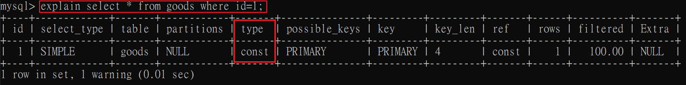
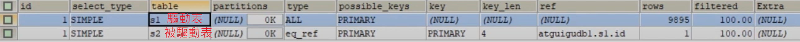

# EXPLAIN

### 概述
* EXPLAIN 不考慮各種 Cache，只單就查詢過程分析。
* EXPLAIN 不能顯示 MySQL在執行查詢時優化的部分。
* EXPLAIN 不會有關於 Trigger、Stored Procedure、Function 等用戶自定義函數查詢時的資訊。

* 部分統計資訊是估算的，非精確值。

<br/>

<br/>

### EXPLAIN 欄位解析

執行 EXPLAIN 後，會有以下這些欄位


<br/>

<br/>

|欄位名稱|描述|
|--|--|
|id|在一個大的查詢語句中，一個SELECT關鍵字都對應了一個`唯一的id`|
|select_type|SELECT關鍵字對應的查詢類型|
|table|資料表名稱|
|partitions|匹配的分區資訊|
|`type`|針對單表的訪問方法(有幾張表就有幾筆紀錄)|
|possible_keys|可能使用的索引|
|key|實際使用的索引|
|`key_len`|實際使用的索引長度|
|ref|當使用索引欄位查詢時，與索引欄位進行等值匹配的物件資訊|
|`rows`|預估需要讀取的紀錄筆數|
|filtered|某張表經過搜尋條件過濾後剩餘紀錄筆數的百分比|
|`Extra`|額外資訊|

<br/>

<br/>

### 欄位 table
紀錄是哪一張表。

<br/>

<br/>

### 欄位 id

以結論來說，id規則如下:

1. 有幾張表，就有幾筆紀錄。

2. 有幾個 SELECT，就有幾個 id。

3. id如果相同，從上往下執行。

4. id越大，優先級越高，越先執行。

`id 的每個號碼，表示一趟獨立的查詢，一個 SQL 查詢，趟數越少越好`

<br/>

`簡單SELECT查詢`

```sql
-- 1筆紀錄，id為1
explain select * from s1;
```

`JOIN查詢`

```sql
-- 2筆紀錄，id皆為1
explain select * from s1 join s2; -- cross join
```


`子查詢`: 子查詢語法會轉換成多表JOIN語法，所以select雖然有2個，但id皆還是為1。
```sql
-- 2筆紀錄，id皆為1
select * from s1 where col_1 in (
    select col_2 from s2 where col_3 = 'a';
);
```

`UNION查詢`: 為了去重複，會多一張臨時表，所以是2+1筆紀錄，臨時表的 id 為 NULL。

```sql
-- 3筆紀錄，2個id (1、2)
explain select * from s1 union select * from s2;
```


<br/>

`UNION ALL查詢`: 因為不用去重複，就不會多臨時表，所以是2筆紀錄。
```sql
-- 2筆紀錄，2個id (1、2)
explain select * from s1 union all select * from s2;
```

<br/>

<br/>

### 欄位 select_type
表示查詢的類型

|類型|描述|
|--|--|
|SIMPLE|不包含 `UNION` 或`子查詢`，都視為SIMPLE類型；JOIN查詢也算此類型。|
|PRIMARY|union時的主表|
|UNION|被PRIMARY union 的表|
|UNION RESULT|union時的臨時表|
|SUBQUERY|若子查詢無法被轉換為 semi-join 形式，該子查詢就`不是相關子查詢`，相關子查詢即兩張表示有依賴關係的；該子查詢的第一個select語句就是此類別。|
|DEPENDENT SUBQUERY|若子查詢無法被轉換為 semi-join 形式，該子查詢`就是相關子查詢`；該子查詢的第一個select語句就是此類別。|
|DEPENDENT UNION|[下方例子](#dependent-union)|
|DERIVED|[下方例子](#derived)|

<br/>

<hr/>

#### PRIMARY、UNION、UNION RESULT 這三個一起討論，SQL如下
```sql
explain
select * from s1
union
select * from s2;
```

左邊的表s1，類型為 `PRIMARY`  
右邊的表s2，類型為 `UNION`  
臨時表，類型為 `UNION RESULT`


<br/>

<br/>

#### DEPENDENT UNION
```sql
explain
select * from s1 where key1 in
(select key1 from s2 where key1 = 'a' union select key1 from s1 where key1 = 'b');
```
此SQL會產生4筆紀錄

`PRIMARY`是指外查詢 `select * from s1...`

`DEPENDENT SUBQUERY` 是指子查詢的第1個select語句 `select key1 from s2 where key1 = 'a'`

DEPENDENT UNION 是指子查詢後使用union的語句 `select key1 from s1 where key1 = 'b'`

最後一張`臨時表`，是將子查詢去重複的表。


<br/>

<br/>

#### DERIVED
衍生表（Derived Table）通常指的是在查詢中使用子查詢產生的臨時表。

```sql
-- 子查詢就是衍生表(臨時表)
EXPLAIN
SELECT * 
FROM
    (
        SELECT key1, count(*) AS c 
        FROM s1 
        GROUP BY key1
    ) AS derived_s1 
WHERE c > 1;
```

<br/>

<br/>

### 欄位 partitions
代表分區表中的命中情況，非分區表，此欄位為 NULL。

<br/>

<br/>

### 欄位 type (重要)
執行計畫的一條紀錄就代表著SQL對某張表的`訪問類型`，是較為重要的一個指標。

完整有以下幾種方法:

* system
* const
* eq_ref
* ref
* fulltext
* ref_or_null
* index_merge
* unique_subquery
* index_subquery
* range
* index
* ALL

`查詢速度排序，由快到慢` :  
`system` > `const` > `eq_ref` > `ref` > fulltext > ref_or_null > index_merge > unique_subquery > index_subquery > `range` > `index` > `ALL`

`SQL 優化目標`:  
是至少達到 range，要求是 ref，最好是 const (阿里巴巴開發手冊)。

<br/>

`system`:  
是一種非常快速且有效率的存取方式，因為它直接透過系統表的方式來定位所需的行，等於是結果已經儲存成常數了，不用再透過索引或範圍查找。

`const`:  
表示查詢是使用常數條件的情況。例如透過`PK`或`Unique Key`直接找出某一行的情況，(B+ Tree中不用回表、也不用向右範圍查找)。



`eq_ref`:  
在連接查詢時，`被驅動表`是透過PK或Unique Key用等於的方式查找的(使用Cluster Index 查1筆)。

```sql
-- s1 驅動表，s2 被驅動表
-- 遍歷 s1，並拿 s1 的主鍵去 s2 中匹配，找出符合的 s2 中的一筆資料
-- 所以等於也是跟 const 相同，都是拿PK去查找1筆資料
explain 
select * from s1 inner join s2 on s1.id = s2.id;
```



<br/>

`ref`:  
當對`二級索引`進行1筆等值匹配查詢，(使用Secondary Index 查1筆)。

```sql
-- key1 是二級索引
explain
select * from s1 where key1 = 'a';
```

<br/>

`ref_or_null`:  
當對`二級索引`進行1筆等值匹配查詢，該索引的值也可以是 NULL 時 (`ref`類型 + is null條件)。

```sql
explain
select * from s1 where key1 = 'a' or key1 is null;
```

<br/>

`fulltext`:  
全文檢索。

<br/>

`index_merge`:  
單表情況下，使用了多個索引，並且對這些索引的結果進行了合併。因為查詢包含了多個條件，每個條件都可以使用不同的索引。

```sql
-- 其中 key1 和 key2 都是二級索引
explain
select * from s1 where key1 = 'a' or key2 = 'a';
```

<br/>

`unique_subquery`
是針對在包含 `IN` 子查詢的語句中，如果優化器最終將 IN 轉換成 EXISTS 子查詢，而且子查詢可以使用到 PK 進行等值匹配時，子查詢就會是此類型。

```sql
--
explain
select *
from s1
where key2 in 
    (
        select id
        from s2
        where s1.key1 = s2.key1
    );
```


<br/>

`index_subquery`:  
同上`unique_subquery`，但是是使用二級索引。


<br/>

`range`:  
使用索引獲取某些`範圍區間`的紀錄。
```sql
explain
select * from s1 where key1 in ('a', 'b', 'c');
```

<br/>

`index`:  
索引全表掃描，當查詢是索引覆蓋的，即所有資料均可從索引樹取得的時候。

```sql
-- 假設有聯合索引 index(key1, key2)
-- 基於最左匹配原則，key2無法直接命中索引，但因為索引覆蓋可以不用回表，所以會掃全索引，還是比掃全表快。
explain
select key1, key2 from s1 where key2 = 'a';
```

<br/>

`ALL`:  
全表掃描。

<br/>

<br/>

### 欄位 possible_keys / key

字面上理解，`possible_keys`為可能使用到的索引，`key`是實際使用到的索引。

通常 where 條件中欄位若是索引欄位，就有可能被列入 possible_keys，優化器在選擇最終索引時，會去評估每個索引的成本，最終選成本最低的，所以優化方向是`讓possible_keys的值越少越好`，評估的時間能降低。

```sql
-- key1 和 key2 皆是二級索引
explain
select * from s1 where key1 > 'z' and key2 = 'a';
```


<br/>

還有另一種情況是 possible_keys 是 NULL，但優化器最終有命中索引，所以`並非 key 就是 possible_keys 的子集合`。

<br/>

<br/>

### 欄位 key_len
實際使用索引的長度，單位為 `Byte`，這個欄位是用來檢查是否充分的利用了上索引，`主要針對聯合索引`，`值越大越好`(不是跟其他紀錄比較，是跟優化過的SQL比較)，利用的索引長度越長，表示索引的區別度越高，越有效率。

若沒有使用索引，則此欄位為 NULL。

```sql
explain
select * from s1 where
```

<br/>

<br/>

### 欄位 ref
當使用索引欄位`等值查詢`時，與索引欄位等值匹配的資訊。

通常與 type 欄位一起查看。

<br/>

<br/>

### 欄位 rows

`預估`需要讀取的紀錄筆數，值越小越好，原因是紀錄都在同一個頁中，I/O 次數可能會更少。

<br/>

<br/>

### 欄位 filtered

* 某張表經過搜尋條件過濾後剩餘紀錄筆數的百分比，越高越好。

* 舉例，過濾前 1000 筆紀錄，過濾後 900 筆紀錄，此時 
`filtered = 90`。

* 對於單表來說，filtered欄位沒有太大的意義，更關注在 join 查詢時，`驅動表的 filtered 值`，此值決定了驅動表要執行的次數 (即 `rows * filtered`)。

    ```sql
    explain
    select * from s1
    inner join s2 on s1.key1 = s2.key1
    where s1.common_field = 'a';
    ```

    

    <br/>

    驅動表為s1，被驅動表為s2。
    
    其中 s1 過濾前紀錄為9895筆(rows欄位)，where過濾後為 9895 * 10% = `989筆紀錄`，代表 s1 是用 989 筆紀錄去對 s2 表進行 s1.key1 = s2.key1 的比對。

<br/>

<br/>

### 欄位 extra (重要)

雖然是描述額外資訊的欄位，但其實有十分重要的資訊，包含如何執行查詢語句，列出幾個比較重要的。

`using index`
* 查詢時不需要回表查詢，直接透過索引就可以取得查詢的資料 (索引覆蓋)。

`Using filesort`
* 某些情況下，排序操作無法使用到索引，只能在記憶體中(記錄較少時)或硬碟中(紀錄較多時)進行排序，將這種在記憶體或硬碟中排序的方式統稱為 filesort。

    ```sql
    -- is_key索引本身就有排序了，無須再進行 filesort
    explain select * from s1 order by is_key;

    -- 需要將數據頁再額外進行 filesort
    explain select * from s1 order by not_key;
    ```

`Using temporary`
* 使用了臨時表，如去重複、排序等。當使用 distinct、group by、union 等子句來查詢時，如果不能有效利用索引，就會透過臨時表來執行查詢。

* 臨時表成本較高，不是一個效能好的查詢方式，應視情況建立索引。

`No tables used`
* 查詢語句中沒有使用 FROM 時，表示沒有使用到任何表。

    ```sql
    explain select 1;
    ```

`Impossible WHERE`
* 當 where 子句恆為false時

    ```sql
    explain select * from s1 where 1 != 1;
    ```

`Using where`
* 當 where 子句的條件欄位沒有使用索引

    ```sql
    -- 情境1，key1為索引，有命中索引，故會顯示 NULL
    explain
    select * from s1 where key1 = 'a';

    -- 情境2，not_key非索引，會顯示 Using where
    explain
    select * from s1 where not_key = 'z';

    -- 情境3，條件1有命中索引，但條件2沒有索引
    -- type欄位 = ref，Extra欄位 = Using where
    explain 
    select * from s1 where key1 = 'a' and not_key = 'z';
    ```


`distinct`
* 在select部分使用了distinc關鍵字

<br/>

<br/>