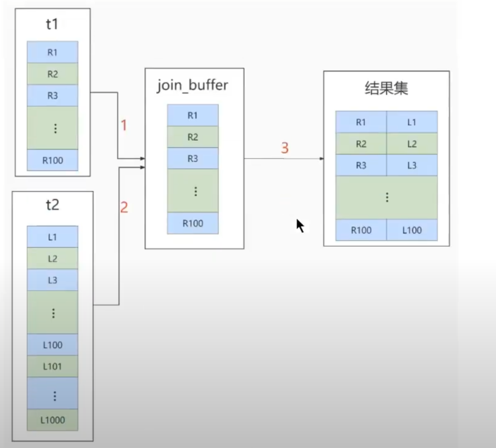
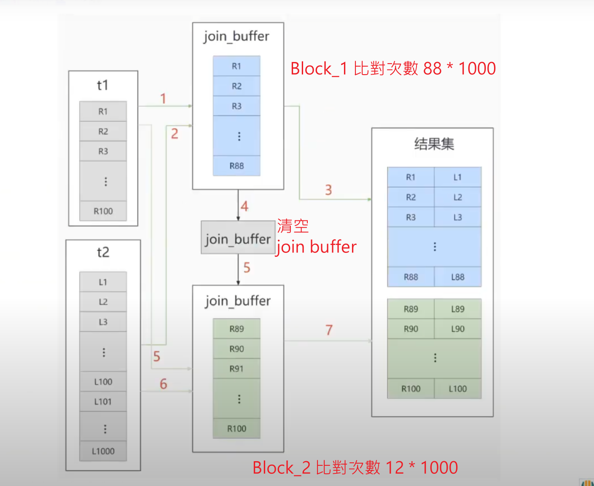

# JOIN底層原理

### 結論

1. 被驅動表的 Join 欄位加上索引 (表示可以用 Index Nested-Loop Join)。

2. 需要 Join 的欄位，數據類型必須保持一致。

3. Left Join 時，選擇小表作為驅動表，大表作為被驅動表，減少外層循環次數(小表走遍歷、大表走索引)。

4. Inner Join 時，優化器會`自動選擇小結果集的表作為驅動表`。

5. `多表關聯`的效能高於`子查詢`。

6. 衍生表無法建立索引。

<br/>

<br/>

### 概述

1. 若使用 INLJ 算法，表示會使用被驅動表的索引，效能不錯。

2. 若使用 BNLJ 算法，表示是將驅動表載入 join buffer 的算法，`掃描被驅動表行數`就會大量增加，尤其被驅動表是大表，這樣可能會掃描被驅動表次數過高，占用大量系統資源，所以這種算法盡量不要用。

3. 小表驅動大表的情境。

    * 如果是 INLJ 算法，應該選擇小表做驅動表(小表掃全表、大表走索引樹)。

    * 如果是 BNLJ 算法

        * 在 join buffer 不夠大時(常見)，應該選擇小表做驅動表(減少被驅動表掃描的總行數)。

        * 在 join buffer 足夠大時，大到可容納整個驅動表，小表大表哪個做驅動表都沒差。

4. `小表`的定義

    * 簡單來說，條件過濾後，行數少的就是小表。

<br/>

<br/>

### Index Nested-Loop Join / INLJ
是資料庫查詢最佳化中一種常見的連接演算法。它通常用於執行兩個表之間的連接操作，其中`至少一個表使用了索引`。

在這個演算法中，資料庫系統首先選擇一個表作為外部表（outer table，即`驅動表`），通常是包含更少行的那個表，然後遍歷這個表的每一行。對於外部表的每一行，系統再在另一個表中搜尋符合的行，這個表通常稱為內部表（inner table，即`被驅動表`）。`為了提高搜尋效率，內部表往往使用了索引`。

可參考[執行比對行數](./3_關聯查詢優化.md#驅動表與被驅動表)


此算法的結論: 

1. 使用此算法，比將SQL拆成多個單表執行的性能更好。

2. 若使用此算法，需要`讓小表作為驅動表`。

3. 若兩表都沒有索引，讓大表加索引效率更好。

<br/>

<br/>

### Simple Nested-Loop Join

是一種基本的連接演算法，它用於執行兩個表之間的連接操作。與 Index Nested-Loop Join 不同，簡單巢狀循環連接`不依賴索引，而是直接對資料表進行巢狀循環`。

這種連接演算法的優點是簡單直觀，`適用於小型表或沒有適當索引的情況`。然而，對於大型表，這種演算法的效能可能會受到影響，因為需要對內部表進行完整的掃描，導致時間複雜度較高。

此算法的執行比對次數就是`每張表行數的乘積`。

```sql
-- 比對次數 = A行數 * B行數
select ...
from A join B
    on A.id = B.id;
```

<br/>

此算法的結論: 

1. 若是使用此算法，則大表、小表誰做驅動表都沒有區別。

<br/>

<br/>

### Block Nested-Loop Join (需要先知道[Join Buffer原理](#join-buffer)) / BNLJ
是一種連接演算法，提高簡單嵌套循環連接的效能。這個演算法引入了「區塊」（block）的概念，以減少內部表的多次存取。

步驟如下:

1. 選擇外部表（驅動表）： 選擇一個表作為外部表，通常選擇包含較少行的表。 

2. 分塊： 將內部表劃分為若干塊，每個塊包含多行記錄。這有助於減少內部表的多次存取。 

3. 巢狀循環： 對於外部表的每一行，遍歷內部表的區塊而不是每一行。這樣，內部表的區塊在內部表的多次存取中僅被存取一次。 

4. 匹配行： 在每個區塊內，尋找與外部表格目前行相符的行，產生連接的結果。

<br/>

此算法的結論: 

1. 此算法的優化方向是，增加 Join Buffer 的記憶體大小，原因是`join_buffer_size`越大，一次可放入的行數越多，分成的Block數越小，`對被驅動表掃描的總行數就越少`。

2. 讓`小表作為驅動表`。

<br/>

<br/>

### Join Buffer

在資料庫系統中，Join Buffer（連接緩衝區）是用於處理連接操作的一種`記憶體區域`。連接操作涉及將兩個表的資料進行關聯，其中 Join Buffer 在記憶體中扮演了關鍵的角色，幫助提高連接查詢的效率。

* 針對在多表連接時，`被驅動表的連線欄位沒有索引的情況下`需要進行全表掃描(外表、內表巢狀循環)，所以引入了 join buffer 記憶體緩衝區來對全表掃描過程加快速度。

* 以下舉例，t1為驅動表、t2為被驅動表，在巢狀循環時，為了加快速度，會將 t1 表載入 join buffer 記憶體中，並掃描 t2 表，逐筆和 join buffer 中的數據做比對。

    

* 此過程，無法減少比對的次數，但因為是在記憶體中，所以效率還是有提升。

* 總比對次數還是相同(100 * 1000次)，但掃描被驅動表(t2)的行數(1000 * 1次變 1000 * 2次)就不同。

    `注意: 比對次數和掃描行數不同。`

<br/>

Join Buffer 記憶體的大小是使用 `join_buffer_size` 設定的，預設值是 256kB。<mark>如果放不下 t1 表中的所有數據的話，就會分塊(Block)進入buffer，再執行比對</mark>


其中的`塊(Block)`就是 Block Nested-Loop Join算法中的由來。



<br/>

<br/>