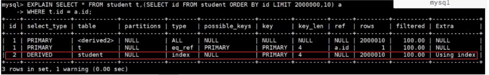

# 排序優化

### 概述

* 在 MySQL 中，有兩種排序方式

    1. Index 排序

    2. FileSort 排序 [解釋](../進階3_分析/02_EXPLAIN.md#欄位-extra-重要)

* 其中 Index 已經以排序的方式儲存了，FileSort 在記憶體中進行排序，占用CPU較多，如果檔案太大，會產生臨時檔案 I/O 到硬碟中儲存，效率低。

* 優化方向會以添加 Order By 欄位的索引，若查詢語句為 Where + Order By，則可以使用聯合索引，`Where 欄位放左邊`。

* 其實可以減少在 SQL 使用 order by，因為資料庫的 CPU 資源很寶貴，建議可以在程式端去排序。

<br/>

<br/>

### 幾個 ORDER BY 導致索引失效的情況

[失效原因為第11、12、13點](../進階4_優化/2_索引失效優化.md#無法生效的n種寫法)


<br/>

<br/>

### 舉例

優化以下 SQL，有 WHERE 和 ORDER BY，故 使用聯合索引優化
```sql
select SQL_NO_CACHE * from student where age = 30 and student_no < 10100 order by `name`;
```

上述SQL，使用 EXPLAIN 分析，若發現排序方式是 FileSort，需要優化。

解決方式: 添加聯合索引(age, name)，原因是 student_no 是範圍查找，加到聯合索引中會使下個個欄位失效。

```sql
create index idx_age_name on student(age, name);
```

<br/>

<br/>

### GROUP BY 優化

* group by 使用索引的原則和 order by 幾乎一致，一樣符合最左匹配原則。

* where 效率高於 having，能寫在 where 的條件就不要寫在 having 中了。

* 若 SQL 中有包含 where、group by、distinct、order by 查詢語句，where 過濾出的結果集盡量保持在 1000 行內，否則會很慢。

<br/>

<br/>

### LIMIT 優化
直接舉例，以下 SQL 需要查詢第 2000000 筆開始的 10 筆數據，困擾是必須先跑完前2000000筆，才能取結果的那 10 筆，效能極差。

```sql
select * from student limit 2000000, 10;
```

優化方式1，適用於PK是自增的表，直接跳去查第2000000筆。
```sql
select * from student where id > 2000000 limit 10;
```

優化方式2，在叢集索引上完成排序分頁，最後根據主鍵關聯回原表查詢。
```sql
-- 子查詢先只找id欄位，再關聯回原表查所有欄位
select * from student s
inner join (select id from student order by id limit 2000000, 10) tmp
on s.id = tmp.id;
```

