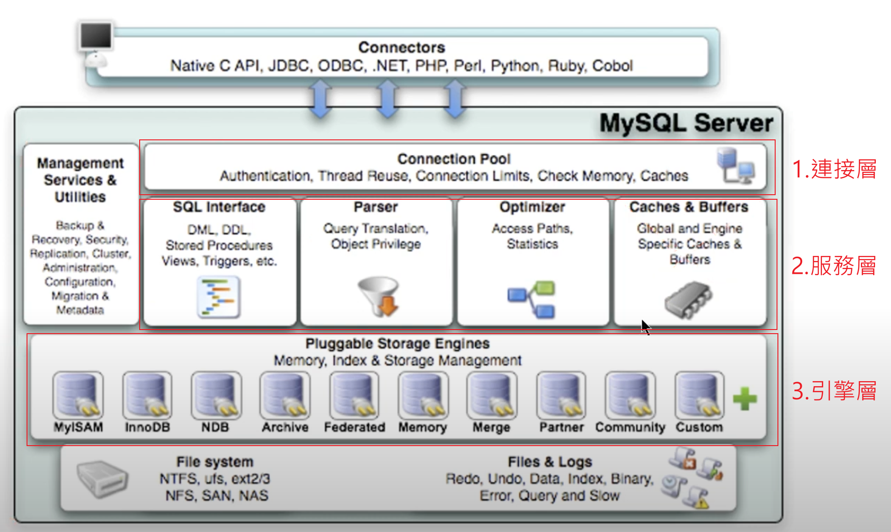

# 索引下推

## 概述

1. 是在 MySQL 5.6 版本後的一個優化方式。

2. 索引下推的`下推`，指的是將 3層式架構的服務層(Service Layer)負責的工作，交給了引擎層(Storage Layer)去處理，`主要減少了回表的次數`。

    

<br/>

3. 比較兩種情況，有使用 WHERE 時
    
    * 沒有使用 ICP 時，查詢步驟如下

        1. 依照欄位查詢二級索引。

        2. 從二級索引中取到所有符合紀錄的主鍵值，`每筆都會回表查詢`。

        3. 存儲引擎把紀錄交給服務層去篩選 WHERE 條件。


    * 有使用 ICP 時，查詢步驟如下

        1. 依照欄位查詢二級索引。

        2. 判斷 WHERE 中的條件是否能在二級索引中就可以判斷(where條件的欄位都必須在索引中)，將符合紀錄的主鍵，再去回表查詢，`等於是提前篩選條件，減少了回表的次數`。

        3. 存儲引擎把紀錄交給服務層去檢測該紀錄是否滿足 WHERE 其餘的條件。

4. 聯合索引使用ICP時，還是需要遵守`最左匹配原則`。

    * 舉例，若聯合索引為 (name, age)，還是會依照最左的欄位(name) 為第一個篩選的欄位。

        ```sql
        select * from user where name like '張%' and age = 10;
        ```

<br/>

<br/>


## 舉例
假如 user 表中，有一個聯合索引 (name, age)，當查詢以下紀錄時

```sql
select * from user where name like '張%' and age = 10;
```

<br/>

`沒有使用ICP`

* 存儲引擎透過聯合索引找到符合條件 `name like '張%'` 紀錄的主鍵，假設有 10000 筆，並將這 10000 筆回表 10000 次找到完整的行紀錄；最終將這些紀錄返回給服務層去篩選 `age = 10` 條件。

* 這樣其實浪費了聯合索引中的 age 欄位，沒有使用到。


`使用ICP`

* 存儲引擎透過聯合索引找到符合條件 `name like '張%'` 紀錄的主鍵，由於聯合索引中包含 age 欄位，所以儲存引擎直接在聯合索引裡依照 `age = 10` 過濾，假設過濾後剩下 100 筆，就只要拿這 100 筆去回表就好了。

* 使用了ICP，在 EXPLAIN 的 Extra 欄位會顯示 `Using Index Condition`，[連結](../進階3_分析/02_EXPLAIN.md#using-index-condition)。


`索引覆蓋`
* 若查詢語句為以下，則不走ICP，直接走索引覆蓋更快。

    ```sql
    select name, age from user where name like '張%' and age = 10;
    ```


<br/>

<br/>

## ICP使用條件
1. 只能用於`二級索引 (Secondary index)`。

    * 若查詢使用 Cluster Index，完整紀錄都已被載入到記憶體中，ICP不會減少IO。

2. EXPLAIN 執行計畫顯示的 type 欄位為 [連結](../進階3_分析/02_EXPLAIN.md#欄位-type-重要)

    * range

    * ref

    * eq_ref

    * ref_or_null

3. 並非全部 where 條件都可以使用 ICP，前提`where條件的欄位都要在聯合索引中`，否則讀不到該欄位的紀錄，還是得回表查詢。

4. 當SQL使用索引覆蓋時，就不會使用ICP。

    * 索引覆蓋的情況下，就不需要回表查詢了，直接將結果返回給服務層